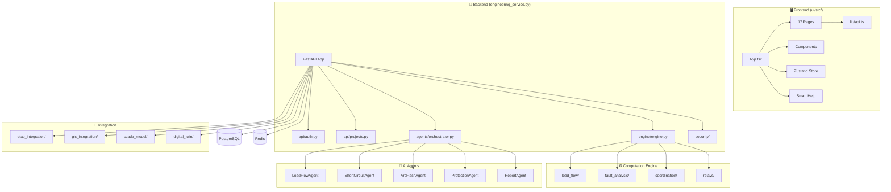

# AI Agent Index — AhmedETAP

> **Purpose:** Complete project intelligence document for AI coding agents.
> **Last Updated:** 2026-06-16
> **Maintainer:** Eng. Ahmed Elbaz

---

## 1. Project Identity

| Field | Value |
|-------|-------|
| Name | AhmedETAP |
| Type | Enterprise Engineering Intelligence Platform |
| Domain | Power Systems Engineering, ETAP Automation, GIS |
| Language | Python 3.12+ (backend), TypeScript 5.7+ (frontend) |
| License | MIT |
| Entry Point (Backend) | `engineering_service.py` → `main()` |
| Entry Point (Frontend) | `ui/src/main.tsx` → `App.tsx` |
| Entry Point (Electron) | `ui/electron/main.cjs` |

---

## 2. Architecture Overview



---

## 3. Module Map

### 3.1 Backend Python Modules

| Module | Path | Purpose | Dependencies | Status |
|--------|------|---------|--------------|--------|
| **engineering_service** | `engineering_service.py` | Main FastAPI app, all routes | fastapi, uvicorn, pydantic | Active |
| **engine** | `engine/engine.py` | PowerSystemEngine core class | numpy, scipy | Active |
| **load_flow** | `load_flow/load_flow.py` | Newton-Raphson solver | numpy, scipy | Active |
| **load_flow_solver** | `load_flow/load_flow.py` | Newton-Raphson solver (canonical) | numpy | Active |
| **optimal_power_flow** | `load_flow/optimal_power_flow.py` | AC/DC OPF | numpy, scipy | Active |
| **fault_analysis** | `fault_analysis/fault.py` | Short circuit (IEC 60909) | numpy | Active |
| **arc_flash** | `fault_analysis/arc_flash_engine.py` | IEEE 1584 calculator | numpy | Active |
| **arc_flash_calc** | `fault_analysis/arc_flash_calc.py` | Incident energy | math | Active |
| **harmonic** | `fault_analysis/harmonic_analysis.py` | THD/TDD analysis | numpy | Active |
| **iec60909** | `fault_analysis/iec60909_engine.py` | IEC 60909 engine | numpy | Active |
| **coordination** | `coordination/coordination.py` | Protection coordination | numpy | Active |
| **relay** | `relays/relay.py` | IEC 60255 relay model | math | Active |
| **core_model** | `core_model/system.py` | Power system model | — | Active |
| **bus** | `core_model/bus.py` | Bus model | — | Active |
| **line** | `core_model/line.py` | Transmission line model | — | Active |
| **generator** | `core_model/generator.py` | Generator model | — | Active |
| **load** | `core_model/load.py` | Load model | — | Active |
| **transformer** | `core_model/transformer.py` | Transformer model | — | Active |
| **motor_model** | `core_model/motor_model.py` | Motor model | — | Active |
| **orchestrator** | `agents/orchestrator.py` | Chief agent orchestrator | numpy, all agents | Active |
| **prompt_loader** | `agents/prompt_loader.py` | 3-tier prompt system | yaml | Active |
| **stability** | `agents/stability_agent.py` | Transient stability | numpy, scipy | Active |
| **cable_sizing** | `agents/cable_sizing_agent.py` | Cable sizing (IEC 60364) | — | Active |
| **earth_grid** | `agents/earth_grid_agent.py` | Earth grid (IEEE 80) | — | Active |
| **renewable** | `agents/renewable_agent.py` | Renewable energy (IEEE 1547) | — | Active |
| **battery** | `agents/battery_storage_agent.py` | BESS (IEC 62933) | — | Active |
| **scada_agent** | `agents/scada_agent.py` | SCADA (IEC 61850) | — | Active |
| **weather** | `agents/weather_agent.py` | Weather data | — | Active |
| **anomaly** | `agents/anomaly_agent.py` | Anomaly detection | scikit-learn | Active |
| **predictive** | `agents/predictive_agent.py` | Predictive analytics | scikit-learn, tensorflow | Active |
| **goal_planner** | `agents/goal_planner_agent.py` | Task decomposition | — | Active |
| **code_guard** | `agents/code_guard_agent.py` | Code quality guard | — | Active |
| **auth** | `api/auth.py` | JWT authentication | bcrypt, jwt, sqlalchemy | Active |
| **projects** | `api/projects.py` | Project CRUD | sqlalchemy | Active |
| **database** | `api/database.py` | Async SQLAlchemy | sqlalchemy, aiosqlite | Active |
| **dependencies** | `api/dependencies.py` | FastAPI dependencies | jwt | Active |
| **security_framework** | `security/security_framework.py` | Auth, RBAC, rate limiting | bcrypt, jwt, cryptography | Active |
| **secrets_manager** | `security/secrets_manager.py` | Vault integration | cryptography, hvac | Active |
| **secure_executor** | `security/secure_executor.py` | Python sandboxing | ast, signal | Active |
| **rasp** | `security/rasp.py` | Runtime self-protection | re | Active |
| **mfa** | `security/mfa.py` | TOTP + WebAuthn | pyotp, hashlib | Active |
| **abac** | `security/abac.py` | Attribute-based access | — | Active |
| **siem** | `security/siem.py` | Security events | — | Active |
| **ml/predictive** | `ml/predictive.py` | ML models | scikit-learn, tensorflow | Active |
| **guards** | `guards/__init__.py` | Code/test/docs guards | — | Active |
| **rag_engine** | `knowledge/rag_engine.py` | Knowledge base RAG | — | Active |
| **digital_twin** | `digital_twin/digital_twin_core.py` | Digital twin sync | — | Active |
| **etap_provider** | `etap_integration/etap_provider.py` | ETAP COM abstraction | — | Active |
| **gis** | `gis_integration/base.py` | GIS integration | — | Active |
| **scada** | `scada_model/scada_model.py` | SCADA data model | — | Active |
| **visualization** | `visualization/visualization.py` | Matplotlib charts | matplotlib | Active |
| **network_solver** | `network_solver/zbus.py` | Z-bus matrix | numpy | Active |
| **caching** | `engine/caching.py` | Redis cache | redis | Active |
| **gpu_solver** | `engine/gpu_solver.py` | GPU acceleration | cupy (optional) | Active |
| **sparse_solver** | `engine/sparse_solver.py` | Sparse matrices | scipy | Active |

### 3.2 Frontend TypeScript Modules

| Module | Path | Purpose | Dependencies | Status |
|--------|------|---------|--------------|--------|
| **App** | `ui/src/App.tsx` | Root component, routing | react-router-dom | Active |
| **Dashboard** | `ui/src/pages/Dashboard.tsx` | Main dashboard | recharts, framer-motion | Active |
| **Studies** | `ui/src/pages/Studies.tsx` | Study cards | — | Active |
| **StudyRun** | `ui/src/pages/StudyRun.tsx` | Study execution | — | Active |
| **AIAssistant** | `ui/src/pages/AIAssistant.tsx` | AI chat | — | Active |
| **Projects** | `ui/src/pages/Projects.tsx` | Project management | — | Active |
| **Settings** | `ui/src/pages/Settings.tsx` | Configuration | — | Active |
| **Diagnostics** | `ui/src/pages/Diagnostics.tsx` | System health | — | Active |
| **Logs** | `ui/src/pages/Logs.tsx` | Audit logs | — | Active |
| **CodeGuard** | `ui/src/pages/CodeGuard.tsx` | Security review | — | Active |
| **DigitalTwin** | `ui/src/pages/DigitalTwin.tsx` | Digital twin UI | — | Active |
| **Reports** | `ui/src/pages/Reports.tsx` | Report generation | — | Active |
| **Layout** | `ui/src/components/Layout.tsx` | App shell | — | Active |
| **Sidebar** | `ui/src/components/Sidebar.tsx` | Navigation | — | Active |
| **Navbar** | `ui/src/components/Navbar.tsx` | Top navigation | — | Active |
| **TitleBar** | `ui/src/components/TitleBar.tsx` | Electron title bar | electronAPI | Active |
| **CommandPalette** | `ui/src/components/command/CommandPalette.tsx` | Ctrl+K palette | — | Active |
| **SmartHelpDrawer** | `ui/src/components/help/SmartHelpDrawer.tsx` | Help panel | — | Active |
| **ContextHelpButton** | `ui/src/components/help/ContextHelpButton.tsx` | Inline help | — | Active |
| **OnboardingTour** | `ui/src/components/onboarding/OnboardingTour.tsx` | First-run tour | localStorage | Active |
| **ContextPanel** | `ui/src/components/context/ContextPanel.tsx` | Right panel | — | Active |
| **ErrorRecovery** | `ui/src/components/context/ErrorRecovery.tsx` | Error→help mapping | — | Active |
| **EngineeringWorkspace** | `ui/src/components/layout/EngineeringWorkspace.tsx` | Resizable panels | — | Active |
| **AppShell** | `ui/src/components/layout/AppShell.tsx` | Main shell | — | Active |
| **TopBar** | `ui/src/components/layout/TopBar.tsx` | Top bar | — | Active |
| **StatusBar** | `ui/src/components/layout/StatusBar.tsx` | Status bar | — | Active |
| **Visual** | `ui/src/components/ui/Visual.tsx` | Glass, glow, status | — | Active |
| **api client** | `ui/src/lib/api.ts` | API communication | fetch | Active |
| **store** | `ui/src/store/index.ts` | Zustand state | zustand | Active |
| **useSmartHelp** | `ui/src/hooks/useSmartHelp.ts` | Help hook | — | Active |
| **helpTopics** | `ui/src/help/helpTopics.ts` | Help content (EN/AR) | — | Active |
| **contextRegistry** | `ui/src/help/contextRegistry.ts` | Context→topic map | — | Active |
| **i18n** | `ui/src/i18n.ts` | i18next config | i18next | Active |
| **ThemeContext** | `ui/src/context/ThemeContext.tsx` | Dark/light mode | — | Active |
| **NotificationContext** | `ui/src/context/NotificationContext.tsx` | Toast notifications | — | Active |

---

## 4. Dependency Graph

### 4.1 Backend Import Chain

```
engineering_service.py
├── api/auth.py → security/security_framework.py, api/database.py
├── api/projects.py → api/database.py, api/dependencies.py
├── api/dependencies.py → api/database.py
├── api/database.py → sqlalchemy, aiosqlite
├── engine/engine.py → load_flow/, fault_analysis/, coordination/, relays/, visualization/
├── agents/orchestrator.py → agents/*.py, numpy
├── security/security_framework.py → bcrypt, jwt, cryptography
├── security/secrets_manager.py → cryptography, hvac
├── security/secure_executor.py → ast, signal
├── security/rasp.py → re
├── security/mfa.py → pyotp, hashlib
├── ml/predictive.py → scikit-learn, tensorflow
├── knowledge/rag_engine.py → (standalone)
├── digital_twin/digital_twin_core.py → (standalone)
├── etap_integration/etap_provider.py → (Windows COM)
├── gis_integration/base.py → (standalone)
└── scada_model/scada_model.py → (standalone)
```

### 4.2 Frontend Import Chain

```
App.tsx
├── components/Layout.tsx → Sidebar.tsx, Navbar.tsx, TitleBar.tsx
├── components/command/CommandPalette.tsx
├── components/help/SmartHelpDrawer.tsx → hooks/useSmartHelp.ts
├── components/onboarding/OnboardingTour.tsx
├── components/context/ErrorRecovery.tsx
├── pages/Dashboard.tsx → lib/api.ts, components/ui/*
├── pages/StudyRun.tsx → lib/api.ts, lib/studyCategories.ts
├── store/index.ts → zustand
├── context/ThemeContext.tsx
└── context/NotificationContext.tsx
```

---

## 5. Critical Paths

### 5.1 Study Execution Flow

```
User → UI (StudyRun.tsx)
  → POST /api/v1/studies/run (engineering_service.py)
    → _run_native_study()
      → engine/engine.py (PowerSystemEngine)
        → load_flow/load_flow.py (Newton-Raphson)
        → fault_analysis/fault.py (IEC 60909)
        → fault_analysis/arc_flash_engine.py (IEEE 1584)
        → coordination/coordination.py (IEC 60255)
    → Result serialized → JSON response
  → UI renders results
```

### 5.2 Authentication Flow

```
User → UI (login form)
  → POST /api/v1/auth/register (api/auth.py)
    → _hash_password() (bcrypt)
    → SQLAlchemy INSERT
  → POST /api/v1/auth/login
    → _verify_password() (bcrypt)
    → _create_access_token() (JWT)
    → _create_refresh_token() (JWT)
  → Token stored in localStorage
  → Subsequent requests: Authorization: Bearer <token>
    → get_current_user_from_header() validates JWT
```

### 5.3 AI Agent Flow

```
User → AIAssistant.tsx
  → POST /api/v1/agents/chat
    → agents/orchestrator.py (ChiefEngineeringOrchestrator)
      → Task decomposition
      → Agent selection (load_flow, short_circuit, etc.)
      → Execute study via engine/
      → Validation agent checks results
      → Report agent formats output
    → Response streamed to UI
```

---

## 6. Entry Points

| Entry Point | File | Command | Port |
|-------------|------|---------|------|
| Backend API | `engineering_service.py` | `python engineering_service.py --port 8000` | 8000 |
| Frontend Dev | `ui/` | `cd ui && pnpm dev` | 5173 |
| Electron | `ui/electron/main.cjs` | `cd ui && npm run electron:dev` | — |
| Docker | `docker-compose.yml` | `docker compose up -d` | 3000, 8000 |
| HF Spaces | `Dockerfile.hf` | Auto-deployed | 7860 |

---

## 7. Configuration Files

| File | Purpose | Format |
|------|---------|--------|
| `.env.example` | Environment template | KEY=VALUE |
| `docker-compose.yml` | Docker orchestration | YAML |
| `prometheus.yml` | Monitoring config | YAML |
| `nginx.conf` | Reverse proxy | Nginx |
| `pyproject.toml` | Python project config | TOML |
| `ruff.toml` | Python linter config | TOML |
| `tsconfig.json` | TypeScript config | JSON |
| `vitest.config.ts` | Test config | TypeScript |
| `mastra.config.ts` | AI agent config | TypeScript |
| `package.json` | Node.js dependencies | JSON |
| `requirements.txt` | Python dependencies | TXT |
| `alembic.ini` | DB migration config | INI |
| `.pre-commit-config.yaml` | Git hooks | YAML |

---

## 8. CI/CD Workflows

| Workflow | File | Trigger | Purpose |
|----------|------|---------|---------|
| CI/CD | `ci-cd.yml` | push, PR | Full pipeline |
| Code Quality | `code-quality.yml` | push, PR | Lint, typecheck |
| Docker Build | `docker-build.yml` | push | Container build |
| Health Checks | `health-checks.yml` | schedule | System health |
| Keepalive | `keepalive.yml` | schedule | HF Space alive |
| Pages | `pages.yml` | push | GitHub Pages |
| Publish Service | `publish-engineering-service.yml` | release | PyPI publish |
| Quality Gates | `quality-gates.yml` | push, PR | Quality checks |
| Release | `release.yml` | tag | Release process |
| Security | `security.yml` | push, PR, schedule | CodeQL, Trivy, TruffleHog |
| HF Sync | `sync-huggingface.yml` | push main | HF deployment |
| UI Tests | `ui-tests.yml` | push, PR | Frontend tests |

---

## 9. Database Schema

### Users Table (api/auth.py)
```sql
CREATE TABLE users (
    id VARCHAR(36) PRIMARY KEY,
    username VARCHAR(64) UNIQUE NOT NULL,
    email VARCHAR(255) UNIQUE NOT NULL,
    password_hash VARCHAR(128) NOT NULL,
    role VARCHAR(32) DEFAULT 'engineer',
    mfa_enabled BOOLEAN DEFAULT FALSE,
    created_at DATETIME,
    updated_at DATETIME,
    last_login DATETIME,
    is_active BOOLEAN DEFAULT TRUE,
    reset_token VARCHAR(128),
    reset_token_expires DATETIME
);
```

### Projects Table (api/projects.py)
```sql
CREATE TABLE projects (
    id VARCHAR(36) PRIMARY KEY,
    name VARCHAR(255) NOT NULL,
    description VARCHAR(2000),
    system_config JSON,
    created_at DATETIME,
    updated_at DATETIME,
    created_by VARCHAR(36) NOT NULL,
    status VARCHAR(32) DEFAULT 'active'
);
```

### Study Results Table (api/projects.py)
```sql
CREATE TABLE study_results (
    id VARCHAR(36) PRIMARY KEY,
    project_id VARCHAR(36) NOT NULL,
    study_type VARCHAR(64) NOT NULL,
    status VARCHAR(32) DEFAULT 'pending',
    config JSON,
    results JSON,
    error_message VARCHAR(2000),
    created_at DATETIME,
    completed_at DATETIME,
    created_by VARCHAR(36) NOT NULL
);
```

---

## 10. Known Technical Debt

| Category | Issue | Priority |
|----------|-------|----------|
| Dead Code | `fix_eol_strings.py` — utility script, not imported | Low |
| Dead Code | `run_complete_setup.py` — setup script, not imported | Low |
| ~~Duplicate~~ | ~~`load_flow/load_flow.py` vs `load_flow/load_flow_solver_fixed.py`~~ | ~~Medium~~ ✅ **Resolved** — consolidated into `load_flow/load_flow.py` |
| Missing | `ui/src/hooks/` only has `useSmartHelp.ts` — more hooks needed | Low |
| Missing | No `useApi.ts` hook in frontend (raw fetch in api.ts) | Medium |
| Security | `.mcp.json` was committed with secrets (now cleaned) | High |
| Config | `ui/package.json` version is `0.0.0` — needs bumping | Low |
| Test | Some test files use `pytest` markers not in config | Low |
| docs | `COMPLETION_REPORT.md` is outdated | Low |

---

## 11. Quick Reference for AI Agents

### To add a new API endpoint:
1. Add route in `engineering_service.py` or `api/*.py`
2. Add Pydantic schema for request/response
3. Add to OpenAPI docs (auto-generated)
4. Add test in `tests/`

### To add a new page:
1. Create `ui/src/pages/NewPage.tsx`
2. Add lazy import in `App.tsx`
3. Add route in `App.tsx`
4. Add nav item in `Sidebar.tsx`
5. Add translation keys in `locales/en.json` and `ar.json`

### To add a new AI agent:
1. Create `agents/new_agent.py`
2. Register in `agents/orchestrator.py`
3. Add prompt YAML in `prompts/`
4. Add API endpoint in `engineering_service.py`
5. Update `AGENTS.md`

### To modify the UI theme:
1. Edit CSS variables in `ui/src/index.css`
2. Update `--accent-primary`, `--bg-primary`, etc.
3. Both dark and light mode variables defined

### To run tests:
```bash
# Backend
pytest -q
pytest tests/test_engineering_service.py -v

# Frontend
cd ui && pnpm test

# Validation
python validate_syntax.py
python validation_suite.py
```
