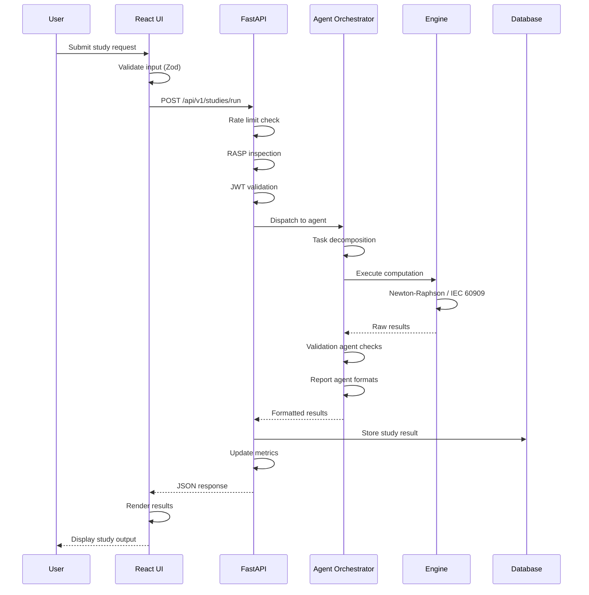
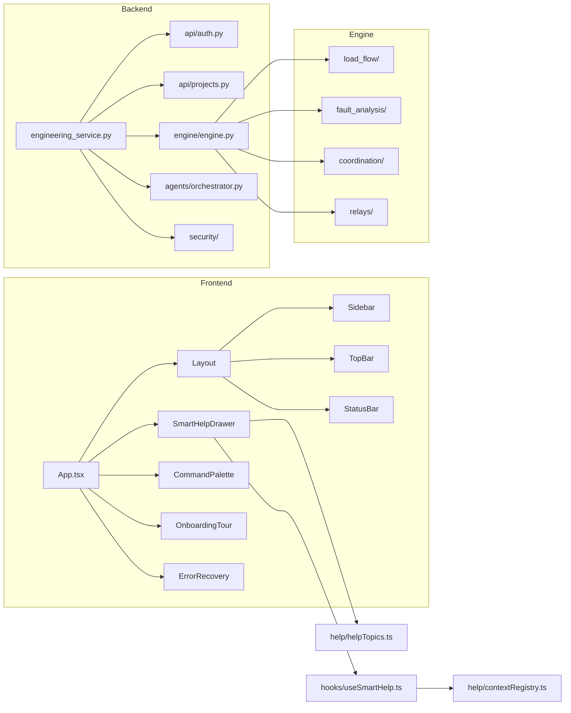

# Architecture — AhmedETAP

## System Architecture

```mermaid
graph TB
    subgraph "Client Tier"
        WEB[Web Browser]
        DESKTOP[Electron Desktop]
        API_DOCS[Swagger / OpenAPI]
    end

    subgraph "Application Tier"
        FE[React 19 UI<br/>TypeScript + Tailwind]
        BE[FastAPI Engineering Service<br/>Python 3.13]
        WS[WebSocket<br/>Real-time Updates]
    end

    subgraph "AI Agent Tier"
        ORCH[Chief Orchestrator]
        AGENTS[23 Specialized Agents]
        PROMPTS[Prompt Management<br/>3-tier fallback]
        GUARDS[Guard Skills<br/>Code/Test/Docs]
    end

    subgraph "Computation Tier"
        LF[Load Flow<br/>NR/FD/DC-OPF]
        SC[Short Circuit<br/>IEC 60909]
        AF[Arc Flash<br/>IEEE 1584]
        HA[Harmonics<br/>IEEE 519]
        PC[Protection<br/>IEC 60255]
        OPF[Optimal Power Flow]
        MS[Motor Starting]
        ST[Stability]
    end

    subgraph "Integration Tier"
        ETAP[ETAP COM<br/>Windows Automation]
        GIS[ArcGIS / QGIS<br/>Spatial Data]
        SCADA[IEC 61850<br/>SCADA Model]
        DT[Digital Twin<br/>State Sync]
    end

    subgraph "Data Tier"
        PG[(PostgreSQL)]
        RD[(Redis Cache)]
        FS[(File System<br/>Reports/Exports)]
        KB[(Knowledge Base<br/>RAG)]
    end

    subgraph "Security Tier"
        AUTH[JWT + bcrypt]
        RBAC[RBAC 5 Roles]
        MFA[TOTP + WebAuthn]
        RASP[RASP Engine]
        VAULT[HashiCorp Vault]
        AUDIT[Audit Logging]
    end

    subgraph "Infrastructure Tier"
        DOCKER[Docker / Compose]
        K8S[Kubernetes / Helm]
        PROM[Prometheus + Grafana]
        NGINX[Nginx Reverse Proxy]
        HF[Hugging Face Spaces]
    end

    WEB --> FE
    DESKTOP --> FE
    API_DOCS --> BE
    FE --> BE
    FE --> WS
    BE --> ORCH
    ORCH --> AGENTS
    AGENTS --> PROMPTS
    AGENTS --> GUARDS
    ORCH --> LF
    ORCH --> SC
    ORCH --> AF
    ORCH --> HA
    ORCH --> PC
    ORCH --> OPF
    ORCH --> MS
    ORCH --> ST
    BE --> ETAP
    BE --> GIS
    BE --> SCADA
    BE --> DT
    BE --> PG
    BE --> RD
    BE --> FS
    BE --> KB
    BE --> AUTH
    AUTH --> RBAC
    AUTH --> MFA
    BE --> RASP
    BE --> VAULT
    BE --> AUDIT
    BE --> DOCKER
    DOCKER --> K8S
    BE --> PROM
    BE --> NGINX
    DOCKER --> HF
```

## Data Flow

```mermaid
sequenceDiagram
    participant U as User
    participant UI as React UI
    participant API as FastAPI
    participant AG as Agent Orchestrator
    participant EN as Engine
    participant DB as Database

    U->>UI: Submit study request
    UI->>UI: Validate input (Zod)
    UI->>API: POST /api/v1/studies/run
    API->>API: Rate limit check
    API->>API: RASP inspection
    API->>API: JWT validation
    API->>AG: Dispatch to agent
    AG->>AG: Task decomposition
    AG->>EN: Execute computation
    EN->>EN: Newton-Raphson / IEC 60909
    EN-->>AG: Raw results
    AG->>AG: Validation agent checks
    AG->>AG: Report agent formats
    AG-->>API: Formatted results
    API->>DB: Store study result
    API->>API: Update metrics
    API-->>UI: JSON response
    UI->>UI: Render results
    UI-->>U: Display study output
```

## Component Relationship

```mermaid
graph LR
    subgraph "Frontend"
        A[App.tsx] --> B[Layout]
        B --> C[Sidebar]
        B --> D[TopBar]
        B --> E[StatusBar]
        A --> F[SmartHelpDrawer]
        A --> G[CommandPalette]
        A --> H[OnboardingTour]
        A --> I[ErrorRecovery]
    end

    subgraph "Backend"
        J[engineering_service.py] --> K[api/auth.py]
        J --> L[api/projects.py]
        J --> M[engine/engine.py]
        J --> N[agents/orchestrator.py]
        J --> O[security/]
    end

    subgraph "Engine"
        M --> P[load_flow/]
        M --> Q[fault_analysis/]
        M --> R[coordination/]
        M --> S[relays/]
    end

    F --> T[help/helpTopics.ts]
    F --> U[hooks/useSmartHelp.ts]
    U --> V[help/contextRegistry.ts]
```
