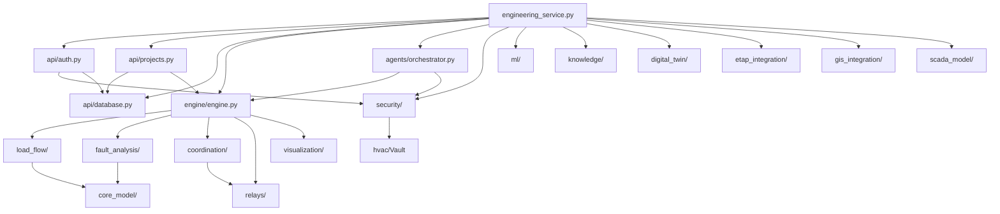

# Dependency Map — AhmedETAP

## Python Dependencies (requirements.txt)

### Core Scientific
| Package | Version | Used By | Purpose |
|---------|---------|---------|---------|
| numpy | >=1.21.0 | engine/, load_flow/, fault_analysis/ | Numerical computing |
| scipy | >=1.7.0 | engine/, load_flow/ | Scientific algorithms |
| pandas | >=1.3.0 | ml/, reporting/ | Data manipulation |
| matplotlib | >=3.4.0 | visualization/ | Charts |

### Web Framework
| Package | Version | Used By | Purpose |
|---------|---------|---------|---------|
| fastapi | >=0.104.0 | engineering_service.py | REST API |
| uvicorn | >=0.24.0 | engineering_service.py | ASGI server |
| pydantic | >=2.0.0 | engineering_service.py, api/ | Data validation |

### Security
| Package | Version | Used By | Purpose |
|---------|---------|---------|---------|
| bcrypt | >=4.0.0 | api/auth.py, security/ | Password hashing |
| PyJWT | >=2.6.0 | api/auth.py, security/ | JWT tokens |
| cryptography | >=36.0.0 | security/ | Encryption |
| hvac | >=2.0.0 | security/secrets_manager.py | HashiCorp Vault |
| pyotp | >=2.9.0 | security/mfa.py | TOTP MFA |

### Database
| Package | Version | Used By | Purpose |
|---------|---------|---------|---------|
| sqlalchemy[asyncio] | >=2.0.0 | api/database.py, api/auth.py | ORM |
| aiosqlite | >=0.19.0 | api/database.py | Async SQLite |
| redis | >=5.0.0 | engine/caching.py | Caching |

### ML/AI
| Package | Version | Used By | Purpose |
|---------|---------|---------|---------|
| scikit-learn | >=1.3.0 | ml/predictive.py | ML models |
| tensorflow | >=2.15.0 | ml/predictive.py | Deep learning |
| langwatch | >=0.1.0 | engineering_service.py | Observability |

### Document Processing
| Package | Version | Used By | Purpose |
|---------|---------|---------|---------|
| PyPDF2 | >=3.0.0 | reporting/ | PDF extraction |
| pdfplumber | >=0.7.0 | reporting/ | PDF parsing |
| python-docx | >=0.8.11 | reporting/ | DOCX generation |
| openpyxl | >=3.0.0 | reporting/ | Excel generation |
| reportlab | >=3.6.0 | reporting/ | PDF generation |

### Testing
| Package | Version | Used By | Purpose |
|---------|---------|---------|---------|
| pytest | >=7.0.0 | tests/ | Test framework |
| pytest-cov | >=3.0.0 | tests/ | Coverage |
| pytest-asyncio | >=0.23.0 | tests/ | Async tests |
| hypothesis | >=6.92.0 | tests/ | Property testing |

## Node.js Dependencies (ui/package.json)

### Core
| Package | Version | Purpose |
|---------|---------|---------|
| react | 19.2.6 | UI framework |
| react-dom | 19.2.6 | React DOM |
| react-router-dom | 7.17.0 | Routing |
| zustand | 5.0.14 | State management |

### UI
| Package | Version | Purpose |
|---------|---------|---------|
| tailwindcss | 4.3.0 | Styling |
| @tailwindcss/vite | 4.3.1 | Vite integration |
| framer-motion | 12.40.0 | Animations |
| recharts | 3.8.1 | Charts |
| lucide-react | 1.18.0 | Icons |
| clsx | 2.1.1 | Class names |
| tailwind-merge | 3.6.0 | Tailwind merge |

### i18n
| Package | Version | Purpose |
|---------|---------|---------|
| i18next | 26.3.1 | Internationalization |
| react-i18next | 17.0.8 | React i18n |
| i18next-browser-languagedetector | 8.2.1 | Language detection |

### Desktop
| Package | Version | Purpose |
|---------|---------|---------|
| electron | 42.3.3 | Desktop wrapper |
| electron-builder | 26.15.2 | Build/packaging |

### Dev
| Package | Version | Purpose |
|---------|---------|---------|
| vite | 8.0.12 | Build tool |
| typescript | 6.0.2 | Type checking |
| vitest | 4.1.8 | Testing |
| eslint | 10.3.0 | Linting |

## Module Interdependency Matrix

