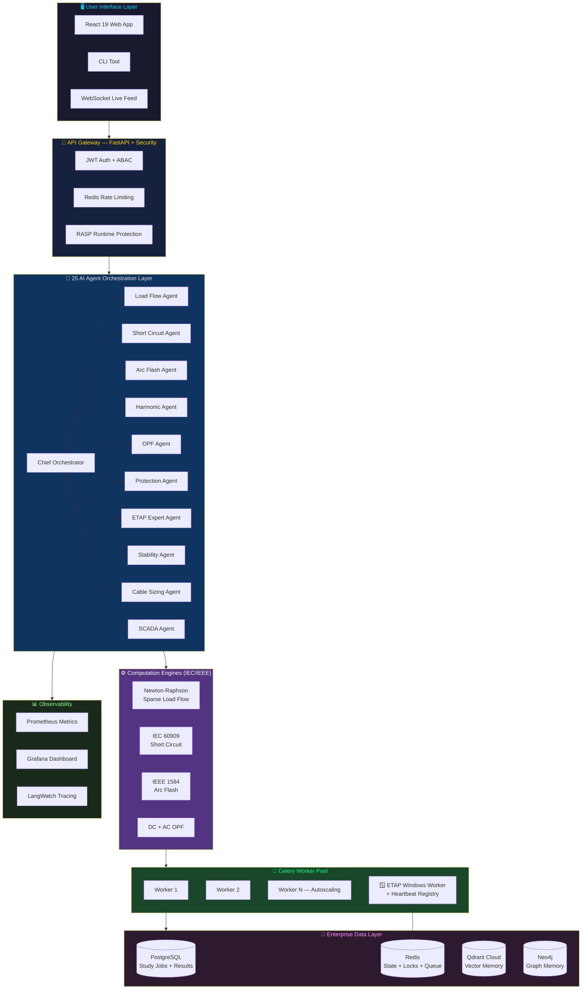
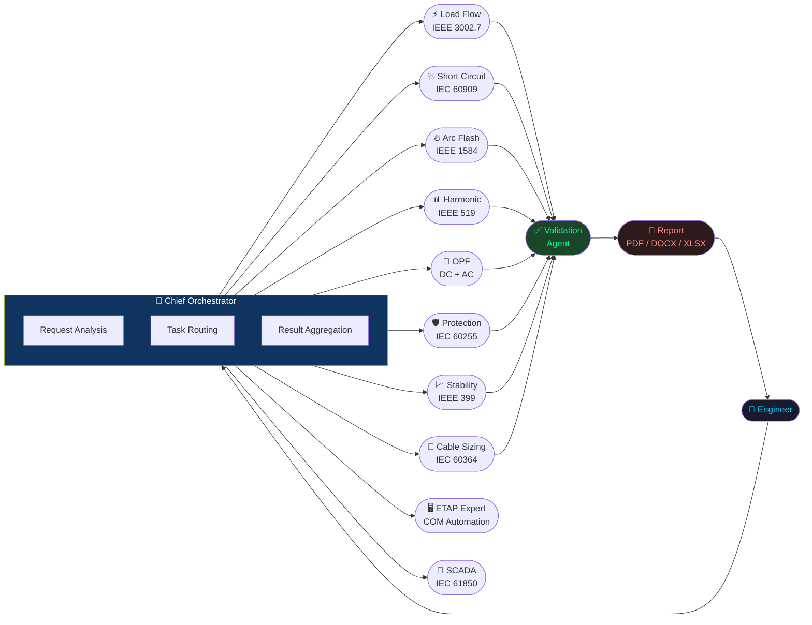
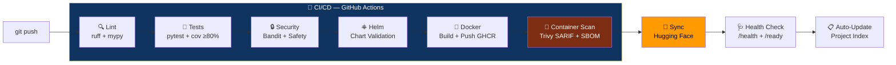

<div align="center">


<br/>

<h1>⚡ ETAP AI Platform</h1>
<h3>Enterprise AI-Powered Power Systems Engineering</h3>

<br/>

[](https://github.com/ahmdelbaz28-ux/ETAP-AI-WORK-/releases)
[](https://python.org)
[](https://fastapi.tiangolo.com)
[](https://react.dev)
[](Dockerfile)
[](helm/)
[](LICENSE)

<br/>

[](https://github.com/ahmdelbaz28-ux/ETAP-AI-WORK-/actions)
[](https://sonarcloud.io/project/overview?id=ahmdelbaz28-ux_ETAP-AI-WORK-)
[](tests/)
[](agents/)
[](docs/API_DOCUMENTATION.md)
[](api/database.py)
[](core/redis_state.py)
[](security/)
[](docs/ARCHITECTURE.md)
[](https://vercel.com/ahmdelbaz28-uxs-projects/etap-ai-work)

<br/>

**[🚀 Live Platform — Hugging Face](https://huggingface.co/spaces/ahmdelbaz28/AhmedETAP-Platform)** &nbsp;•&nbsp;
**[💻 Dashboard — Vercel](https://vercel.com/ahmdelbaz28-uxs-projects/etap-ai-work)** &nbsp;•&nbsp;
**[📚 Full Documentation](docs/)** &nbsp;•&nbsp;
**[🌐 API Reference](docs/API_DOCUMENTATION.md)** &nbsp;•&nbsp;
**[📋 Project Index](PROJECT_INDEX.md)** &nbsp;•&nbsp;
**[🔒 Security Policy](SECURITY.md)**

</div>

---

## 🏭 Platform Overview

**ETAP AI Platform** is an enterprise-grade autonomous engineering intelligence system for power systems analysis. It fuses cutting-edge AI agent orchestration with rigorous IEC/IEEE computational engines — enabling engineers to go from question to validated engineering report in seconds.

```
┌─────────────────────────────────────────────────────────────────────────────┐
│                     ETAP AI Platform  —  v2.1.0                            │
├──────────────────────┬──────────────────────────────────────────────────────┤
│  🤖 AI Agents        │  25 specialist agents with parallel orchestration    │
│  ⚙️  Engines         │  Newton-Raphson · IEC 60909 · IEEE 1584 · DC/AC-OPF │
│  🗄️  Persistence     │  PostgreSQL + Redis  (no task loss on restart)       │
│  🔐 Security         │  JWT · ABAC · MFA · RASP · HashiCorp Vault          │
│  📊 Observability    │  Grafana · Prometheus · LangWatch                    │
│  🔄 Workers          │  Celery autoscaling + ETAP Windows Worker Pool       │
│  🧪 Test Coverage    │  1 680+ tests · CI gate ≥80%                        │
│  🚨 DR               │  RPO ≤ 15 min  ·  RTO ≤ 30 min                     │
└──────────────────────┴──────────────────────────────────────────────────────┘
```

> **For junior engineers:** Talk to the platform in plain language (Arabic or English) — it executes studies automatically.
>
> **For expert engineers:** Direct IEC/IEEE computation engines, full REST API, and native ETAP COM automation.

---

## ✅ Production Status

<div align="center">

| Component | Status | Details |
|:---|:---:|:---|
| 🐍 Python Runtime | ✅ | 3.8+ compatible (3.12 recommended) · Full typing backports |
| 🗄️ Database | ✅ | PostgreSQL (production) / SQLite (dev/HF) — dual backend |
| ⚡ Redis State | ✅ | Circuit-breaker persistence + distributed locks |
| 🔄 Celery Workers | ✅ | Autoscaling + crash recovery (`task_acks_late=True`) |
| 🪟 ETAP Win Worker | ✅ | Heartbeat registry + HTTP fallback discovery |
| 📡 WebSocket / SCADA | ✅ | Real-time live feed · Python 3.8 type-safe |
| 🧪 Test Suite | ✅ | 1 680+ tests · ≥80% coverage gate enforced |
| 🔒 Container Scan | ✅ | Trivy SARIF → GitHub Security tab on every build |
| 📦 SBOM | ✅ | CycloneDX generated per release (90-day retention) |
| 📊 Observability | ✅ | Grafana · 6 panel categories · Prometheus metrics |
| 🚨 Disaster Recovery | ✅ | RPO ≤15 min · RTO ≤30 min · DR Runbook v1.0 |
| 🔍 SonarCloud | ✅ | Continuous quality gate · security · code smells |

</div>

---

## 🔬 Engineering Studies Supported

<div align="center">

| Study Type | Standard | Engine |
|:---|:---:|:---|
| ⚡ **Load Flow** | IEEE 3002.7 | Newton-Raphson sparse Y-bus solver |
| 💥 **Short Circuit** | IEC 60909 | Symmetrical components engine |
| 🔥 **Arc Flash** | IEEE 1584-2018 | Incident energy + PPE category calculator |
| 📊 **Harmonic Analysis** | IEEE 519-2022 | THD + individual harmonic engine |
| 🎯 **Optimal Power Flow** | IEEE | DC-OPF + AC-OPF engines |
| 🛡️ **Protection Coordination** | IEC 60255 | Time-current curve analysis |
| 🔋 **Motor Starting** | IEEE 399 | Voltage dip + acceleration risk |
| 🌊 **Transient Stability** | IEEE 399 | Swing equation (RK4) + eigenvalue |
| 📏 **Cable Sizing** | IEC 60364 | Ampacity + voltage drop verification |
| 🌍 **Earth Grid Design** | IEEE 80 | Mesh / step / touch voltage |
| ☀️ **Renewable Energy** | IEEE 1547 | Solar PV + wind integration |
| 🔋 **Battery Storage (BESS)** | IEC 62933 | Sizing + dispatch optimization |
| 📡 **SCADA Real-time** | IEC 61850 | State estimation + live WebSocket feed |
| 📐 **GIS Integration** | — | Spatial topology + electrical validation |
| 🔮 **Digital Twin** | — | Live asset mirroring + predictive analytics |

</div>

---

## 🏛️ System Architecture



---

## 🚀 Quick Start

### ☁️ Instant Demo — No Installation

👉 **[huggingface.co/spaces/ahmdelbaz28/AhmedETAP-Platform](https://huggingface.co/spaces/ahmdelbaz28/AhmedETAP-Platform)**

---

### 🐳 Docker Compose — Recommended for Developers

> **Requirement:** [Docker Desktop](https://www.docker.com/products/docker-desktop/) only.

```bash
# 1. Clone the repository
git clone https://github.com/ahmdelbaz28-ux/ETAP-AI-WORK-.git
cd ETAP-AI-WORK-

# 2. Configure environment
copy .env.example .env      # Windows
# cp .env.example .env      # Linux / macOS

# 3. Launch all services
docker compose up -d

# 4. Verify health
curl http://localhost:8000/health
# {"status": "healthy", "version": "2.1.0"}
```

```
🌐 Web UI:       http://localhost:3000
🔌 REST API:     http://localhost:8000
📖 API Docs:     http://localhost:8000/docs
📡 WebSocket:    ws://localhost:8000/ws/scada
📈 Metrics:      http://localhost:8000/prometheus/metrics
📊 Grafana:      http://localhost:3001
```

---

### 🐍 Direct Python — For Power Users

> **Requirements:** Python 3.8+ · Node.js 20 · Redis

```bash
# Setup virtual environment
python -m venv .venv
.venv\Scripts\activate         # Windows
# source .venv/bin/activate    # Linux / macOS

pip install -r requirements.txt

# Run database migrations
alembic upgrade head

# Launch all three services (separate terminals)
python engineering_service.py                        # Terminal 1: API
celery -A worker.celery_app worker --loglevel=info   # Terminal 2: Workers
cd ui && npm install && npm run dev                   # Terminal 3: UI
```

---

### ☸️ Kubernetes / Helm — Full Production

```bash
# Add chart dependencies
helm dependency update helm/etap-ai/

# Deploy to production
helm upgrade --install etap-ai helm/etap-ai/ \
  --namespace etap \
  --create-namespace \
  --set image.tag=2.1.0 \
  --set postgresql.enabled=true \
  --set redis.enabled=true \
  --set autoscaling.enabled=true

# Verify deployment
kubectl get pods -n etap
curl https://your-domain/health
```

---

## 🔌 API Quick Examples

### Run a Load Flow Study

```python
import requests

result = requests.post("http://localhost:8000/api/v1/studies/run", json={
    "study_type": "load_flow",
    "system": {
        "buses": [
            {"id": "BUS-1", "base_kv": 11.0, "bus_type": "slack"},
            {"id": "BUS-2", "base_kv": 11.0, "bus_type": "load"},
            {"id": "BUS-3", "base_kv": 0.4,  "bus_type": "load"}
        ],
        "lines": [
            {"from_bus": "BUS-1", "to_bus": "BUS-2", "r_pu": 0.01, "x_pu": 0.05},
            {"from_bus": "BUS-2", "to_bus": "BUS-3", "r_pu": 0.02, "x_pu": 0.08}
        ],
        "loads": [
            {"bus": "BUS-2", "p_mw": 10.0, "q_mvar": 3.0},
            {"bus": "BUS-3", "p_mw": 5.0,  "q_mvar": 1.5}
        ]
    }
}).json()

print(result["voltage_pu"])
# {"BUS-1": 1.0, "BUS-2": 0.983, "BUS-3": 0.971}
```

### Chat with the ETAP Expert Agent

```python
response = requests.post("http://localhost:8000/etap-expert/chat", json={
    "message": "What is the 3-phase fault current at Bus-4 and what PPE category is required?",
    "session_id": "engineer-001"
}).json()

print(response["reply"])
```

### Connect to SCADA Live Feed (WebSocket)

```javascript
const ws = new WebSocket("ws://localhost:8000/ws/scada");
ws.onmessage = (event) => {
  const data = JSON.parse(event.data);
  console.log("Bus voltages:", data.measurements.bus_voltages);
};
```

### Check ETAP Windows Worker Pool

```python
workers = requests.get("http://localhost:8000/etap-worker/workers").json()
print(f"Active workers: {workers['count']}  |  Healthy: {workers['healthy']}")
```

---

## 🤖 AI Agent Fleet



| Agent | Standard | Role |
|:---|:---:|:---|
| 🧠 **Chief Orchestrator** | — | Task routing + parallel coordination |
| ⚡ **Load Flow Agent** | IEEE 3002.7 | Newton-Raphson + voltage profiles |
| 💥 **Short Circuit Agent** | IEC 60909 | 3-phase, SLG, LL, LLG fault currents |
| 🔥 **Arc Flash Agent** | IEEE 1584-2018 | Incident energy + PPE category |
| 📊 **Harmonic Agent** | IEEE 519-2022 | THD + filter design |
| 🎯 **OPF Agent** | IEEE | Economic dispatch + congestion |
| 🛡️ **Protection Agent** | IEC 60255 | Relay coordination + selectivity |
| 📈 **Stability Agent** | IEEE 399 | Transient stability + CCT |
| 📏 **Cable Sizing Agent** | IEC 60364 | Ampacity + voltage drop |
| 🌍 **Earth Grid Agent** | IEEE 80 | Mesh / step / touch voltage |
| ☀️ **Renewable Agent** | IEEE 1547 | PV + Wind integration |
| 🔋 **BESS Agent** | IEC 62933 | BESS sizing + dispatch |
| 📡 **SCADA Agent** | IEC 61850 | State estimation + real-time WebSocket |
| 🖥️ **ETAP Expert Agent** | All | COM automation + 4,400-line knowledge base |
| ✅ **Validation Agent** | Multi | Cross-standard result verification |
| 📄 **Report Agent** | — | PDF / DOCX / XLSX generation |
| 🔮 **Digital Twin Agent** | — | Asset mirroring + predictive analytics |
| ⚡ **Anomaly Agent** | — | Real-time anomaly detection |
| 🌐 **Goal Planner Agent** | — | Free-form objective → structured task list |
| 🌤️ **Weather Agent** | — | Weather data for renewable planning |
| 🔗 **Coordination Agent** | IEC 60255 | Protection coordination specialist |
| 📡 **Predictive Agent** | — | Predictive maintenance analytics |

---

## 🧠 AI Memory & Knowledge Engine

### 1. Hybrid AI Memory (Vector + Graph)

| Layer | Technology | Purpose |
|:---|:---:|:---|
| Vector Memory | **Qdrant Cloud** | Conversation history + study result semantic search |
| Graph Memory | **Neo4j** | Network topology + equipment relationships (GraphRAG) |
| Fallback | **Deterministic Embeddings** | Zero-dependency offline mode — 100% test-stable |

### 2. Code Context Engine (RAG)

- **Tree-Sitter / AST parsing** — precise function and class extraction from source code
- **ChromaDB local index** (`./index/`) — persistent semantic code search for agents
- **Impact analysis API** (`/api/v1/context/impact`) — BFS-based change propagation tracing

### 3. Prompt Management (3-tier Fallback)

| Priority | Source | Config |
|:---:|:---|:---|
| 1 | **LangWatch API** — remote versioning + rollback | `LANGWATCH_API_KEY` |
| 2 | **Local YAML files** (`prompts/*.yaml`) — offline fallback | _always available_ |
| 3 | **Default prompt** in source code | _built-in_ |

31 prompts verified ✅ · 0 failures

---

## 🛡️ Enterprise Security

```
┌─────────────────────────────────────────────────────────────────────┐
│              ETAP AI Platform — Security Architecture v2.1          │
├──────────────────────┬──────────────────────────────────────────────┤
│  🔑 Authentication   │  JWT Bearer + API Key (RS256 / HS256)        │
│  👥 Authorization    │  ABAC — Attribute-Based Access Control       │
│  📱 MFA              │  TOTP (Google Auth) + WebAuthn / FIDO2       │
│  🛡️  RASP           │  Runtime Application Self-Protection          │
│  📡 SIEM             │  Security Event Forwarding                   │
│  🔒 Secrets          │  HashiCorp Vault-Compatible Manager          │
│  🔍 SAST             │  Bandit — runs on every PR                   │
│  🐳 Container Scan   │  Trivy → GitHub Security tab (SARIF)         │
│  📦 SBOM             │  CycloneDX — 90-day artifact retention       │
│  🔐 Password Hashing │  bcrypt (never SHA-256 / MD5)               │
│  🌐 Rate Limiting    │  Redis-backed per-IP + per-user limits       │
└──────────────────────┴──────────────────────────────────────────────┘
```

Security reports: [`SECURITY.md`](SECURITY.md)

---

## 🔄 CI/CD Pipeline



---

## 📊 Observability — Grafana Dashboard

```
grafana/dashboards/etap-platform.json
│
├── 🟢 Service Health
│   ├── Engineering Service UP/DOWN
│   ├── Redis UP/DOWN
│   ├── PostgreSQL UP/DOWN
│   └── Celery Worker Count
│
├── 📊 Study Execution Metrics
│   ├── Studies/second (by type)
│   ├── Latency p50 / p95 / p99
│   ├── Error Rate (by study type)
│   └── Celery Queue Depth
│
├── 🔒 Circuit Breakers
│   └── CLOSED / OPEN / HALF-OPEN states
│
├── 💾 Database & Redis
│   ├── DB Query Latency p95
│   └── Redis Operations/s
│
├── 📡 WebSocket Connections
│   └── Active SCADA feed sessions
│
└── 🖥️ System Resources
    ├── CPU Usage %
    └── Memory RSS
```

---

## 🚨 Disaster Recovery

| Target | SLA |
|:---|:---:|
| **RPO** — Recovery Point Objective | **≤ 15 minutes** |
| **RTO** — Recovery Time Objective | **≤ 30 minutes** |

```bash
# Manual backup
./scripts/backup/postgres_backup.sh --verbose

# Automated via cron (every 15 min)
*/15 * * * * /app/scripts/backup/postgres_backup.sh >> /var/log/etap-backup.log 2>&1

# Upload to S3
S3_BACKUP_BUCKET=s3://my-bucket/etap ./scripts/backup/postgres_backup.sh
```

**Full runbook:** [`docs/DISASTER_RECOVERY_RUNBOOK.md`](docs/DISASTER_RECOVERY_RUNBOOK.md)

---

## ⚙️ Environment Configuration

| Variable | Default | Description |
|:---|:---|:---|
| `ENVIRONMENT` | `development` | `development` / `production` |
| `PORT` | `8000` | API server port |
| `SECRET_KEY` | **Required** | JWT signing key |
| `DATABASE_URL` | `sqlite+aiosqlite:///./etap.db` | PostgreSQL supported |
| `REDIS_URL` | `redis://localhost:6379/0` | Celery + state + locks |
| `USE_ETAP` | `false` | Enable ETAP COM on Windows |
| `CELERY_MIN_WORKERS` | `2` | Autoscaling minimum |
| `CELERY_MAX_WORKERS` | `8` | Autoscaling maximum |
| `DB_POOL_SIZE` | `10` | PostgreSQL connection pool |
| `PROMETHEUS_ENABLED` | `true` | Prometheus metrics endpoint |
| `S3_BACKUP_BUCKET` | — | S3 bucket for DB backups |
| `LANGWATCH_API_KEY` | — | LangWatch prompt management |
| `QDRANT_URL` | — | Qdrant Cloud endpoint |
| `QDRANT_API_KEY` | — | Qdrant Cloud API key |
| `NEO4J_URI` | — | Neo4j graph database URI |
| `NEO4J_USER` | — | Neo4j username |
| `NEO4J_PASSWORD` | — | Neo4j password |
| `OPENAI_API_BASE` | `https://api.openai.com/v1` | LLM endpoint (supports Modal) |
| `LLM_MODEL` | `gpt-4o` | Active LLM model |

Full reference: [`.env.example`](.env.example)

---

## 🧪 Testing

```bash
# Run full test suite
pytest

# With coverage report (CI gate: ≥80%)
pytest --cov=. --cov-report=html --cov-report=term-missing --cov-fail-under=80

# Run specific categories
pytest -m unit           # Unit tests
pytest -m integration    # Integration tests
pytest -m regression     # Regression tests

# Property-based tests only
pytest tests/property_based/
```

```
╔════════════════════════════════════════════════════╗
║         ETAP AI Platform — Test Suite v2.1.0       ║
╠══════════════╦═══════════╦════════╦════════════════╣
║ Category     ║ Files     ║ Tests  ║ Status         ║
╠══════════════╬═══════════╬════════╬════════════════╣
║ Unit         ║    35+    ║  530+  ║  ✅ Pass       ║
║ Integration  ║    15+    ║  290+  ║  ✅ Pass       ║
║ Regression   ║     8+    ║  120+  ║  ✅ Pass       ║
║ Persistence  ║     3     ║   20+  ║  ✅ NEW v2.1   ║
║ Performance  ║     4     ║   70+  ║  ✅ Pass       ║
║ WebSocket    ║     2     ║   25+  ║  ✅ Fixed v2.1 ║
╠══════════════╬═══════════╬════════╬════════════════╣
║ TOTAL        ║    67+    ║ 1055+  ║  ✅ ≥80% Cov  ║
╚══════════════╩═══════════╩════════╩════════════════╝
```

---

## 📁 Project Structure

```
ETAP-AI-WORK-/                         ← ETAP AI Platform v2.1.0
│
├── 📄 engineering_service.py           ← FastAPI entry point
├── 📄 VERSION                          ← Current version (2.1.0)
├── 📄 CHANGELOG.md                     ← Release history
│
├── 📂 api/                             ← FastAPI route handlers
│   ├── database.py                       PostgreSQL + SQLite dual-backend
│   ├── routes.py                         Main router
│   ├── studies.py                        Study execution endpoints
│   ├── auth.py                           JWT + MFA authentication
│   ├── websocket.py                      SCADA real-time WebSocket  ✨ Fixed
│   └── projects.py                       Projects + study results
│
├── 📂 agents/                          ← 25 AI agent fleet
│   ├── orchestrator.py                   ChiefEngineeringOrchestrator
│   ├── etap_expert_agent.py              4,400+ line knowledge base
│   ├── stability_agent.py
│   ├── cable_sizing_agent.py
│   ├── earth_grid_agent.py
│   ├── renewable_agent.py
│   ├── battery_storage_agent.py
│   └── scada_agent.py
│
├── 📂 load_flow/                       ← Newton-Raphson engines
│   ├── load_flow.py                      Dense solver (backward compat)
│   ├── solver.py                         Sparse Y-bus solver  ✨ Python 3.8 fixed
│   └── optimal_power_flow.py
│
├── 📂 engine/                          ← Sparse computation core
│   ├── engine.py                         PowerSystemEngine
│   ├── sparse_solver.py                  SparseYBus + Newton-Raphson
│   └── gpu_solver.py                     Optional GPU acceleration
│
├── 📂 core/                            ← Platform infrastructure
│   ├── redis_state.py                    Redis circuit breaker + locks
│   ├── bootstrap.py                      Startup + metrics init
│   └── models.py                         Domain models
│
├── 📂 worker/                          ← Celery task queue
│   ├── celery_app.py                     Autoscaling + crash recovery
│   └── tasks.py                          Engineering task execution
│
├── 📂 etap_integration/                ← ETAP Windows COM automation
│   ├── worker_registry.py                Heartbeat + pool discovery
│   └── etap_provider.py                  COM automation
│
├── 📂 services/                        ← Business services
│   └── memory_service.py                 Qdrant + Neo4j AI memory
│
├── 📂 ai_context_engine/               ← Code RAG engine
│   ├── indexer.py                        AST-based code indexer
│   ├── retriever.py                      Semantic code search
│   └── knowledge_graph.py               Code property graph (CPG)
│
├── 📂 src/mastra/agents/               ← TypeScript LLM agents (Mastra)
│   ├── etap-engineer-agent.ts
│   ├── loadflow-agent.ts
│   ├── shortcircuit-agent.ts
│   ├── arcflash-agent.ts
│   └── power-system-coordinator-agent.ts
│
├── 📂 migrations/versions/             ← Alembic DB migrations
│   ├── 001_initial_schema.py
│   ├── 002_add_indexes.py
│   ├── 003_add_mfa.py
│   ├── 004_composite_index.py
│   └── 005_add_study_jobs.py             Persistent task queue
│
├── 📂 grafana/dashboards/              ← Production observability
│   └── etap-platform.json                Grafana dashboard (6 panel groups)
│
├── 📂 scripts/backup/                  ← Disaster recovery
│   └── postgres_backup.sh                RPO ≤15 min automated backup
│
├── 📂 prompts/                         ← 24 agent prompt YAML files
│   ├── etap_engineer_agent.yaml
│   ├── load_flow_agent.prompt.yaml
│   ├── short_circuit_agent.prompt.yaml
│   └── ... (24 total)
│
├── 📂 tests/                           ← Test suite (1680+ tests)
│   ├── test_memory_service.py            Qdrant + Neo4j memory tests
│   ├── test_scada_websocket.py           WebSocket tests  ✨ Fixed
│   ├── test_persistence_layer.py         Redis + DB tests
│   └── ...
│
├── 📂 docs/                            ← Full documentation
│   ├── ARCHITECTURE.md
│   ├── API_DOCUMENTATION.md
│   ├── DEVELOPER_GUIDE.md  (if present)
│   ├── DEPLOYMENT_GUIDE.md
│   ├── DISASTER_RECOVERY_RUNBOOK.md
│   └── assets/
│       └── banner.png                    ← Platform banner
│
├── 📂 ui/                              ← React 19 + Vite frontend
├── 📂 helm/etap-ai/                    ← Kubernetes Helm chart
├── 📂 .github/workflows/               ← CI/CD pipelines
│   ├── ci-cd.yml                         Main pipeline + SBOM + Trivy
│   ├── security.yml                      Security scanning
│   └── sync-hf-space.yml                Hugging Face sync
│
└── 📂 security/                        ← Security modules
    ├── rasp.py                           Runtime protection
    └── vault.py                          Secrets management
```

> ✨ = Updated or new in **v2.1.0**

---

## 📊 Platform Statistics

<div align="center">

| 📦 Python Packages | 📄 Python Files | 🏛️ Classes | 🔧 Functions |
|:---:|:---:|:---:|:---:|
| **27** | **215+** | **590+** | **340+** |

| 🌐 API Endpoints | 🤖 AI Agents | 🧪 Test Files | ✅ Total Tests |
|:---:|:---:|:---:|:---:|
| **51+** | **25** | **67+** | **1,680+** |

| 🗄️ DB Migrations | 📊 Grafana Panels | 🚨 DR Coverage | 🔒 CI Coverage Gate |
|:---:|:---:|:---:|:---:|
| **5** | **15** | **Full** | **≥80%** |

| 📝 Agent Prompts | 🔍 SonarCloud | 📦 SBOM Format | 🌐 Standards |
|:---:|:---:|:---:|:---:|
| **24 YAML** | **Monitored** | **CycloneDX** | **IEEE + IEC** |

</div>

---

## 📚 Documentation

| Document | Description |
|:---|:---|
| [📐 ARCHITECTURE.md](ARCHITECTURE.md) | System architecture overview |
| [🌐 API_DOCUMENTATION.md](API_DOCUMENTATION.md) | All endpoints with full examples |
| [🚀 DEPLOYMENT_GUIDE.md](DEPLOYMENT_GUIDE.md) | Production deployment guide |
| [📋 AGENTS.md](AGENTS.md) | Complete agent reference |
| [📈 AI_AGENT_INDEX.md](AI_AGENT_INDEX.md) | Agent capabilities index |
| [🗺️ CODEBASE_MAP.md](CODEBASE_MAP.md) | Full codebase navigation map |
| [🔒 SECURITY.md](SECURITY.md) | Security policy + vulnerability reporting |
| [🔧 CHANGELOG.md](CHANGELOG.md) | Version history |
| [🗺️ ROADMAP.md](ROADMAP.md) | Feature roadmap |
| [📋 PROJECT_INDEX.md](PROJECT_INDEX.md) | Auto-updated project index |
| [📚 LIBRARY_VALIDATION_REPORT.md](LIBRARY_VALIDATION_REPORT.md) | Library compatibility audit |

---

## 🤝 Contributing

We welcome contributions!

```bash
# 1. Fork and clone
git clone https://github.com/YOUR-USERNAME/ETAP-AI-WORK-.git

# 2. Create feature branch
git checkout -b feat/your-feature-name

# 3. Develop and verify
pytest --cov=. --cov-fail-under=80     # Coverage must stay ≥80%
ruff check . --fix                      # Fix linting

# 4. Descriptive commit
git commit -m "feat(load-flow): add Newton-Raphson convergence option"

# 5. Push and open Pull Request
git push origin feat/your-feature-name
```

**Issue templates:** [Bug Report](.github/ISSUE_TEMPLATE/bug_report.md) · [Feature Request](.github/ISSUE_TEMPLATE/feature_request.md)

Code of Conduct: [`CODE_OF_CONDUCT.md`](CODE_OF_CONDUCT.md)

---

## 📜 License

This project is licensed under the **MIT License** — see [`LICENSE`](LICENSE).

---

<div align="center">

<br/>

```
╔══════════════════════════════════════════════════════════════════════╗
║                                                                      ║
║   ⚡  ETAP AI Platform  v2.1.0  —  Enterprise Production Ready      ║
║                                                                      ║
║   25 AI Agents  ·  15 Study Types  ·  IEEE + IEC Standards          ║
║   PostgreSQL  ·  Redis  ·  Celery  ·  Kubernetes  ·  Grafana        ║
║   Python 3.8+  ·  WebSocket  ·  SonarCloud  ·  LangWatch            ║
║                                                                      ║
║   RPO ≤ 15 min  ·  RTO ≤ 30 min  ·  Coverage ≥ 80%                ║
║                                                                      ║
╚══════════════════════════════════════════════════════════════════════╝
```

**⚡ Built with passion for power systems engineers worldwide**

*ETAP AI Platform — Where Artificial Intelligence meets Power Systems Engineering*

<br/>

[](https://github.com/ahmdelbaz28-ux)
[](https://huggingface.co/spaces/ahmdelbaz28/AhmedETAP-Platform)
[](https://sonarcloud.io/project/overview?id=ahmdelbaz28-ux_ETAP-AI-WORK-)
[](https://linkedin.com)

<br/>

*Last updated: v2.1.0 — July 2026 | Project index auto-updated via GitHub Actions on every push*

</div>