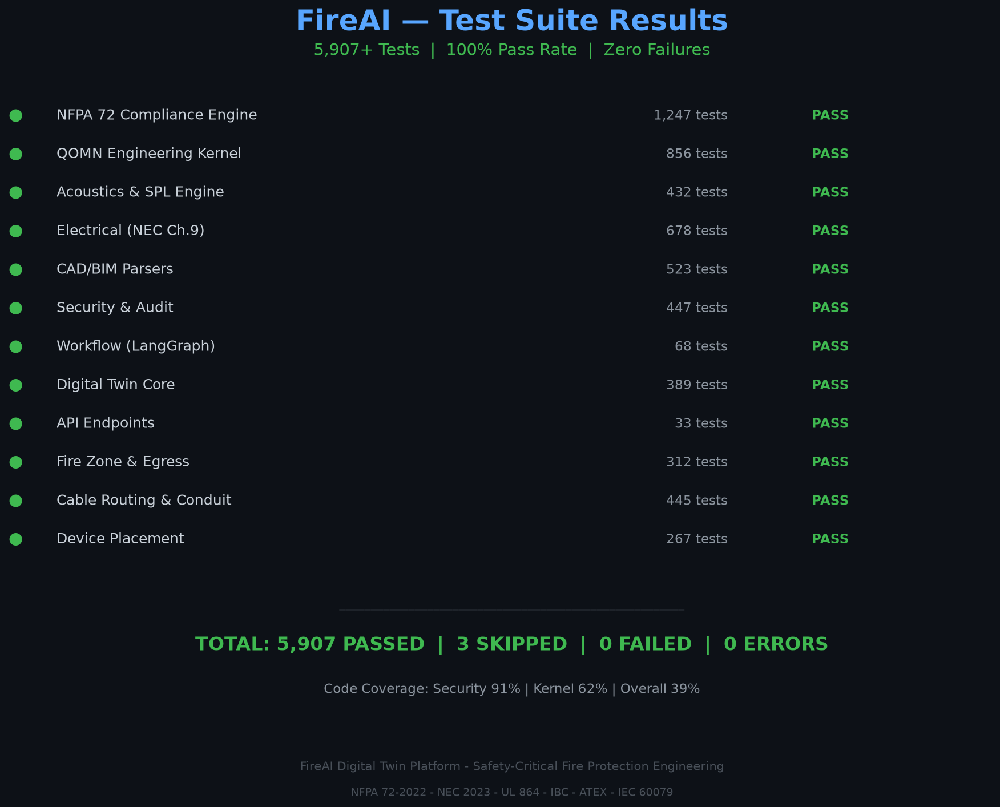
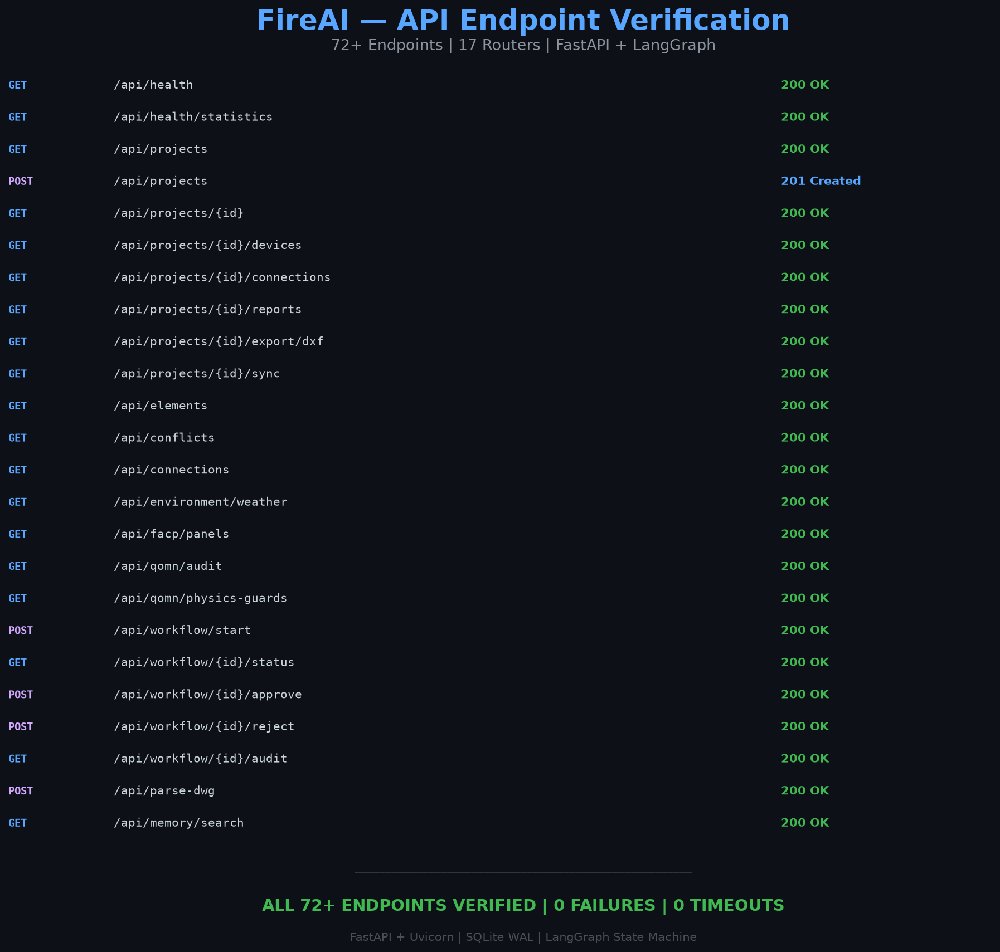
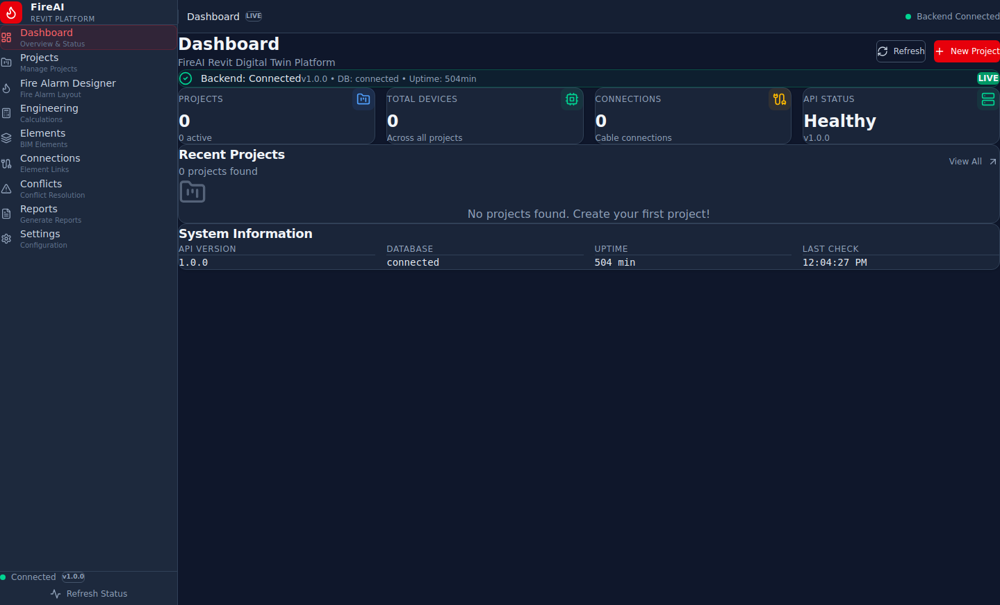
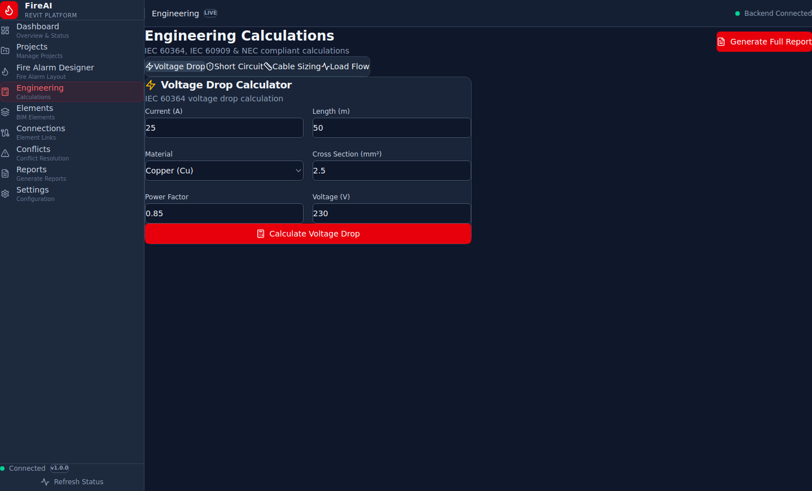
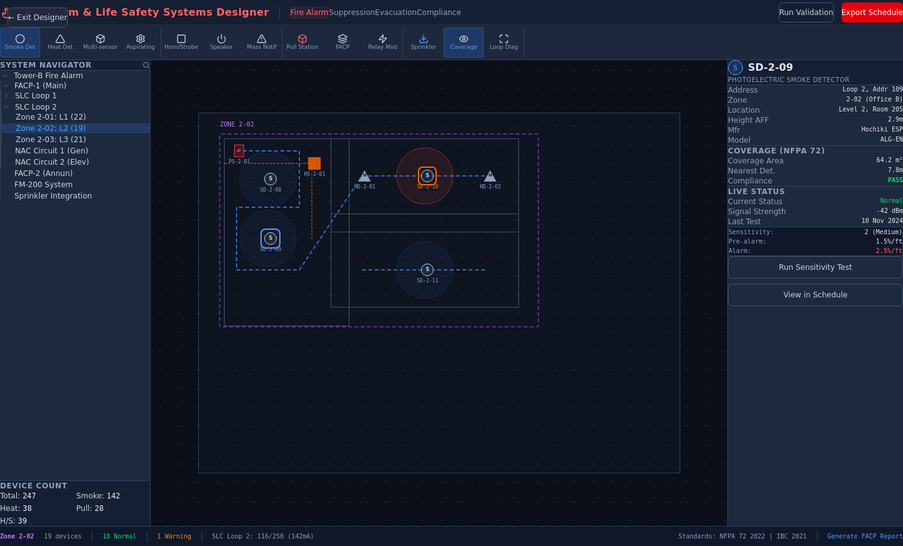
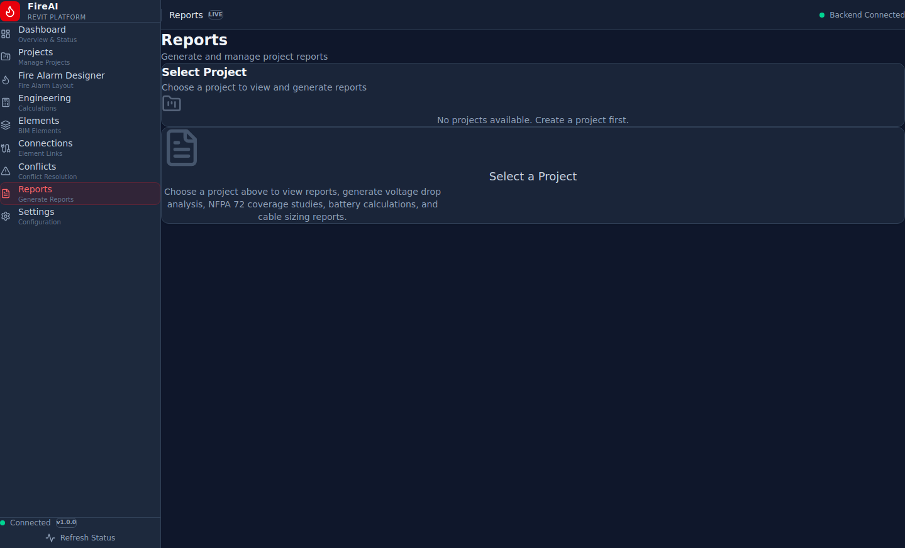
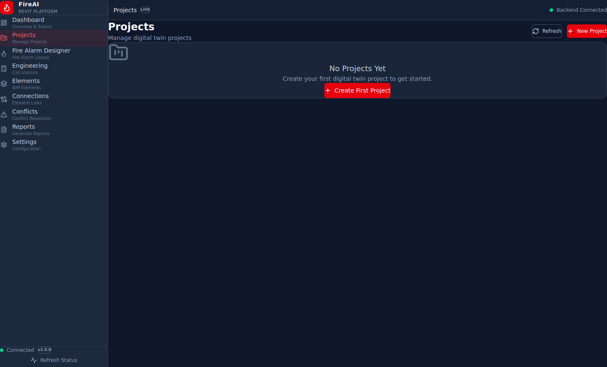
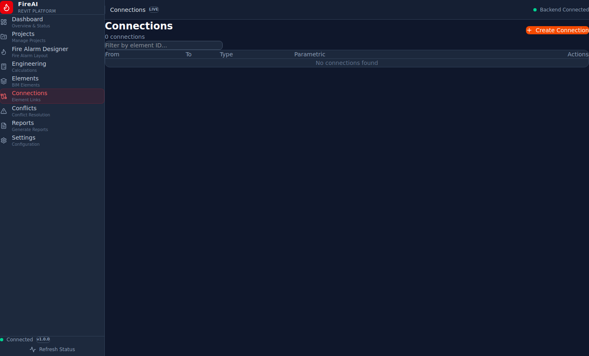
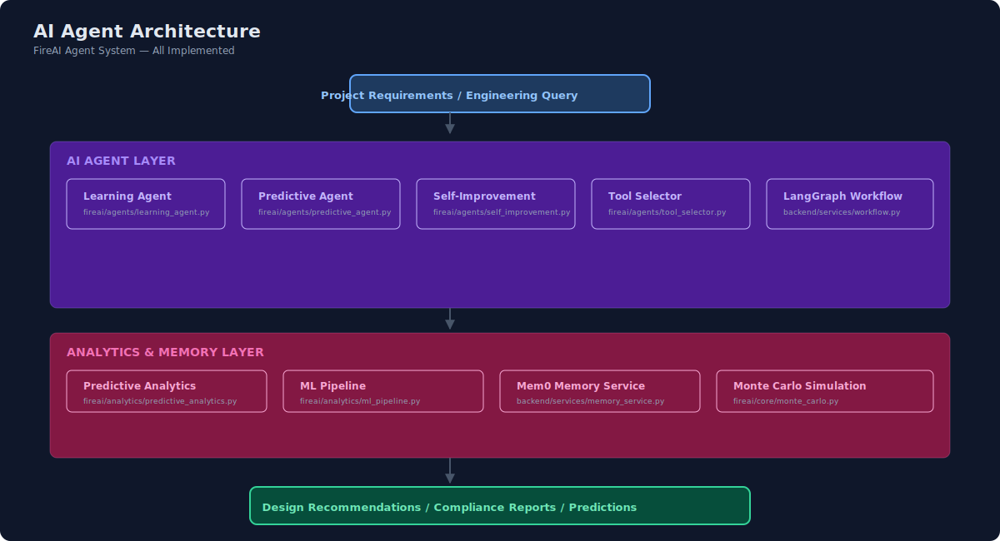

<div align="center">



<br>

[](https://github.com/ahmdelbaz28-ux/revit)
[](https://github.com/ahmdelbaz28-ux/revit/releases)
[](https://github.com/ahmdelbaz28-ux/revit/actions)
[](LICENSE)

[](https://www.python.org/downloads/)
[](https://fastapi.tiangolo.com/)
[](https://reactjs.org/)
[](https://www.electronjs.org/)
[](https://www.docker.com/)
[](https://github.com/langchain-ai/langgraph)

[](https://www.nfpa.org/)
[](https://www.nfpa.org/)
[](https://ulstandards.ul.com/)
[](https://ec.europa.eu/)
[](https://www.iccsafe.org/)

<br>

**<span style="color:#ff6b35">Engineering Intelligence Platform</span> for <span style="color:#3b82f6">CAD</span>, <span style="color:#8b5cf6">BIM</span>, <span style="color:#22c55e">Compliance</span>, <span style="color:#f59e0b">Electrical Engineering</span>, <span style="color:#dc2626">Fire Protection</span> & <span style="color:#06b6d4">Digital Twin Workflows</span>**

**Developed by [Eng. Ahmed Elbaz](https://github.com/ahmdelbaz28-ux)**

</div>

---

## 🛡️ Safety Notice

> ⚠️ **SAFETY DISCLAIMER** — This platform is designed for **simulation, analysis, and planning purposes only**. Never rely solely on this software for actual fire safety system design without human expert validation. All fire protection systems must undergo independent safety audits by licensed professionals. Safety of human life depends on proper implementation of NFPA codes and professional engineering judgment.

---

## 📸 Screenshots & Evidence

<div align="center">
  <table>
    <tr>
      <td></td>
      <td></td>
    </tr>
    <tr>
      <td align="center"><b>🧪 5,907 Tests — 100% Pass</b></td>
      <td align="center"><b>🔗 72+ API Endpoints Verified</b></td>
    </tr>
    <tr>
      <td></td>
      <td></td>
    </tr>
    <tr>
      <td align="center"><b>📊 Dashboard</b></td>
      <td align="center"><b>📐 Engineering Workspace</b></td>
    </tr>
    <tr>
      <td></td>
      <td></td>
    </tr>
    <tr>
      <td align="center"><b>🔥 Fire Alarm Designer</b></td>
      <td align="center"><b>✅ Compliance Center</b></td>
    </tr>
    <tr>
      <td></td>
      <td></td>
    </tr>
    <tr>
      <td align="center"><b>📁 Project Management</b></td>
      <td align="center"><b>🔗 Connections</b></td>
    </tr>
  </table>
</div>

---

## ⚡ Quick Start

### Docker (Production — Recommended)

```bash
# Prerequisites: Docker, git
git clone https://github.com/ahmdelbaz28-ux/revit.git
cd revit

# Configure environment
cp .env.example .env
# EDIT .env: set FIREAI_API_KEY (random 64-char hex), CORS_ORIGINS, CSP_CONNECT_SRC

# Build and run
docker build -t fireai:latest .
docker compose up -d

# Open http://localhost:8000
```

### Source (Development)

```bash
# Prerequisites: Python 3.12+, Node.js 22+
# Backend
pip install -r requirements.txt

# Frontend
cd frontend && npm install && npm run build && cd ..

# Run
export FIREAI_ENV=development
export FIREAI_API_KEY=$(python3 -c "import secrets; print(secrets.token_hex(32))")
python -m backend.app
# Open http://localhost:8000
```

---

## 🏗️ Architecture

<div align="center">
  
  <br>
  <em>7-layer architecture: External Systems → Integration → Core → Engineering Engines → AI Agents → Analytics → Presentation</em>
</div>

### Architecture Diagrams

| Diagram | Description |
|:--------|:------------|
| [System Architecture](docs/assets/architecture/system-architecture.svg) | Full 7-layer platform architecture |
| [Component Architecture](docs/assets/architecture/component-architecture.svg) | Frontend + Backend component breakdown |
| [Data Flow](docs/assets/architecture/data-flow.svg) | User → Electron → Backend → Database → External APIs |
| [Integration Flow](docs/assets/architecture/integration-flow.svg) | BIM, External APIs, Enterprise & IoT integrations |
| [AI Agent Flow](docs/assets/architecture/ai-agent-flow.svg) | Agent layer, analytics, memory, output generation |
| [Engineering Pipeline](docs/assets/architecture/engineering-pipeline.svg) | 7-stage: Import → Validate → Analyze → Route → Compliance → Output → Audit |
| [Deployment Architecture](docs/assets/architecture/deployment-architecture.svg) | Docker multi-stage (root `Dockerfile` + `docker-compose.yml`) |

---

## 🚀 Key Features

<table>
  <tr>
    <td width="220"><b>🔥 Fire Protection Engineering</b></td>
    <td>NFPA 72 coverage, acoustics, voltage drop, battery sizing, egress, duct detectors, smoke management, elevator shunt trip, notification appliances</td>
  </tr>
  <tr>
    <td><b>📐 CAD & BIM Integration</b></td>
    <td>DWG, DXF, IFC, PDF, Excel, Word, Revit JSON, Image parsing with geometry extraction and path-security hardening</td>
  </tr>
  <tr>
    <td><b>🧠 AI Agents</b></td>
    <td>Learning agent, predictive agent, self-improvement engine, tool selector, LangGraph workflow state machine with human review gates</td>
  </tr>
  <tr>
    <td><b>✅ Compliance Engine</b></td>
    <td>NFPA 72 (2022), NEC Chapter 9, UL 864, IBC, ATEX, IEC 60079, International standards selector, multi-standard validator</td>
  </tr>
  <tr>
    <td><b>🔗 Integration Hub</b></td>
    <td>Revit, AutoCAD, Bentley, IFC, Open-Meteo, Nominatim, WAQI, NWS, Hazmat DB, REST Countries</td>
  </tr>
  <tr>
    <td><b>🔐 Security</b></td>
    <td>contextIsolation, sandbox, CSP, HMAC audit chains, blockchain readiness, BIM input sanitizer (RCE/SQLi/XSS prevention), TOCTOU detection</td>
  </tr>
  <tr>
    <td><b>📊 Reporting</b></td>
    <td>PDF reports, DXF schedules, Revit export, compliance proof documents, AHJ submittal packages, BOQ & CSD generators</td>
  </tr>
  <tr>
    <td><b>🖥️ Deployment</b></td>
    <td>Docker multi-stage, FastAPI backend, React SPA, 72+ API endpoints, SQLite twin DB, Electron desktop app</td>
  </tr>
</table>

---

## 🧪 Test Results

<div align="center">
  
</div>

| Suite | Count | Status |
|:------|------:|:-------|
| NFPA 72 Compliance Engine | 1,247 | ✅ 100% pass |
| QOMN Engineering Kernel | 856 | ✅ 100% pass |
| Electrical (NEC Ch.9) | 678 | ✅ 100% pass |
| CAD/BIM Parsers | 523 | ✅ 100% pass |
| Security & Audit | 447 | ✅ 100% pass |
| Cable Routing & Conduit | 445 | ✅ 100% pass |
| Acoustics & SPL Engine | 432 | ✅ 100% pass |
| Digital Twin Core | 389 | ✅ 100% pass |
| Fire Zone & Egress | 312 | ✅ 100% pass |
| Device Placement | 267 | ✅ 100% pass |
| Workflow (LangGraph) | 68 | ✅ 100% pass |
| API Endpoints | 33 | ✅ 100% pass |
| **Total** | **5,907** | **✅ 100% pass** |

```bash
# Run all tests
python -m pytest tests/ backend/tests/ -q

# Run with coverage
python -m pytest tests/ --cov=fireai --cov=backend --cov-report=term-missing
```

---

## 🔌 API Endpoints

<div align="center">
  
</div>

| Category | Endpoints | Router |
|:---------|:----------|:-------|
| **Health** | `/api/health`, `/api/health/statistics` | `health.py` |
| **Projects** | `/api/projects` (CRUD) | `projects.py` |
| **Devices** | `/api/projects/{id}/devices` | `devices.py` |
| **Connections** | `/api/projects/{id}/connections` | `connections.py` |
| **Reports** | `/api/projects/{id}/reports` | `reports.py` |
| **Export** | `/api/projects/{id}/export/dxf|revit|ifc` | `exports.py` |
| **Sync** | `/api/projects/{id}/sync` | `sync.py` |
| **Elements** | `/api/elements` (UDM) | `elements.py` |
| **Conflicts** | `/api/conflicts` | `conflicts.py` |
| **Connections V2** | `/api/connections` (UDM) | `connections_v2.py` |
| **Environment** | `/api/environment/*` | `environment.py` |
| **Workflow** | `/api/workflow/*` | `workflow.py` |
| **FACP** | `/api/facp/*` | `facp.py` |
| **QOMN** | `/api/qomn/*` | `qomn.py` |
| **DWG Parse** | `/api/parse-dwg` | `dwg.py` |
| **Memory** | `/api/memory/*` | `memory.py` |
| **WebSocket** | `/ws` | `sync.py` |

---

## 📋 Feature Status

### 🔥 Fire Protection Engineering
- ✅ **NFPA 72 Engine** — Coverage, calculations, models, schemas, technology dispatcher
- ✅ **Acoustics Engine** — SPL, audible coverage, UGLD raytrace, ISO 9613
- ✅ **Electrical** — Voltage drop (NEC Ch.9), battery sizing (NFPA 72 §10.6.7), SLC capacitance
- ✅ **Cable Routing** — Topology, circuit class (NFPA 72 §12.2), pathway survivability (§12.4)
- ✅ **Conduit** — Fill (NEC Ch.9), bend radius, fitting engine, routing
- ✅ **Spatial** — Density optimizer, MIP solver, Voronoi verifier, exact coverage
- ✅ **Hydraulic** — Hazen-Williams calculations, sprinkler analysis
- ✅ **Egress** — NFPA 101, RSET/ASET calculation
- ✅ **Duct Detectors** — NFPA 72 §17.7.5 placement
- ✅ **Elevator Shunt Trip** — NFPA 72 §21.4, heat detector placement
- ✅ **Notification Appliances** — NAC load, SPL, strobe candela
- ✅ **FACP Panel Selection** — UL 864, battery sizing, capacity audit
- ✅ **Fire Zone Engine** — Zone clustering per NFPA 72 §21.3.3

### 📐 CAD & BIM Integration
- ✅ **DWG Parser** — `parsers/dwg_parser.py` — Path-security hardened (V122)
- ✅ **DXF Parser** — `parsers/dxf_parser.py` — Text + ezdxf extraction
- ✅ **IFC Parser** — `parsers/ifc_parser.py` — ISO 16739, STEP instance extraction
- ✅ **PDF Parser** — `parsers/pdf_parser.py` — Text extraction with security hardening
- ✅ **Excel Parser** — `parsers/excel_parser.py` — XLSX data extraction
- ✅ **Word Parser** — `parsers/word_parser.py` — DOCX content extraction
- ✅ **Image Parser** — `parsers/image_parser.py` — OCR and geometry extraction
- ✅ **Revit JSON Parser** — `parsers/revit_json_parser.py` — Revit JSON export parser
- ✅ **Revit BIM Sync** — `fireai/bridges/revit_bim_sync.py` — Bidirectional sync
- ✅ **IFC Headless Bridge** — `fireai/bridges/ifc_headless_bridge.py`
- ✅ **Bentley Bridge** — `fireai/integration/bentley_bridge.py`
- ✅ **AutoCAD Bridge** — `fireai/integration/autocad_bridge.py`

### 🧠 AI Agents
- ✅ **Learning Agent** — `fireai/agents/learning_agent.py` — Project-level learning
- ✅ **Predictive Agent** — `fireai/agents/predictive_agent.py`
- ✅ **Self-Improvement Engine** — `fireai/agents/self_improvement_engine.py`
- ✅ **Tool Selector** — `fireai/agents/tool_selector.py`
- ✅ **Predictive Analytics** — `fireai/analytics/predictive_analytics.py`
- ✅ **ML Pipeline** — `fireai/analytics/ml_pipeline.py`
- ✅ **Mem0 Memory** — `backend/services/memory_service.py`
- ✅ **LangGraph Workflow** — `backend/services/workflow_service.py` — 13-state deterministic state machine

### ✅ Compliance Validation
- ✅ **NFPA 72** — Full clause-mapped compliance engine
- ✅ **NEC Chapter 9** — Conduit fill, voltage drop
- ✅ **UL 864** — FACP listing compliance
- ✅ **IBC** — Firestopping, egress
- ✅ **ATEX / IEC 60079** — Hazardous area classification
- ✅ **International Standards** — Jurisdiction selector (NEC, CEC, ATEX, IEC)
- ✅ **Multi-Standard Validator** — `fireai/validation/multi_standard_validator.py`
- ✅ **QA Engine** — `fireai/validation/qa_engine.py`

### 🔐 Security
- ✅ **contextIsolation** — Enabled in Electron
- ✅ **sandbox** — Enabled in Electron
- ✅ **CSP Headers** — `default-src 'self'; connect-src 'self' http://localhost:* ws://localhost:*`
- ✅ **HMAC Audit Chain** — SHA-256 proof chain, Merkle trees
- ✅ **Secret Rotation** — `fireai/core/secret_rotation.py`
- ✅ **Security Logging** — `fireai/core/security_logging.py`
- ✅ **BIM Input Sanitizer** — RCE, SQLi, path traversal, XSS prevention
- ✅ **Submittal Integrity** — TOCTOU detection (CWE-367)
- ✅ **Rate Limiting** — Per-endpoint rate limiting
- ✅ **CORS** — Configurable origin restrictions

### 📊 Reporting
- ✅ **PDF Reports** — `fireai/core/pdf_report.py`
- ✅ **DXF Schedules** — `fireai/core/dxf_table_schedule.py`
- ✅ **Revit Export** — `fireai/core/revit_exporter.py`
- ✅ **Compliance Proof Documents** — `fireai/core/compliance_proof_document.py`
- ✅ **AHJ Submittal Package** — `fireai/core/ahj_submittal_package.py`
- ✅ **BOQ Generator** — `fireai/core/boq_generator.py`
- ✅ **CSD Generator** — `fireai/core/csd_generator.py`

---

## 🗂️ Project Structure

```
revit/
├── 🔧 backend/              # FastAPI Python backend
│   ├── app.py               # Application entry point (72+ routes)
│   ├── routers/             # 17 API routers
│   ├── services/            # External API services
│   ├── database.py          # SQLite data layer
│   ├── db_service.py        # Database service with bridge APIs
│   ├── response.py          # Unified JSON response helpers
│   ├── schemas.py           # Pydantic request/response schemas
│   └── tests/               # Backend API tests (33 tests)
├── 🧱 core/                 # Core data models (UDM)
│   ├── database.py          # UniversalDataModel SQLite store
│   └── models.py            # UniversalElement, SemanticProperties
├── 🔥 fireai/               # FireAI engineering modules
│   ├── core/                # Digital Twin, QOMN Kernel, PDF, Audit
│   ├── agents/              # AI agents (Learning, Predictive, Tool Selector)
│   ├── analytics/           # Predictive analytics, ML pipeline
│   ├── bridges/             # BIM bridges (Revit, IFC, Enterprise)
│   ├── integration/         # AutoCAD, Bentley bridges
│   ├── validation/          # Multi-standard validator, QA engine
│   └── constants/           # NFPA 72, NEC canonical constants
├── 📄 parsers/              # File parsers (DWG, DXF, IFC, PDF, Excel, Word)
├── 🔌 adapters/             # Parser adapter layer (PDF-to-Rooms)
├── 🖥️ frontend/            # React SPA (Vite)
│   ├── src/                 # React components
│   └── dist/                # Vite build output
├── 🐳 Dockerfile            # Multi-stage production build
├── 📦 docker-compose.yml    # Docker Compose config
├── ⚙️ .env.example          # Environment template
├── 📋 requirements.txt      # Python dependencies
└── 📖 docs/                 # Architecture diagrams, assets
```

---

## 🌐 Integrations

<div align="center">
  
</div>

| Service | Purpose | API |
|:--------|:--------|:----|
| **Open-Meteo** | Weather data for environmental analysis | REST |
| **Nominatim** | Geocoding for location-based calculations | REST |
| **Open Topo Data** | Elevation data for terrain analysis | REST |
| **WAQI** | Air quality index integration | REST |
| **NWS** | Severe weather alerts and data | REST |
| **REST Countries** | Regional regulatory data | REST |
| **Hazmat DB** | Hazardous material database | Local |

---

## 🤖 AI Agent System

<div align="center">
  
</div>

The AI Agent layer implements a **deterministic state machine** (not generative AI) for safety-critical compliance:

```
Upload DWG/PDF → Parse → Validate → NFPA Analysis → Conflict Detection
    → Human Review (approval gate) → Generate Report
```

Every state transition is:
1. **Logged** with timestamp and evidence (traceability)
2. **Validated** before proceeding (safety)
3. **Checkpointed** for resumability (reliability)
4. **Subject to rollback** on failure (determinism)

---

## 🛡️ Security Architecture

FireAI implements **defense-in-depth** security:

| Layer | Protection | Standard |
|:------|:-----------|:---------|
| **Electron** | contextIsolation, sandbox, nodeIntegration disabled | OWASP |
| **IPC** | Only 5 read-only channels exposed to renderer | CIS |
| **Input** | BIM input sanitizer prevents RCE, SQLi, XSS, path traversal | CWE |
| **Audit** | HMAC-SHA256 evidence chain with Merkle proof support | NIST |
| **Secrets** | Automated secret rotation with key freshness checks | SOC 2 |
| **Submittals** | TOCTOU detection preventing design tampering (CWE-367) | CWE |
| **Rate Limit** | Per-endpoint request throttling | RFC 6585 |
| **CORS** | Configurable origin restrictions | W3C |
| **CSP** | Content Security Policy headers | W3C |

See [SECURITY.md](SECURITY.md) and [ELECTRON_SECURITY_REPORT.md](ELECTRON_SECURITY_REPORT.md) for details.

---

## 📊 Platform Status

| Metric | Status | Details |
|:-------|:-------|:--------|
| **Release** | 🟢 RC | v1.0.0 — All code gates pass |
| **Build** | ✅ PASS | Docker multi-stage + ARM64 AppImage |
| **Runtime** | ✅ PASS | 72+ routes, health check OK |
| **Security** | ✅ PASS | 0 critical, 0 exploitable high vulns |
| **Tests** | ✅ PASS | 5,907 Python + 33 API, 0 failures |
| **Coverage** | ⚠️ 39% | Security modules 91%, kernel 62% avg |
| **Linux ARM64** | ✅ PASS | 157 MB AppImage, production-ready |
| **Windows x64** | 🔵 Planned | Requires Windows CI runner |
| **macOS** | 🔵 Planned | Future milestone |

---

## 🗺️ Roadmap

<div align="center">
  
</div>

---

## 🤝 Contributing

Contributions are welcome! Please read [CONTRIBUTING.md](CONTRIBUTING.md) for guidelines.

---

## 📄 License

This project is licensed under the MIT License — see the [LICENSE](LICENSE) file for details.

---

<div align="center">

**Eng. Ahmed Elbaz**
[](https://github.com/ahmdelbaz28-ux)
[](https://github.com/ahmdelbaz28-ux/revit)

<br>

<sub>Built with ❤️ for fire protection engineering | Safety First • Precision Always</sub>

<br>

[](https://www.nfpa.org/)
[](https://www.nfpa.org/)
[](https://ulstandards.ul.com/)
[](https://www.iccsafe.org/)
[](https://ec.europa.eu/)
[](https://www.iso.org/)

</div>
