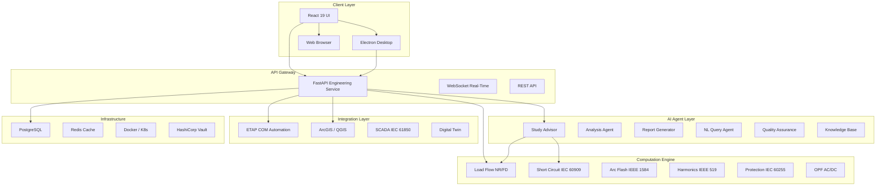
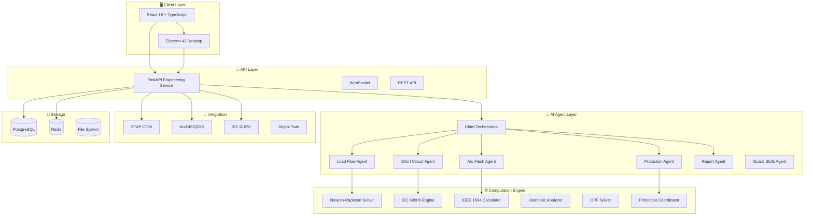
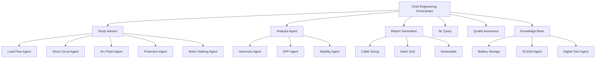
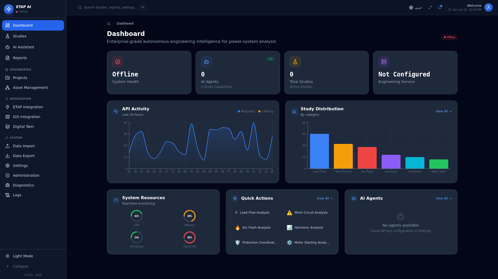
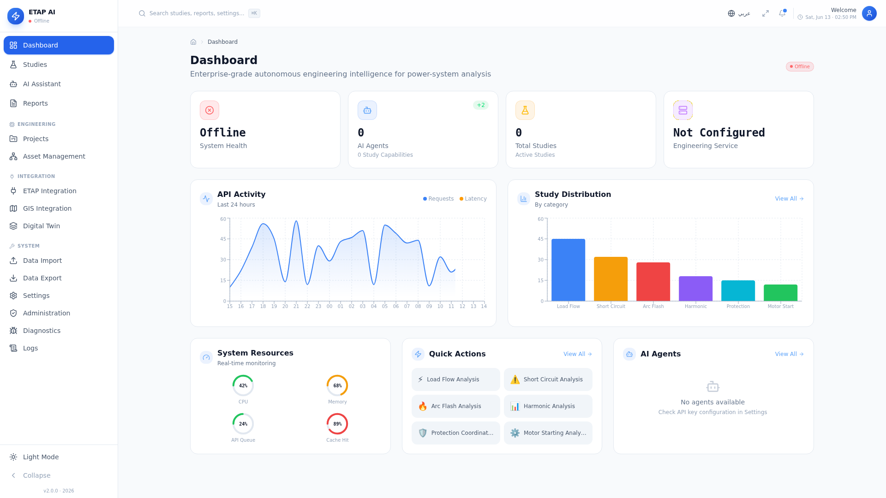
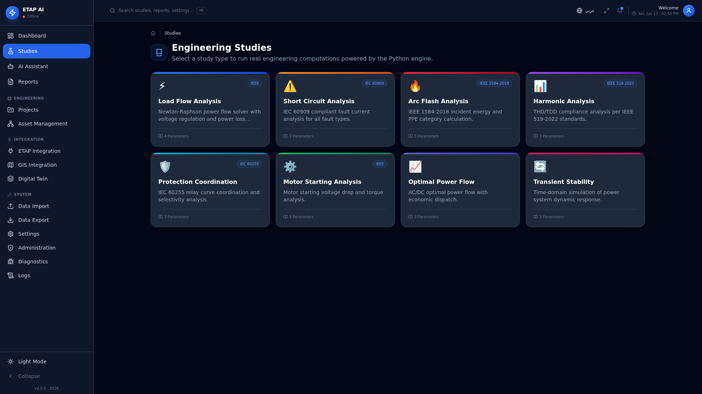
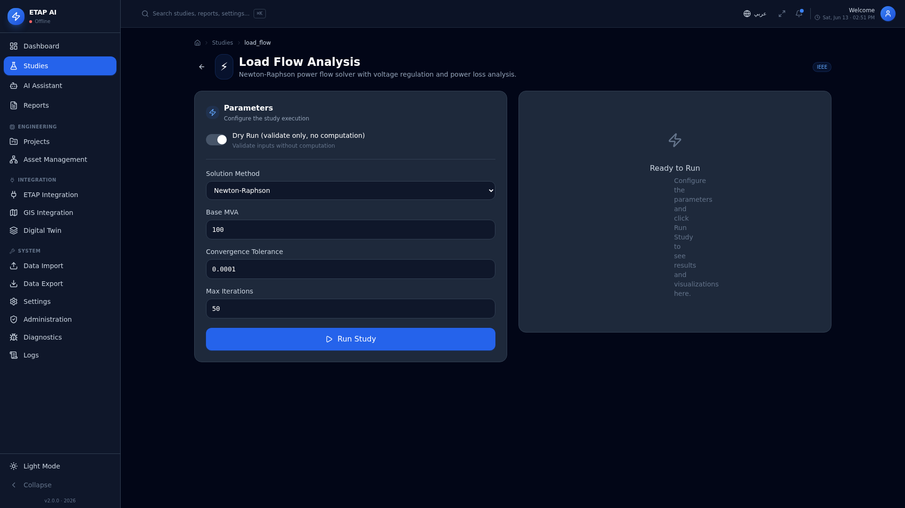
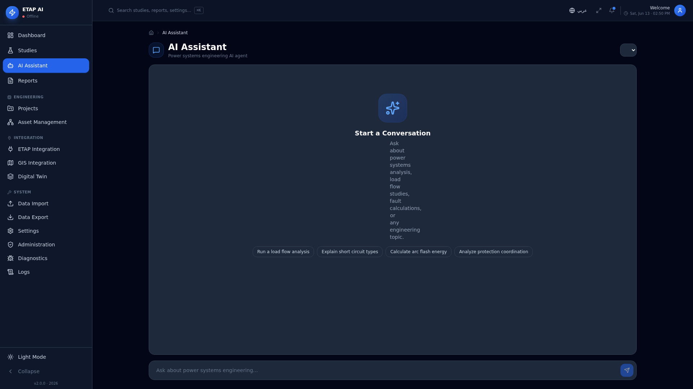
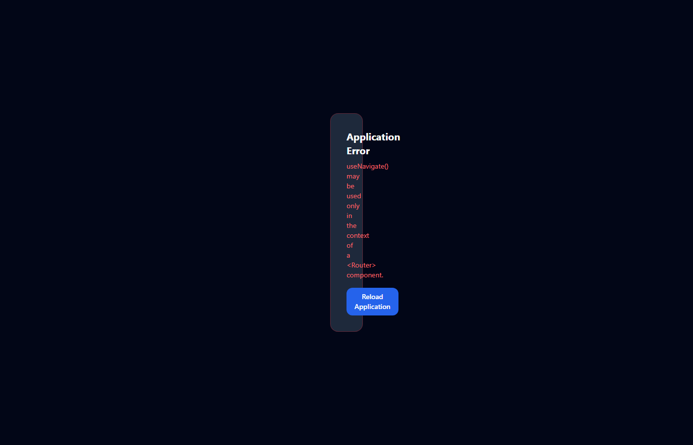
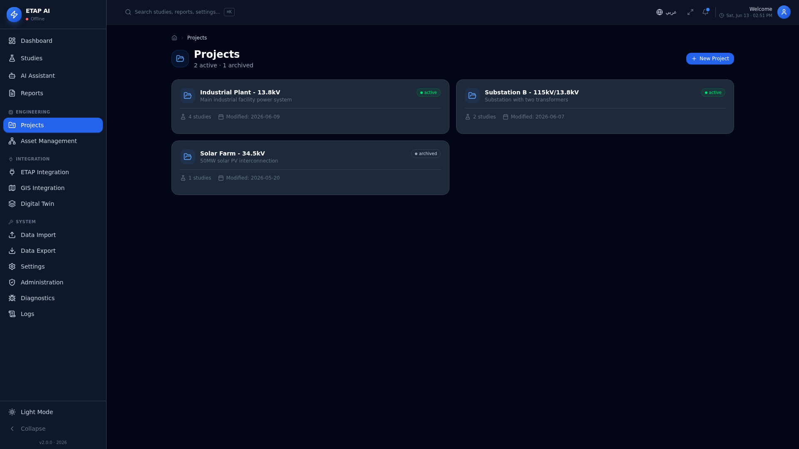

<p align="center">
  <a href="https://github.com/ahmdelbaz28-ux/AhmedETAP">
    
  </a>
</p>

<h1 align="center">AhmedETAP</h1>

<p align="center">
  <strong>Enterprise-Grade Autonomous Engineering Intelligence Platform</strong>
  <br>
  <em>Power System Analysis · AI Agent Orchestration · ETAP Integration · GIS Enrichment</em>
</p>

<p align="center">
  <a href="https://github.com/ahmdelbaz28-ux/AhmedETAP/releases">
    
  </a>
  <a href="LICENSE">
    
  </a>
  <a href="https://github.com/ahmdelbaz28-ux/AhmedETAP/actions/workflows/ci-cd.yml">
    
  </a>
  <a href="https://github.com/ahmdelbaz28-ux/AhmedETAP/actions/workflows/security.yml">
    
  </a>
</p>

<p align="center">
  <a href="https://github.com/ahmdelbaz28-ux/AhmedETAP/actions/workflows/code-quality.yml">
    
  </a>
  <a href="https://github.com/ahmdelbaz28-ux/AhmedETAP/actions/workflows/docker-build.yml">
    
  </a>
  <a href="https://github.com/ahmdelbaz28-ux/AhmedETAP/actions/workflows/quality-gates.yml">
    
  </a>
  <a href="https://github.com/ahmdelbaz28-ux/AhmedETAP/actions/workflows/ui-tests.yml">
    
  </a>
  <a href="https://huggingface.co/spaces/ahmdelbaz28/etap-ai-platform">
    
  </a>
</p>

---

## Table of Contents

- [Overview](#overview)
- [Key Features](#key-features)
- [Architecture](#architecture)
- [Tech Stack](#tech-stack)
- [Quick Start](#quick-start)
- [Installation](#installation)
- [Project Structure](#project-structure)
- [API Reference](#api-reference)
- [Engineering Studies](#engineering-studies)
- [AI Agent System](#ai-agent-system)
- [Screenshots](#screenshots)
- [Deployment](#deployment)
- [Testing](#testing)
- [Security](#security)
- [Contributing](#contributing)
- [Roadmap](#roadmap)
- [FAQ](#faq)
- [Troubleshooting](#troubleshooting)
- [License](#license)
- [Author](#author)

---

## Overview

**AhmedETAP** is an enterprise-grade autonomous engineering intelligence platform designed for comprehensive power system analysis, ETAP automation, GIS enrichment, and intelligent engineering decision support. Built from the ground up by **Eng. Ahmed Elbaz**, it combines native Python computation engines with AI agent orchestration, real-time monitoring, and a modern React-based desktop application.



---

## Key Features

<details>
<summary><strong>Electrical Engineering Studies</strong></summary>

| Study | Engine | Standard | Status |
|-------|--------|----------|--------|
| Load Flow | Newton-Raphson, Fast Decoupled, DC-OPF | IEEE 3002.7 | Production |
| Short Circuit | IEC 60909 compliant fault analysis | IEC 60909 | Production |
| Arc Flash | Incident energy & PPE calculator | IEEE 1584-2018 | Production |
| Harmonics | THD/TDD compliance analysis | IEEE 519-2022 | Production |
| Protection Coordination | IEC 60255 relay curve coordination | IEC 60255 | Production |
| Optimal Power Flow | AC/DC with economic dispatch | — | Production |
| Motor Starting | Voltage dip & acceleration analysis | IEEE 399 | Production |
| Transient Stability | Swing equation (RK4), eigenvalue analysis | IEEE 399 | Beta |
| Cable Sizing | Ampacity & voltage drop verification | IEC 60364 | Beta |
| Earth Grid | Mesh/step/touch voltage calculation | IEEE 80 | Beta |

</details>

<details>
<summary><strong>AI Agent Orchestration</strong></summary>

- **23 specialized agents** with task planning and RAG context
- Knowledge base integration for IEEE/IEC/NFPA standards
- Audit-friendly responses with full traceability
- Multi-agent workflow orchestration
- Prompt management with 3-tier fallback (LangWatch → Local YAML → Default)

</details>

<details>
<summary><strong>Enterprise Security</strong></summary>

| Layer | Implementation |
|-------|---------------|
| Authentication | JWT with bcrypt (14 rounds), account lockout (5 attempts) |
| Authorization | RBAC with 5 roles (ADMIN, ENGINEER, ANALYST, VIEWER, GUEST), 25+ permissions |
| Sandboxing | Python AST validation, restricted globals, SIGALRM timeout (30s) |
| Secrets | HashiCorp Vault with encrypted local fallback (Fernet) |
| Audit | JSON-structured audit trail with log rotation |
| Rate Limiting | Token-bucket algorithm with per-client tracking |
| RASP | Runtime Application Self-Protection (SQLi, XSS, Cmdi, SSRF) |
| MFA | TOTP (RFC 6238) + WebAuthn/FIDO2 |

</details>

<details>
<summary><strong>Desktop Application</strong></summary>

- **Electron 42** with frameless window and custom title bar
- System tray with context menu
- Native file dialogs for engineering file formats (.etp, .xml, .csv)
- Keyboard shortcuts (Ctrl+K command palette, F1 smart help)
- Auto-update support
- Cross-platform: Windows, Linux, macOS

</details>

---

## Architecture



---

## Tech Stack

| Layer | Technology | Version |
|-------|-----------|---------|
| **Backend** | Python, FastAPI, Pydantic v2 | 3.13+ |
| **Frontend** | React, TypeScript, Tailwind CSS | 19.2+ |
| **Desktop** | Electron | 42.3 |
| **AI/ML** | LangChain, RAG, scikit-learn, TensorFlow | Latest |
| **Database** | PostgreSQL, Redis | 15+, 7+ |
| **DevOps** | Docker, Docker Compose, GitHub Actions | Latest |
| **Security** | JWT, bcrypt, HashiCorp Vault, Trivy | Latest |
| **GIS** | ArcGIS API, QGIS, GDAL | Latest |
| **Testing** | pytest, Vitest, Playwright | Latest |

---

## Quick Start

### Prerequisites

```
Python 3.13+    Node.js 22+    Docker (optional)
```

### One-Command Setup

```bash
# Clone the repository
git clone https://github.com/ahmdelbaz28-ux/AhmedETAP.git
cd AhmedETAP

# Install dependencies
python -m pip install -r requirements.txt
cd ui && pnpm install && cd ..

# Validate
python validate_syntax.py
pytest -q

# Run
python engineering_service.py --host 0.0.0.0 --port 8000 &
cd ui && pnpm dev
```

Access: **http://localhost:3000** (UI) | **http://localhost:8000/docs** (API)

### Docker

```bash
docker compose up -d
```

---

## Installation

### Method 1: Manual Installation

```bash
# 1. Clone
git clone https://github.com/ahmdelbaz28-ux/AhmedETAP.git
cd AhmedETAP

# 2. Python environment
python -m venv venv
source venv/bin/activate  # Linux/macOS
# venv\Scripts\activate   # Windows
pip install -r requirements.txt

# 3. Frontend
cd ui
pnpm install
cd ..

# 4. Environment configuration
cp .env.example .env
# Edit .env with your configuration

# 5. Validate
python validate_syntax.py
python validation_suite.py
pytest -q
```

### Method 2: Docker

```bash
# Production
docker compose up -d

# With engineering service
docker compose --profile engineering up -d

# Full stack (with monitoring)
docker compose --profile full up -d
```

### Method 3: Hugging Face Spaces

The live demo runs on Hugging Face Spaces with automatic deployment from the `main` branch.

```bash
# No local installation needed
# Visit: https://huggingface.co/spaces/ahmdelbaz28/etap-ai-platform
```

---

## Project Structure

```
AhmedETAP/
├── engine/                    # Power system computation engine
│   ├── engine.py              # Main PowerSystemEngine class
│   ├── gpu_solver.py          # GPU-accelerated solver
│   ├── sparse_solver.py       # Sparse matrix operations
│   └── caching.py             # Redis-backed study cache
├── core_model/                # Power system data models
│   ├── system.py, bus.py, line.py, generator.py, load.py
├── load_flow/                 # Load flow solvers
│   ├── load_flow.py           # Newton-Raphson, Fast Decoupled
│   └── optimal_power_flow.py  # AC/DC OPF
├── fault_analysis/            # Fault analysis engines
│   ├── fault.py               # Short circuit (IEC 60909)
│   ├── arc_flash_calc.py      # Arc flash (IEEE 1584)
│   └── harmonic_analysis.py   # Harmonics (IEEE 519)
├── coordination/              # Protection coordination
├── relays/                    # Relay models (IEC 60255)
├── agents/                    # 23 AI agents
│   ├── orchestrator.py        # Chief Engineering Orchestrator
│   ├── prompt_loader.py       # 3-tier prompt system
│   └── *.py                   # Specialized agents
├── security/                  # Security framework
│   ├── security_framework.py  # Auth, RBAC, rate limiting
│   ├── secure_executor.py     # Python sandboxing
│   ├── secrets_manager.py     # HashiCorp Vault integration
│   ├── rasp.py                # Runtime self-protection
│   ├── mfa.py                 # TOTP + WebAuthn MFA
│   └── siem.py                # Security event forwarding
├── api/                       # FastAPI routers
│   ├── auth.py                # Authentication endpoints
│   ├── projects.py            # Project CRUD
│   ├── database.py            # Async SQLAlchemy
│   └── dependencies.py        # JWT, RBAC dependencies
├── engineering_service.py     # Main FastAPI application
├── ui/                        # React + TypeScript frontend
│   ├── src/
│   │   ├── components/        # UI components
│   │   ├── pages/             # 17 page modules
│   │   ├── hooks/             # React hooks
│   │   ├── help/              # Smart Help system
│   │   └── lib/               # API client, utilities
│   └── electron/              # Electron desktop wrapper
├── tests/                     # 47 test files
├── docs/                      # Documentation
├── .github/workflows/         # 13 CI/CD workflows
└── docker-compose.yml         # Production deployment
```

---

## API Reference

The FastAPI service exposes a comprehensive REST API with automatic OpenAPI documentation.

### Core Endpoints

| Endpoint | Method | Description |
|----------|--------|-------------|
| `/health` | GET | Health check |
| `/healthz` | GET | Liveness probe |
| `/readyz` | GET | Readiness probe |
| `/metrics` | GET | System metrics |
| `/docs` | GET | Swagger UI |
| `/api/v1/studies/run` | POST | Execute engineering study |
| `/api/v1/system/validate` | POST | Validate power system model |
| `/api/v1/agents/info` | GET | Agent metadata |
| `/api/v1/auth/register` | POST | Register user |
| `/api/v1/auth/login` | POST | Authenticate |
| `/api/v1/projects` | GET/POST | Project CRUD |
| `/api/v1/guards/review` | POST | Code quality review |

### Example: Run Load Flow Study

```bash
curl -X POST http://localhost:8000/api/v1/studies/run \
  -H "Content-Type: application/json" \
  -d '{
    "study_type": "load_flow",
    "system": {
      "base_mva": 100,
      "buses": [
        {"bus_id": 1, "bus_type": "slack", "voltage_magnitude": 1.05},
        {"bus_id": 2, "bus_type": "pq", "load_power_real": 0.8, "load_power_imag": 0.3}
      ],
      "lines": [
        {"line_id": 1, "from_bus_id": 1, "to_bus_id": 2, "r1": 0.01, "x1": 0.05}
      ]
    }
  }'
```

---

## Engineering Studies

### Supported Study Types

| Study Type | Parameters | Output |
|-----------|-----------|--------|
| `load_flow` | System model, solver type | Bus voltages, line flows, losses |
| `short_circuit` | Bus ID, fault type | Fault currents, voltage dips |
| `arc_flash` | Voltage, fault current, duration | Incident energy, PPE category |
| `harmonic_analysis` | System model, harmonic spectrum | THD/TDD, compliance status |
| `protection_coordination` | Relay IDs, fault currents | Coordination margins |
| `optimal_power_flow` | Objective function, constraints | Optimal dispatch, marginal costs |

---

## AI Agent System

The platform includes **23 specialized AI agents** organized into a hierarchical orchestration model:



---

## Screenshots

### Dashboard

<p align="center">
  
  
</p>

### Engineering Studies

<p align="center">
  
  
</p>

### AI Assistant & Digital Twin

<p align="center">
  
  
</p>

### Projects & Reports

<p align="center">
  
  
</p>

---

## Deployment

### Docker Compose (Recommended)

```bash
# Production deployment
docker compose --profile production up -d

# With engineering service
docker compose --profile engineering up -d

# Full stack with monitoring
docker compose --profile full up -d
```

### Kubernetes

Helm charts are available in `charts/etap-ai/`:

```bash
helm install etap-ai ./charts/etap-ai --namespace etap-system
```

### Hugging Face Spaces

Automatic deployment via GitHub Actions on push to `main`.

---

## Testing

```bash
# Run all tests
pytest -q

# Run with coverage
pytest --cov=. --cov-report=html

# Run specific test suite
pytest tests/test_engineering_service.py -v
pytest tests/test_security_e2e.py -v

# UI tests
cd ui && pnpm test

# Validation suite
python validation_suite.py
python validate_syntax.py
```

| Metric | Count | Status |
|--------|------:|--------|
| Python test files | 34 | Passing |
| TypeScript test files | 13 | Passing |
| Engineering validation | 31/31 | Pass |
| Syntax validation | 173/173 | Pass |

---

## Security

<details>
<summary><strong>Security Architecture</strong></summary>

| Layer | Implementation |
|-------|---------------|
| **Authentication** | JWT + bcrypt (14 rounds) + account lockout |
| **Authorization** | RBAC with 5 roles, 25+ permissions |
| **Sandboxing** | Python AST validation, restricted globals |
| **Secrets** | HashiCorp Vault + Fernet encrypted fallback |
| **Rate Limiting** | Token-bucket with LRU eviction |
| **Audit Logging** | JSON-structured with rotation |
| **RASP** | SQLi, XSS, Cmdi, SSRF detection |
| **MFA** | TOTP (RFC 6238) + WebAuthn |
| **Dependency Scanning** | CodeQL + Trivy + TruffleHog |

</details>

### Reporting Vulnerabilities

See [SECURITY.md](SECURITY.md) for responsible disclosure instructions.

---

## Contributing

We welcome contributions! Please see [CONTRIBUTING.md](CONTRIBUTING.md) for guidelines.

### Quick Contribution Guide

```bash
# 1. Fork and clone
git clone https://github.com/<your-username>/AhmedETAP.git

# 2. Create branch
git checkout -b feat/my-feature

# 3. Make changes and validate
python validate_syntax.py
pytest -q

# 4. Commit and push
git commit -m "feat: add my feature"
git push origin feat/my-feature

# 5. Open a Pull Request
```

---

## Roadmap

| Phase | Status | Description |
|-------|--------|-------------|
| Phase 1 | ✅ Complete | Core computation engine, load flow, short circuit |
| Phase 2 | ✅ Complete | AI agent orchestration, security framework |
| Phase 3 | ✅ Complete | ETAP COM integration, GIS, SCADA |
| Phase 4 | ✅ Complete | Transient stability, cable sizing, earth grid |
| Phase 5 | ✅ Complete | ML/AI predictive analytics, anomaly detection |
| Phase 6 | ✅ Complete | Kubernetes deployment, monitoring, observability |
| Phase 7 | 🔄 In Progress | Desktop Electron app, UI enhancements |
| Phase 8 | 📋 Planned | Cloud deployment (AWS/Azure), multi-tenant |

See [ROADMAP.md](ROADMAP.md) for detailed planning.

---

## FAQ

<details>
<summary><strong>What makes AhmedETAP different from traditional ETAP?</strong></summary>

AhmedETAP is open-source with AI agent orchestration, a modern web/desktop UI, Docker support, and 548+ automated tests. Traditional ETAP is proprietary, desktop-only, and lacks AI capabilities.

</details>

<details>
<summary><strong>Can I use AhmedETAP without ETAP installed?</strong></summary>

Yes. The native Python solvers work independently. ETAP COM integration is optional for cross-validation studies.

</details>

<details>
<summary><strong>What standards are supported?</strong></summary>

IEEE 3002.7, IEC 60909, IEEE 1584-2018, IEEE 519-2022, IEC 60255, IEEE 399, IEEE 80, IEC 60364, NFPA 70E.

</details>

<details>
<summary><strong>Is there a cloud-hosted version?</strong></summary>

The live demo runs on Hugging Face Spaces. Self-hosted deployment via Docker or Kubernetes is recommended for production.

</details>

---

## Troubleshooting

| Issue | Solution |
|-------|----------|
| Backend not responding | `python engineering_service.py --port 8000` |
| UI build fails | `cd ui && pnpm install && pnpm build` |
| Database errors | Check PostgreSQL connection in `.env` |
| ETAP COM unavailable | Windows-only; use native solvers on Linux/macOS |
| Redis connection refused | `docker compose up redis` or check `REDIS_URL` |

See [docs/TROUBLESHOOTING_GUIDE.md](docs/TROUBLESHOOTING_GUIDE.md) for comprehensive diagnostics.

---

## License

This project is licensed under the **MIT License** — see [LICENSE](LICENSE) for details.

```
MIT License — Copyright (c) 2026 Eng. Ahmed Elbaz
```

---

## Author

<p align="center">
  <a href="https://github.com/ahmdelbaz28-ux">
    
  </a>
  <br>
  <strong>Eng. Ahmed Elbaz</strong>
  <br>
  <em>Electrical Power Engineer & AI Systems Architect</em>
  <br>
  <a href="mailto:ahmdelbaz28@gmail.com">ahmdelbaz28@gmail.com</a> ·
  <a href="https://github.com/ahmdelbaz28-ux">GitHub</a> ·
  <a href="https://huggingface.co/spaces/ahmdelbaz28/etap-ai-platform">Live Demo</a>
</p>

---

<p align="center">
  <sub>Built with precision for the power systems engineering community.</sub>
</p>
