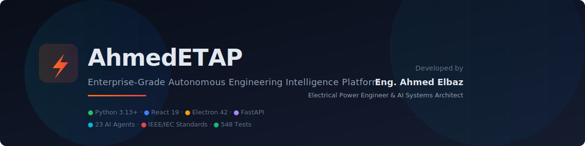
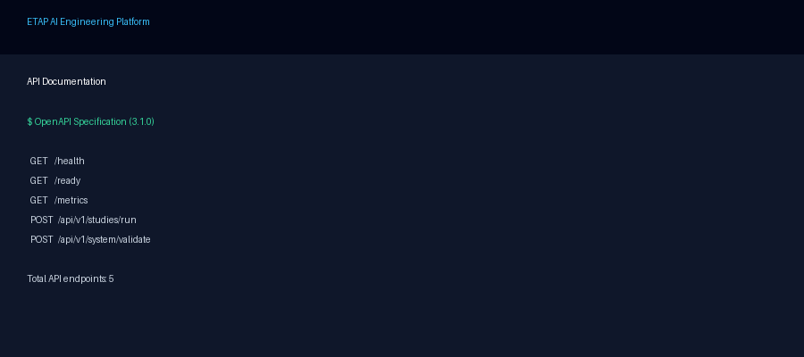
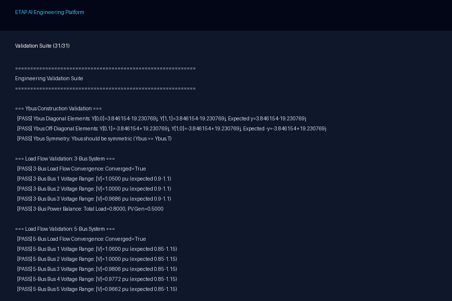
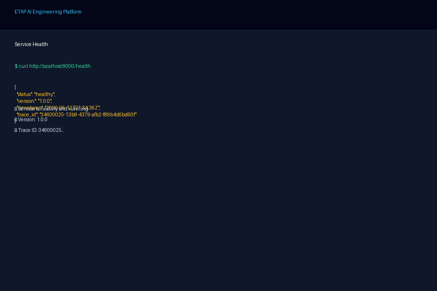
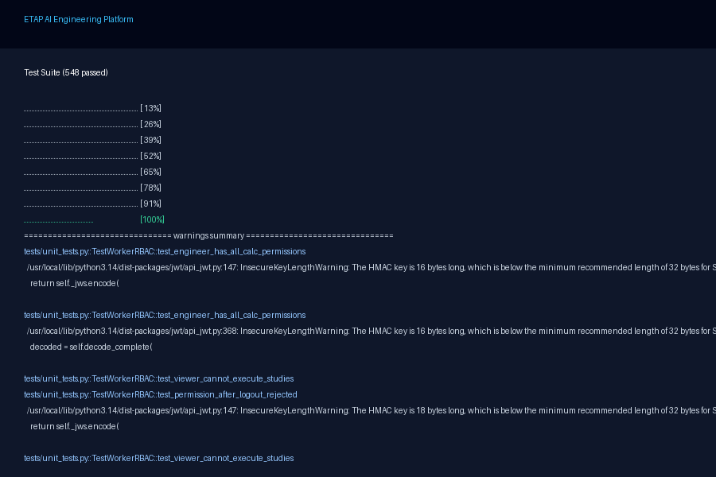
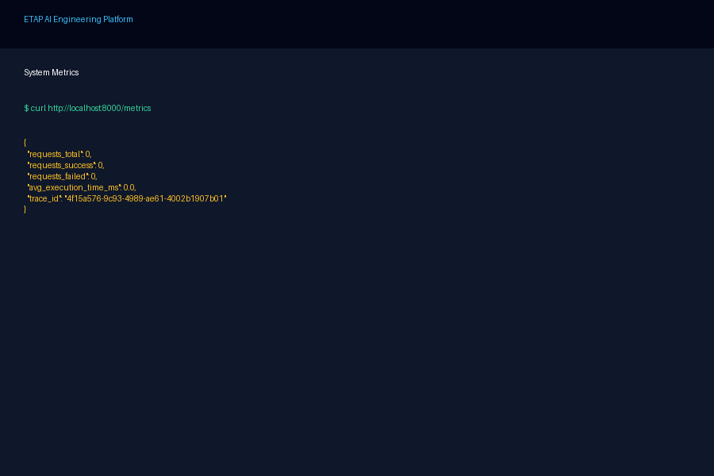

<p align="center">
  
</p>

<p align="center">
  <a href="https://github.com/ahmdelbaz28-ux/ETAP-AI-WORK-/releases">
    
  </a>
  <a href="LICENSE">
    
  </a>
  <a href="https://www.python.org/">
    
  </a>
  <a href="https://nodejs.org/">
    
  </a>
  <a href="docker-compose.yml">
    
  </a>
  <a href="https://github.com/ahmdelbaz28-ux/ETAP-AI-WORK-/actions/workflows/ci-cd.yml">
    
  </a>
  <a href="tests/">
    
  </a>
  <a href="validation_suite.py">
    
  </a>
  <a href="docs/">
    
  </a>
</p>

<p align="center">
  <strong>Built by <a href="https://github.com/ahmdelbaz28-ux">Eng. Ahmed Elbaz</a></strong>
  <br>
  <em>Electrical Power Engineer & AI Systems Architect</em>
</p>

<p align="center">
  <a href="#-what-is-etap-ai">Overview</a> ·
  <a href="#-quick-start">Quick Start</a> ·
  <a href="#-architecture">Architecture</a> ·
  <a href="#-supported-studies">Studies</a> ·
  <a href="#-validation--quality">Quality</a> ·
  <a href="#-security">Security</a> ·
  <a href="#-documentation">Docs</a>
</p>

---

## 🚀 What is ETAP AI?

**Enterprise-grade autonomous engineering intelligence** for validated power-system studies, ETAP automation, GIS enrichment, AI workflows, and production operations.

ETAP AI bridges the gap between manual engineering workflows and automated, auditable, standards-compliant computation. It combines native power-system calculation engines with AI agent orchestration, ETAP COM automation, GIS model enrichment, and enterprise-grade security — all in one platform.

```text
┌─────────────────────────────────────────────────────────┐
│                                                         │
│    Input → Validate → Model → Solve → Verify → Report   │
│                                                         │
│    548 tests · 31/31 validation · 173 files · MIT       │
│                                                         │
└─────────────────────────────────────────────────────────┘
```

---

## 👤 About the Author

<table>
  <tr>
    <td>
      <strong>Eng. Ahmed Elbaz</strong><br>
      <em>Founder & Lead Architect</em><br><br>
      Electrical Power Engineer specializing in power systems analysis, AI systems architecture, and enterprise automation. Creator of the ETAP AI Engineering Platform — combining deep domain expertise in electrical engineering with modern AI/ML infrastructure.
    </td>
    <td>
      <table>
        <tr><td><strong>📧</strong></td><td><a href="mailto:ahmdelbaz28@gmail.com">ahmdelbaz28@gmail.com</a></td></tr>
        <tr><td><strong>🐙</strong></td><td><a href="https://github.com/ahmdelbaz28-ux">@ahmdelbaz28-ux</a></td></tr>
        <tr><td><strong>🔬</strong></td><td>Power Systems · AI · Automation</td></tr>
        <tr><td><strong>📜</strong></td><td>IEEE · IEC · NFPA Standards</td></tr>
      </table>
    </td>
  </tr>
</table>

---

## 📸 See It In Action

> **Note:** Replace these placeholder images with real screenshots once the application is deployed. The live demo captures the dashboard, study results, and API documentation.

| Dashboard | API Documentation | Validation Suite |
|:---:|:---:|:---:|
|  |  |  |
| **Health Check** | **Tests Passing** | **System Metrics** |
|  |  |  |

> See the [full screenshot gallery](docs/screenshots/) for more images.

---

## ✨ Key Features

<table>
  <tr>
    <td width="33%">
      <h3>🔧 Engineering Studies</h3>
      Load flow, short circuit, arc flash (IEEE 1584-2018), harmonic analysis (IEEE 519-2022), optimal power flow, protection coordination — all with native solvers.
    </td>
    <td width="33%">
      <h3>🤖 AI Agent Orchestration</h3>
      9 specialized agents with task planning, RAG context, and audit-friendly responses. Knowledge base integration for standards and procedures.
    </td>
    <td width="33%">
      <h3>🔄 ETAP Automation</h3>
      Windows COM automation for ETAP study execution. Cross-validation between native engines and ETAP results. Dedicated Windows worker support.
    </td>
  </tr>
  <tr>
    <td width="33%">
      <h3>🗺️ GIS Integration</h3>
      ArcGIS, QGIS, and tabular data enrichment. Topology validation, electrical attribute checks, model quality reports.
    </td>
    <td width="33%">
      <h3>🔒 Enterprise Security</h3>
      JWT authentication, RBAC (5 roles), Python sandboxing, Secrets Manager (Vault + Fernet), audit logging, rate limiting.
    </td>
    <td width="33%">
      <h3>📊 Validation & Quality</h3>
      548 automated tests, 31 engineering validation gates, 173 syntax-verified files, CI/CD quality gates (pre-commit, pre-build, post-build).
    </td>
  </tr>
</table>

---

## 🏗️ Architecture

```
┌────────────────────────────────────────────────────────────┐
│                    API Gateway & Security                    │
│  JWT · RBAC · Rate Limit · CORS · Audit Log · Trace IDs    │
├────────────────────────────────────────────────────────────┤
│                  Chief Engineering Orchestrator              │
│  7 specialized agents · task planning · consensus & merge   │
├────────┬──────────┬───────────┬──────────┬─────────────────┤
│ Load   │ Short    │ Arc Flash │ Harmonic │ Protection      │
│ Flow   │ Circuit  │ IEEE      │ Analysis │ Coordination    │
│ Agents │ Agents   │ 1584-2018 │ IEEE 519 │ IEC Curves      │
├────────┴──────────┴───────────┴──────────┴─────────────────┤
│              Calculation Engines + ETAP COM                  │
├────────────────────────────────────────────────────────────┤
│      GIS Model     │     Reporting      │    Security       │
│      Enrichment    │     Engine         │    Framework      │
└────────────────────────────────────────────────────────────┘
```

See [docs/ARCHITECTURE.md](docs/ARCHITECTURE.md) for detailed component diagrams, data flows, and integration patterns.

---

## 🛠️ Quick Start

### Prerequisites

```bash
# Python 3.13+
python3 --version

# Node.js 22+
node --version

# pnpm (package manager)
npm install -g pnpm

# Docker (optional, for containerized deployment)
docker --version
```

### Install

```bash
git clone https://github.com/ahmdelbaz28-ux/ETAP-AI-WORK-.git
cd ETAP-AI-WORK-

# Python dependencies
python3 -m pip install -r requirements.txt

# Node.js dependencies
pnpm install
```

### Validate

```bash
# Syntax validation (173 files)
python3 validate_syntax.py

# Engineering validation suite (31 tests)
python3 validation_suite.py

# Full pytest suite (548 tests)
pytest -q
```

### Run

```bash
# Terminal 1: Engineering service (port 8000)
python3 engineering_service.py --host 0.0.0.0 --port 8000

# Terminal 2: UI (port 3000)
cd ui && pnpm dev
```

```bash
# Or with Docker Compose
docker compose up -d
```

Access the platform at **http://localhost:3000** and the API at **http://localhost:8000/docs**.

---

## 📊 Validation & Quality

| Metric | Count | Status |
|--------|------:|--------|
| Python syntax validation | **173/173** files | ✅ |
| Engineering validation suite | **31/31** tests | ✅ |
| Pytest suite | **548** tests | ✅ |
| UI component tests (Vitest) | **3** tests | ✅ |
| Docker images | **2** Dockerfiles | ✅ |
| CI/CD workflows | **10** workflows | ✅ |
| Pre-commit hooks | **7** checks | ✅ |

### Quality Gates

| Gate | Trigger | What It Checks |
|------|---------|----------------|
| **PRE_COMMIT** | Every push/PR | Lint, tests, syntax, validation, type checking |
| **PRE_BUILD** | Push to main | Docker build, compose validation |
| **POST_BUILD** | After build | E2E smoke tests, Trivy security scan |
| **SCHEDULED** | Nightly + manual | Full regression, performance baseline |

---

## 🔒 Security

The platform implements defense-in-depth security across all layers:

| Layer | Controls |
|-------|----------|
| **Authentication** | JWT with bcrypt (cost 14), account lockout (5 attempts), Fernet encryption |
| **Authorization** | RBAC with 5 roles (ADMIN, ENGINEER, ANALYST, VIEWER, GUEST), ~25 permissions |
| **Sandboxing** | Python AST validation, restricted globals, SIGALRM timeout (30s), output truncation (10KB) |
| **Secrets** | HashiCorp Vault with encrypted local fallback (Fernet), key rotation, env validation |
| **Audit** | JSON-structured audit trail to `security_audit.log` and `key_access.log` |
| **Rate Limiting** | Token-bucket algorithm with per-client tracking, LRU eviction, TTL cleanup |

See [SECURITY.md](SECURITY.md) and [docs/SECURITY_OPERATIONS_MANUAL.md](docs/SECURITY_OPERATIONS_MANUAL.md) for operational guidance.

---

## 📚 Documentation

| Document | Audience |
|----------|----------|
| [Architecture](docs/ARCHITECTURE.md) | Engineers and architects |
| [Deployment Guide](DEPLOYMENT_GUIDE.md) | DevOps and SRE teams |
| [API Documentation](API_DOCUMENTATION.md) | API consumers |
| [Security Operations Manual](docs/SECURITY_OPERATIONS_MANUAL.md) | Security teams |
| [Operations Runbook](docs/OPERATIONS_RUNBOOK.md) | Operators |
| [Incident Response](docs/INCIDENT_RESPONSE_RUNBOOK.md) | Incident commanders |
| [Disaster Recovery](docs/DISASTER_RECOVERY_PLAN.md) | SRE and business continuity |
| [Troubleshooting Guide](docs/TROUBLESHOOTING_GUIDE.md) | Developers and support |
| [Contributing Guide](CONTRIBUTING.md) | Contributors |

---

## 🤝 Contributing

I welcome contributions! Here's how to get started:

1. **Fork** the repository
2. **Create** a focused branch (`feat/my-feature`)
3. **Run** validation before committing:
   ```bash
   python3 validate_syntax.py
   python3 validation_suite.py
   pytest -q
   ```
4. **Open** a pull request with context and screenshots

See [CONTRIBUTING.md](CONTRIBUTING.md) for detailed guidelines.

---

## 📝 License

Copyright © 2026 **Eng. Ahmed Elbaz**. Licensed under the [MIT License](LICENSE).

ETAP® is a registered trademark of ETAP Corporation. This project is independent and is not affiliated with, endorsed by, or connected to ETAP Corporation.

---

<p align="center">
  <strong>Built with 💙 by <a href="https://github.com/ahmdelbaz28-ux">Eng. Ahmed Elbaz</a></strong>
  <br>
  <em>Electrical Power Engineer & AI Systems Architect</em>
  <br><br>
  <a href="https://github.com/ahmdelbaz28-ux/ETAP-AI-WORK-/issues">Report Bug</a> ·
  <a href="https://github.com/ahmdelbaz28-ux/ETAP-AI-WORK-/issues">Request Feature</a> ·
  <a href="https://github.com/ahmdelbaz28-ux">Follow @ahmdelbaz28-ux</a>
</p>
