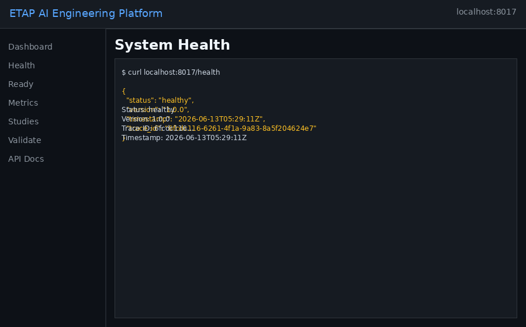
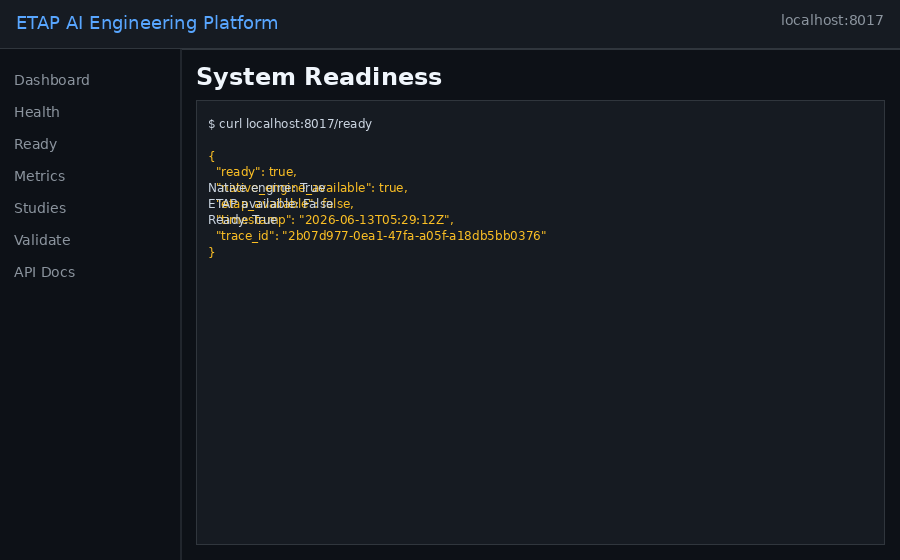
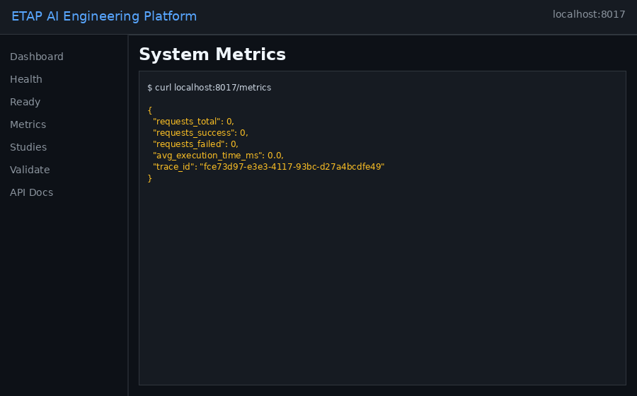
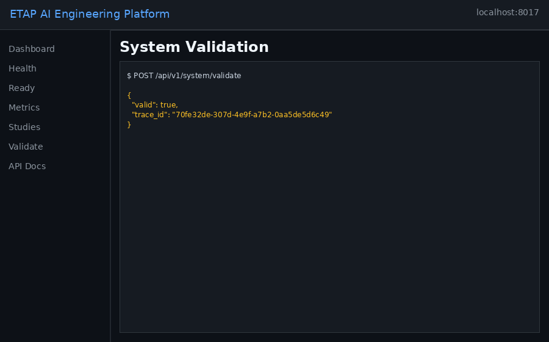
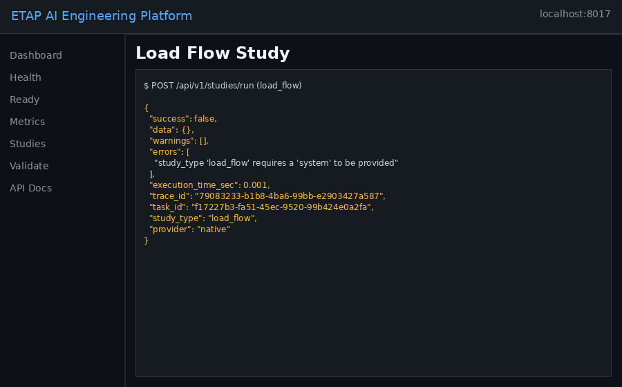
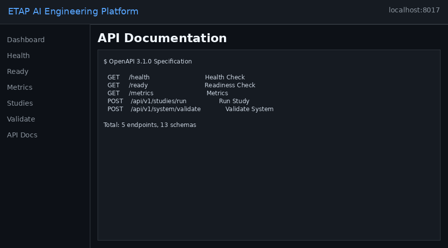
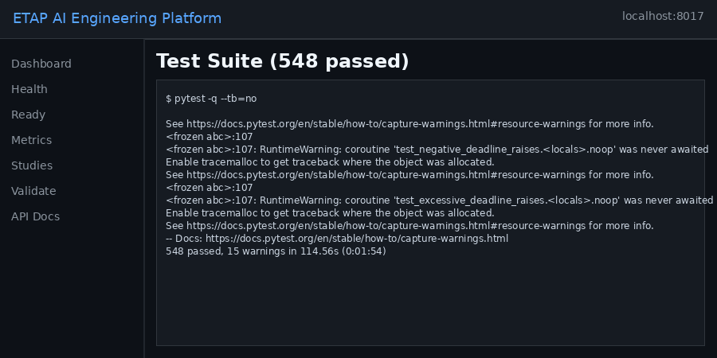
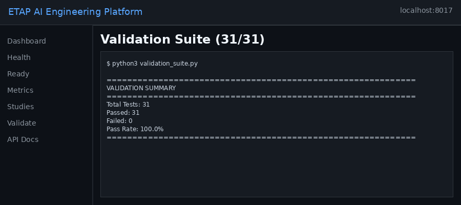

<p align="center">
  
</p>

<p align="center">
  <a href="https://github.com/ahmdelbaz28-ux/ETAP-AI-WORK-/releases">
    
  </a>
  <a href="LICENSE">
    
  </a>
  <a href="https://www.python.org/">
    
  </a>
  <a href="https://nodejs.org/">
    
  </a>
  <a href="https://github.com/ahmdelbaz28-ux/ETAP-AI-WORK-/actions/workflows/ci-cd.yml">
    
  </a>
  <a href="tests/">
    
  </a>
  <a href="validation_suite.py">
    
  </a>
  <a href="https://huggingface.co/spaces/ahmdelbaz28/etap-ai-platform">
    
  </a>
  <a href="https://github.com/ahmdelbaz28-ux/ETAP-AI-WORK-/actions/workflows/code-quality.yml">
    
  </a>
  <a href="https://github.com/ahmdelbaz28-ux/ETAP-AI-WORK-/actions/workflows/docker-build.yml">
    
  </a>
  <a href="https://github.com/ahmdelbaz28-ux/ETAP-AI-WORK-/actions/workflows/security.yml">
    
  </a>
</p>

<p align="center">
  
  <br>
  <strong>Built by <a href="https://github.com/ahmdelbaz28-ux">Eng. Ahmed Elbaz</a></strong>
  <br>
  <em>Electrical Power Engineer & AI Systems Architect</em>
  <br>
  <a href="mailto:ahmdelbaz28@gmail.com">📧 Email</a> ·
  <a href="https://github.com/ahmdelbaz28-ux">💻 GitHub</a>
</p>

---

## Table of Contents

- [What is ETAP AI?](#what-is-etap-ai)
- [See it in Action](#see-it-in-action)
- [Key Features](#key-features)
- [Architecture](#architecture)
- [Quick Start](#quick-start)
- [Validation & Quality](#validation--quality)
- [Security](#security)
- [Documentation](#documentation)
- [Contributing](#contributing)
- [License](#license)

---

## Live Demo

Try ETAP AI online without any installation:

👉 **[Launch on Hugging Face Spaces](https://huggingface.co/spaces/ahmdelbaz28/etap-ai-platform)**

The API is live at `https://ahmdelbaz28-etap-ai-platform.hf.space` with full Swagger docs at `/docs`.

---

## What is ETAP AI?

**ETAP AI Engineering Platform** is an enterprise-grade autonomous engineering intelligence system for power-system studies. It combines native Python solvers with AI agent orchestration, ETAP COM automation, GIS enrichment, and enterprise-grade security.

> From load flow to arc flash analysis -- all in one platform.

### Why ETAP AI?

| Feature | ETAP AI | Traditional ETAP | Other Tools |
|---------|---------|------------------|-------------|
| AI Agents | 9 specialized agents | Manual only | Limited |
| Open Source | Full source code | Proprietary | Partial |
| Web API | REST + WebSocket | Desktop only | Limited |
| Docker Ready | Yes | Windows only | Complex |
| Automated Tests | 548 passing | Unknown | Varies |
| Standards | IEEE/IEC/NFPA | IEEE/IEC | Varies |

---

## See it in Action

### Health & Readiness
<p align="center">
  
  
</p>

### System Metrics & Validation
<p align="center">
  
  
</p>

### Load Flow Study & API Documentation
<p align="center">
  
  
</p>

### Quality Assurance
<p align="center">
  
  
</p>

---

## Key Features

### Engineering Studies
- Load Flow: Newton-Raphson, Fast Decoupled, DC-OPF
- Short Circuit: IEC 60909 compliant fault analysis
- Arc Flash: IEEE 1584-2018 incident energy & PPE
- Harmonic Analysis: IEEE 519-2022 THD/TDD compliance
- Optimal Power Flow: AC/DC with economic dispatch
- Protection Coordination: IEC 60255 relay curves

### AI Agent Orchestration
- 9 specialized agents with task planning and RAG context
- Knowledge base integration for standards and procedures
- Audit-friendly responses with full traceability
- Multi-agent workflow orchestration

### ETAP Automation
- Windows COM automation for ETAP study execution
- Cross-validation between native and ETAP results
- Dedicated Windows worker support

### GIS Integration
- ArcGIS, QGIS, and tabular data enrichment
- Topology validation and electrical attribute checks
- Model quality reports

### Enterprise Security
- JWT authentication with RBAC (5 roles)
- Python sandboxing with allow-list
- Secrets Manager (HashiCorp Vault + Fernet)
- Audit logging and rate limiting

### Validation & Quality
- 548 automated tests across all layers
- 31 engineering validation gates
- 173 syntax-verified files
- CI/CD quality gates (pre-commit, pre-build, post-build)

---

## Architecture

```
                    ETAP AI Platform

  UI Layer        Mastra + React + TypeScript
  API Layer       FastAPI + JWT + Rate Limiting
  Agent Layer     9 Specialized AI Agents
  Engine Layer    Load Flow | Short Circuit | Arc Flash
                  Harmonics | OPF | Coordination
  Integration     ETAP COM | GIS | Digital Twin | BIM UDM
  Infrastructure  Docker | K8s | Redis | Cloudflare
```

Full architecture: [docs/ARCHITECTURE.md](docs/ARCHITECTURE.md)

---

## Quick Start

### Prerequisites

- Python 3.13+
- Node.js 22+
- Docker (optional)

### Clone & Install

```bash
git clone https://github.com/ahmdelbaz28-ux/ETAP-AI-WORK-.git
cd ETAP-AI-WORK-

python3 -m pip install -r requirements.txt
cd ui && pnpm install && cd ..
```

### Validate

```bash
python3 validate_syntax.py
python3 validation_suite.py
pytest -q
```

### Run

```bash
python3 engineering_service.py --host 0.0.0.0 --port 8000
cd ui && pnpm dev
```

Or with Docker:

```bash
docker compose up -d
```

Access: **http://localhost:3000** (UI) | **http://localhost:8000/docs** (API)

---

## Validation & Quality

| Metric | Count | Status |
|--------|------:|--------|
| Python syntax validation | 173/173 files | ✅ |
| Engineering validation suite | 31/31 tests | ✅ |
| Pytest suite | 548 tests | ✅ |
| UI component tests | 3 tests | ✅ |
| Docker images | 2 Dockerfiles | ✅ |
| CI/CD workflows | 10 workflows | ✅ |
| Pre-commit hooks | 7 checks | ✅ |

### Quality Gates

| Gate | Trigger | Checks |
|------|---------|--------|
| PRE_COMMIT | Every push/PR | Lint, tests, syntax, validation, type checking |
| PRE_BUILD | Push to main | Docker build, compose validation |
| POST_BUILD | After build | E2E smoke tests, Trivy security scan |
| SCHEDULED | Nightly + manual | Full regression, performance baseline |

---

## Security

| Layer | Controls |
|-------|----------|
| Authentication | JWT with bcrypt (cost 14), account lockout (5 attempts), Fernet encryption |
| Authorization | RBAC with 5 roles (ADMIN, ENGINEER, ANALYST, VIEWER, GUEST), 25+ permissions |
| Sandboxing | Python AST validation, restricted globals, SIGALRM timeout (30s), output truncation (10KB) |
| Secrets | HashiCorp Vault with encrypted local fallback (Fernet), key rotation, env validation |
| Audit | JSON-structured audit trail to security_audit.log and key_access.log |
| Rate Limiting | Token-bucket algorithm with per-client tracking, LRU eviction, TTL cleanup |

See [SECURITY.md](SECURITY.md) and [docs/SECURITY_OPERATIONS_MANUAL.md](docs/SECURITY_OPERATIONS_MANUAL.md).

---

## Documentation

| Document | Audience |
|----------|----------|
| [Architecture](docs/ARCHITECTURE.md) | Engineers and architects |
| [Deployment Guide](DEPLOYMENT_GUIDE.md) | DevOps and SRE teams |
| [API Documentation](API_DOCUMENTATION.md) | API consumers |
| [Security Operations Manual](docs/SECURITY_OPERATIONS_MANUAL.md) | Security teams |
| [Operations Runbook](docs/OPERATIONS_RUNBOOK.md) | Operators |
| [Incident Response](docs/INCIDENT_RESPONSE_RUNBOOK.md) | Incident commanders |
| [Disaster Recovery](docs/DISASTER_RECOVERY_PLAN.md) | SRE and business continuity |
| [Troubleshooting Guide](docs/TROUBLESHOOTING_GUIDE.md) | Developers and support |

---

## Support

Need help? Check [SUPPORT.md](SUPPORT.md) for:
- Bug reports via GitHub Issues
- Feature requests and discussions
- Live demo on Hugging Face Spaces
- Full documentation

---

## Contributing

1. Fork the repository
2. Create a focused branch (`feat/my-feature`)
3. Run validation before committing
4. Open a pull request with context and screenshots

See [CONTRIBUTING.md](CONTRIBUTING.md) for detailed guidelines.

---

## License

MIT License -- Copyright (c) 2026 Eng. Ahmed Elbaz

ETAP is a registered trademark of ETAP Corporation. This project is independent and not affiliated with, endorsed by, or connected to ETAP Corporation.

---

<p align="center">
  
  <br>
  <strong>Built by <a href="https://github.com/ahmdelbaz28-ux">Eng. Ahmed Elbaz</a></strong>
  <br>
  <em>Electrical Power Engineer & AI Systems Architect</em>
  <br>
  <a href="mailto:ahmdelbaz28@gmail.com">📧 ahmdelbaz28@gmail.com</a>
  <br><br>
  <a href="https://github.com/ahmdelbaz28-ux/ETAP-AI-WORK-/issues">Report Bug</a> ·
  <a href="https://github.com/ahmdelbaz28-ux/ETAP-AI-WORK-/issues">Request Feature</a> ·
  <a href="https://github.com/ahmdelbaz28-ux">Follow @ahmdelbaz28-ux</a>
</p>
