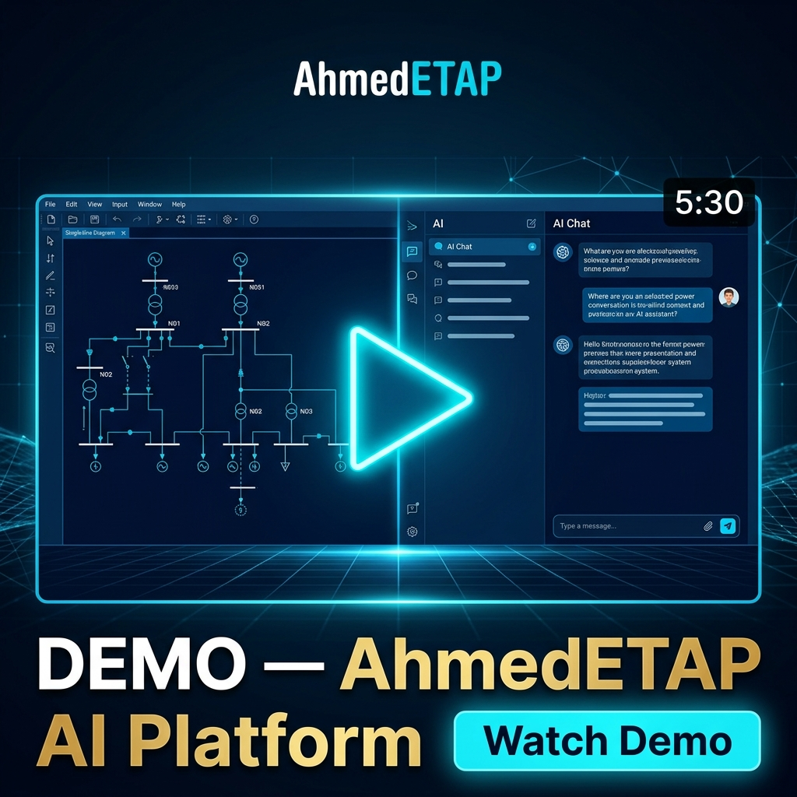
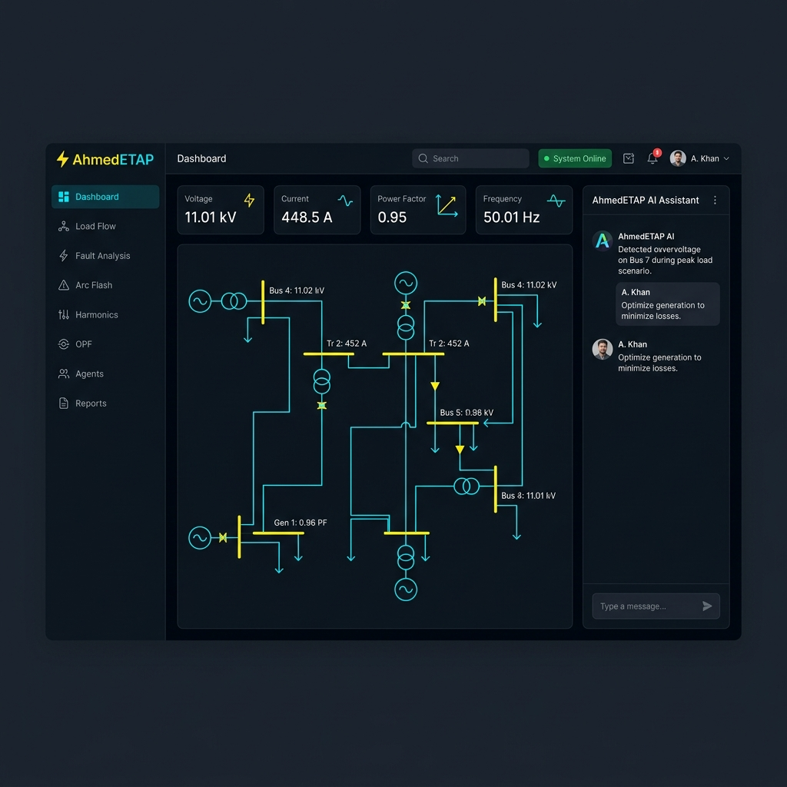
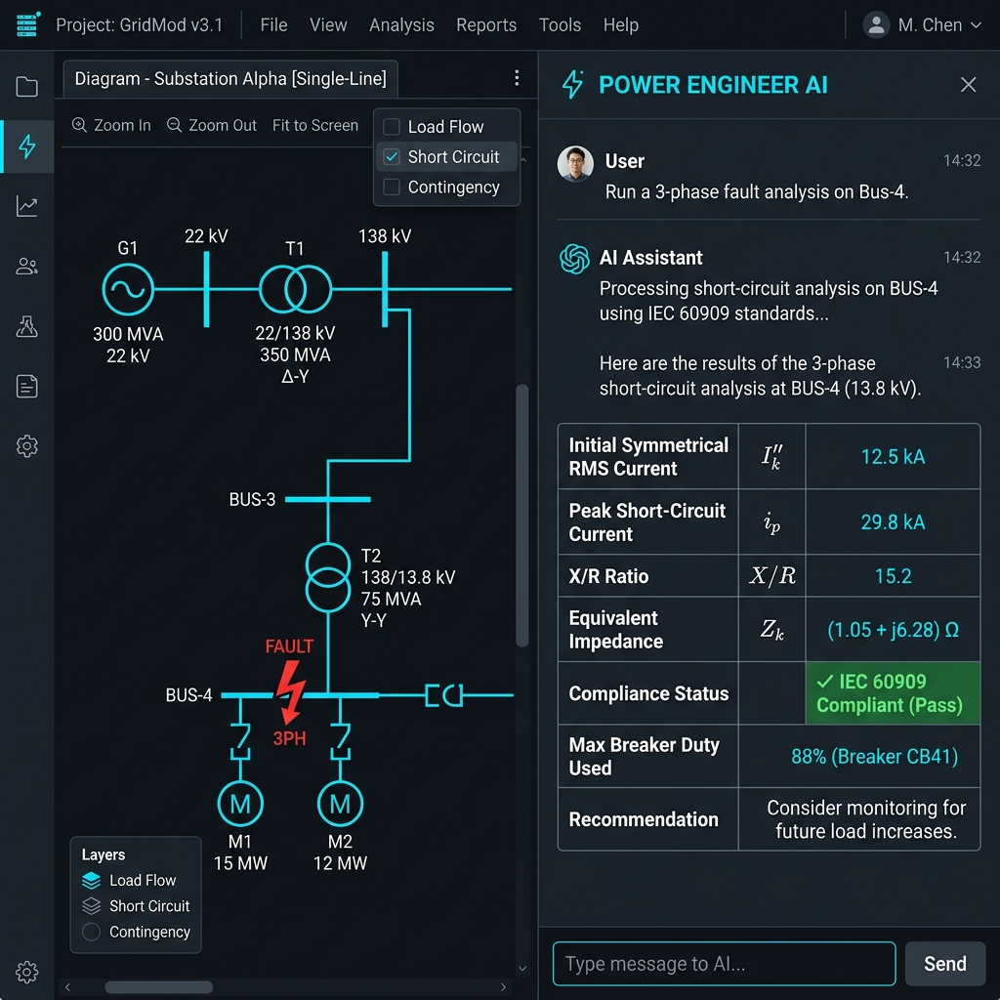
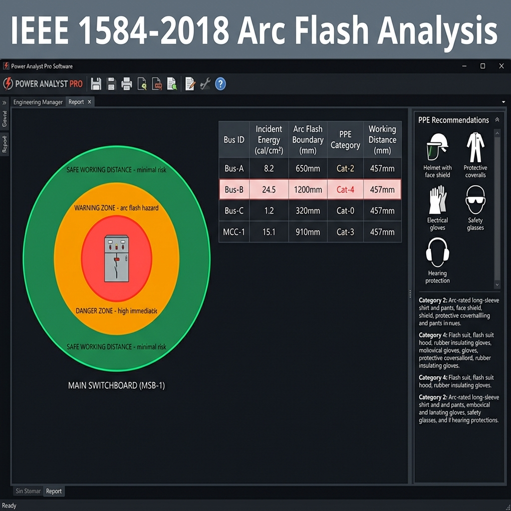
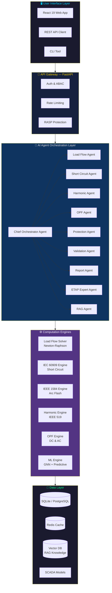
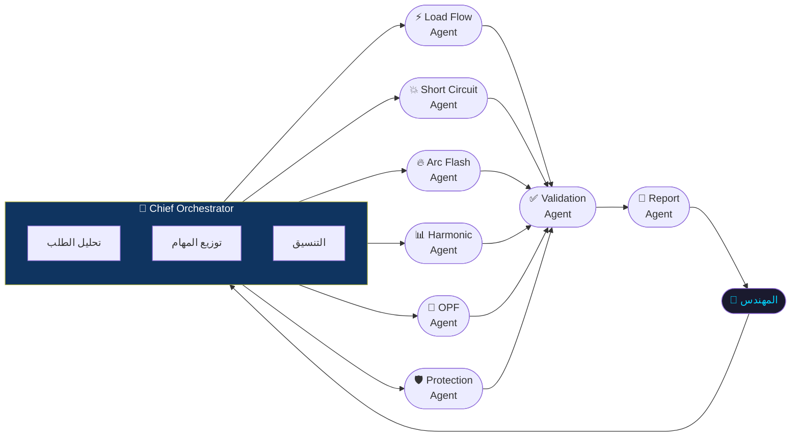
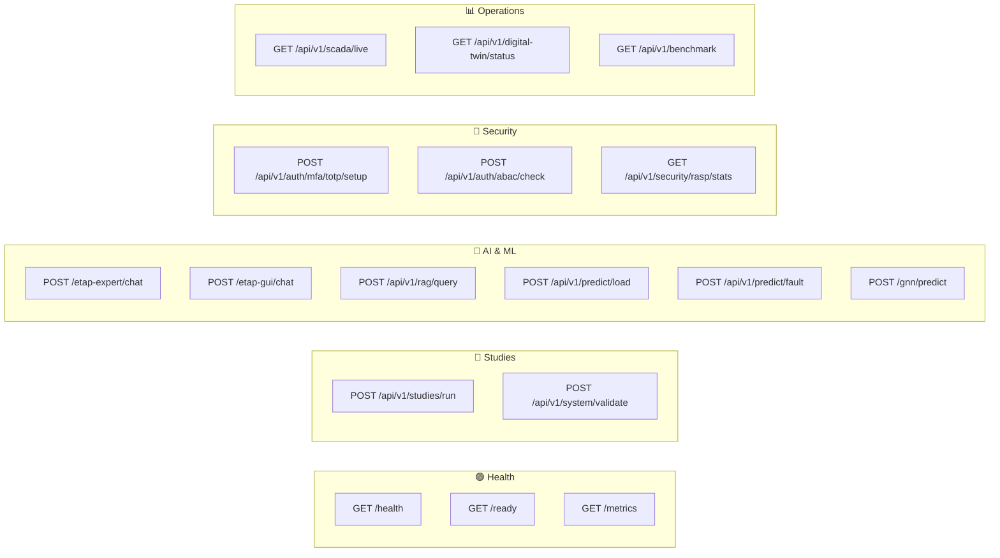
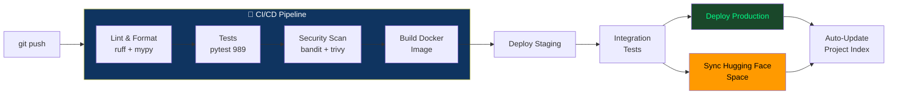

<div align="center">


<br/><br/>

# ⚡ AhmedETAP

### المنصة الذكية لهندسة أنظمة القوى الكهربائية
### Enterprise AI-Powered Power Systems Engineering Platform

<br/>

[](https://github.com/ahmdelbaz28-ux/ETAP-AI-WORK-/releases)
[](https://python.org)
[](https://fastapi.tiangolo.com)
[](https://react.dev)
[](Dockerfile)
[](LICENSE)

<br/>

[](tests/)
[](https://github.com/ahmdelbaz28-ux/ETAP-AI-WORK-/actions)
[](agents/)
[](docs/API_REFERENCE.md)
[](PROJECT_INDEX.md)

<br/>

**[🚀 Live Demo](https://huggingface.co/spaces/ahmdelbaz28/AHMEDETAP)** &nbsp;•&nbsp;
**[📚 Documentation](docs/)** &nbsp;•&nbsp;
**[🌐 API Reference](docs/API_REFERENCE.md)** &nbsp;•&nbsp;
**[📋 Project Index](PROJECT_INDEX.md)**

</div>

---

## 🎬 Demo Video

<div align="center">

[](https://huggingface.co/spaces/ahmdelbaz28/AHMEDETAP)

> **▶️ اضغط على الصورة لتشغيل الديمو المباشر على Hugging Face**

</div>

---

## 📸 لقطات الشاشة

<div align="center">

### 🖥️ لوحة التحكم الرئيسية — Main Dashboard



<br/><br/>

### 🤖 مساعد الذكاء الاصطناعي — AI Engineering Assistant



<br/><br/>

### ⚡ تحليل Arc Flash — IEEE 1584-2018



</div>

---

## 🌟 ما هو AhmedETAP؟

**AhmedETAP** هو منصة ذكاء اصطناعي متكاملة لهندسة أنظمة القوى الكهربائية. تجمع بين:

- 🔢 **محركات حسابية** متخصصة لأصعب دراسات الطاقة الكهربائية
- 🤖 **10 وكلاء ذكاء اصطناعي** متخصصين يعملون معاً
- 🌐 **واجهة ويب حديثة** بـ React 19
- 🔌 **API مفتوح** بـ 51 endpoint
- 🔐 **أمان على مستوى المؤسسات**

> **للمهندسين المبتدئين:** تتحدث مع المنصة بلغة عادية وتقوم بتشغيل الدراسات الهندسية تلقائياً!
>
> **للمهندسين المتخصصين:** API كامل، محركات IEC/IEEE مباشرة، وتكامل مع ETAP.

---

## 🔬 الدراسات الهندسية المدعومة

```
┌─────────────────────────────────────────────────────────────────┐
│                   Power Studies Coverage                        │
├──────────────────────┬──────────────────────┬───────────────────┤
│  ✅ Load Flow        │  ✅ Short Circuit     │  ✅ Arc Flash      │
│  Newton-Raphson      │  IEC 60909           │  IEEE 1584-2018   │
├──────────────────────┼──────────────────────┼───────────────────┤
│  ✅ Harmonic Analysis│  ✅ Optimal Power Flow│  ✅ Protection     │
│  IEEE 519-2022       │  DC & AC-OPF         │  Coordination     │
└──────────────────────┴──────────────────────┴───────────────────┘
```

---

## 🏛️ معمارية النظام — System Architecture



---

## 🚀 التثبيت — Installation Guide

> **للمبتدئين:** اختر الطريقة الأسهل لك. كل الطرق تنتهي بنفس النتيجة!

---

### 🥇 الطريقة الأولى: الديمو الفوري (بدون تثبيت)

**لا تحتاج لتثبيت أي شيء!** فقط اضغط:

👉 **[huggingface.co/spaces/ahmdelbaz28/AHMEDETAP](https://huggingface.co/spaces/ahmdelbaz28/AHMEDETAP)**

---

### 🐳 الطريقة الثانية: Docker Compose (الأسهل للتثبيت المحلي)

> **المطلوب:** [Docker Desktop](https://www.docker.com/products/docker-desktop/) فقط

**الخطوة 1 — تحميل المشروع:**
```bash
git clone https://github.com/ahmdelbaz28-ux/ETAP-AI-WORK-.git
cd ETAP-AI-WORK-
```

**الخطوة 2 — إعداد المتغيرات:**
```bash
# انسخ ملف الإعدادات
copy .env.example .env        # Windows
# cp .env.example .env        # Linux/Mac

# افتح الملف وغير هذه القيم:
# SECRET_KEY=any-random-long-string-here
# DATABASE_URL=sqlite+aiosqlite:///./etap.db
```

**الخطوة 3 — تشغيل كل الخدمات:**
```bash
docker compose up -d
```

**الخطوة 4 — افتح المتصفح:**
```
🌐 الواجهة:     http://localhost:3000
🔌 API:         http://localhost:8000
📊 Metrics:     http://localhost:8000/prometheus/metrics
📖 API Docs:    http://localhost:8000/docs
```

**لإيقاف التشغيل:**
```bash
docker compose down
```

---

### 🐍 الطريقة الثالثة: Python مباشر (للمطورين)

> **المطلوب:** Python 3.12 · Node.js 20 · Redis

**الخطوة 1 — تحميل المشروع:**
```bash
git clone https://github.com/ahmdelbaz28-ux/ETAP-AI-WORK-.git
cd ETAP-AI-WORK-
```

**الخطوة 2 — إعداد بيئة Python:**
```bash
# إنشاء بيئة افتراضية
python -m venv .venv

# تفعيلها
.venv\Scripts\activate        # Windows
source .venv/bin/activate     # Linux/Mac

# تثبيت المكتبات
pip install -r requirements.txt
```

**الخطوة 3 — إعداد المتغيرات:**
```bash
copy .env.example .env
```

```env
# محتوى ملف .env للتشغيل المحلي
ENVIRONMENT=development
PORT=8000
SECRET_KEY=my-local-dev-secret-key-123
DATABASE_URL=sqlite+aiosqlite:///./etap.db
REDIS_URL=redis://localhost:6379/0
```

**الخطوة 4 — تشغيل الباكند:**
```bash
python engineering_service.py
```

**الخطوة 5 — تشغيل الفرونت إند (terminal جديد):**
```bash
cd ui
npm install
npm run dev
```

**الخطوة 6 — تشغيل Celery Worker (terminal جديد):**
```bash
celery -A worker.celery_app worker --loglevel=info
```

---

### ☁️ الطريقة الرابعة: Kubernetes / Helm

> **للمؤسسات والإنتاج الكامل**

```bash
# إضافة الـ Dependencies
helm dependency update helm/etap-ai/

# التثبيت
helm upgrade --install etap-ai helm/etap-ai/ \
  --namespace etap \
  --create-namespace \
  --set image.tag=1.0.0 \
  --set secrets.key="your-production-secret"

# التحقق
kubectl get pods -n etap
```

---

### ✅ التحقق من نجاح التثبيت

بعد التشغيل، تحقق أن كل شيء يعمل:

```bash
# هل الخدمة تعمل؟
curl http://localhost:8000/health
# Expected: {"status": "healthy", "version": "1.0.0"}

# هل الـ API جاهز؟
curl http://localhost:8000/ready
# Expected: {"status": "ready"}

# هل يمكن تشغيل دراسة؟
curl -X POST http://localhost:8000/api/v1/studies/run \
  -H "Content-Type: application/json" \
  -d '{"study_type": "load_flow", "system": {"buses": [{"id": "B1", "base_kv": 11.0, "bus_type": "slack"}, {"id": "B2", "base_kv": 11.0, "bus_type": "load"}], "lines": [{"from_bus": "B1", "to_bus": "B2", "r_pu": 0.01, "x_pu": 0.05, "b_pu": 0.0}], "loads": [{"bus": "B2", "p_mw": 5.0, "q_mvar": 2.0}]}}'
```

---

## 🔌 مثال سريع — Quick Example

### تحليل Load Flow بسيط

```python
import requests

# تشغيل دراسة Load Flow
response = requests.post("http://localhost:8000/api/v1/studies/run",
    json={
        "study_type": "load_flow",
        "system": {
            "buses": [
                {"id": "BUS-1", "base_kv": 11.0, "bus_type": "slack"},
                {"id": "BUS-2", "base_kv": 11.0, "bus_type": "load"},
                {"id": "BUS-3", "base_kv": 0.4,  "bus_type": "load"}
            ],
            "lines": [
                {"from_bus": "BUS-1", "to_bus": "BUS-2", "r_pu": 0.01, "x_pu": 0.05},
                {"from_bus": "BUS-2", "to_bus": "BUS-3", "r_pu": 0.02, "x_pu": 0.08}
            ],
            "loads": [
                {"bus": "BUS-2", "p_mw": 10.0, "q_mvar": 3.0},
                {"bus": "BUS-3", "p_mw": 5.0,  "q_mvar": 1.5}
            ]
        }
    }
)
print(response.json())
```

### التحدث مع ETAP Expert AI

```python
# سؤال مباشر باللغة العربية أو الإنجليزية
response = requests.post("http://localhost:8000/etap-expert/chat",
    json={
        "message": "ما هي قيمة تيار القصر الثلاثي الأطوار على Bus-4 وما هي توصيات PPE؟",
        "session_id": "engineer-session-001"
    }
)
print(response.json()["reply"])
```

---

## 🤖 وكلاء الذكاء الاصطناعي



| الوكيل | التخصص | المعيار |
|:---|:---|:---|
| 🧠 **Chief Orchestrator** | تنسيق جميع الوكلاء وتوزيع المهام | — |
| ⚡ **Load Flow Agent** | تحليل انسياب الأحمال | IEEE |
| 💥 **Short Circuit Agent** | حساب تيارات القصر | IEC 60909 |
| 🔥 **Arc Flash Agent** | تحليل مخاطر القوس الكهربائي | IEEE 1584-2018 |
| 📊 **Harmonic Agent** | تحليل التوافقيات والتشويه | IEEE 519-2022 |
| 🎯 **OPF Agent** | جدولة الأحمال الأمثل | IEEE |
| 🛡️ **Protection Agent** | تنسيق الحماية والمرحلات | IEEE |
| ✅ **Validation Agent** | التحقق من النتائج والمعايير | Multi-standard |
| 📄 **Report Agent** | توليد التقارير (PDF/DOCX/XLSX) | — |
| 🔍 **RAG Agent** | استرجاع المعرفة من قواعد IEEE/IEC | — |

---

## 🌐 نقاط الـ API

> **الرابط الأساسي:** `http://localhost:8000`
> **توثيق تفاعلي:** `http://localhost:8000/docs`



**[📖 Full API Reference →](docs/API_REFERENCE.md)**

---

## ⚙️ إعدادات البيئة — Configuration

| المتغير | القيمة الافتراضية | الوصف |
|:---|:---|:---|
| `ENVIRONMENT` | `development` | `development` / `production` |
| `PORT` | `8000` | منفذ الـ API |
| `SECRET_KEY` | — | مفتاح التشفير (إلزامي) |
| `DATABASE_URL` | `sqlite+aiosqlite:///./etap.db` | قاعدة البيانات |
| `REDIS_URL` | `redis://localhost:6379/0` | خادم Redis للكاش |
| `USE_ETAP` | `false` | تفعيل تكامل ETAP |
| `JWT_ALGORITHM` | `HS256` | خوارزمية JWT |
| `ACCESS_TOKEN_EXPIRE_MINUTES` | `480` | صلاحية التوكن |
| `PROMETHEUS_ENABLED` | `true` | تفعيل Prometheus |

---

## 🧪 الاختبارات — Testing

```bash
# تشغيل كل الاختبارات
pytest

# مع تقرير التغطية
pytest --cov=. --cov-report=html --cov-report=term-missing

# فئات محددة
pytest -m unit           # اختبارات الوحدة فقط
pytest -m integration    # اختبارات التكامل
pytest -m regression     # اختبارات الانحدار
```

```
╔═══════════════════════════════════════════════╗
║          AhmedETAP Test Results               ║
╠══════════════╦═══════════╦════════╦══════════╣
║ Category     ║ Files     ║ Tests  ║ Status   ║
╠══════════════╬═══════════╬════════╬══════════╣
║ Unit         ║    32     ║  ~520  ║  ✅ Pass ║
║ Integration  ║    14     ║  ~280  ║  ✅ Pass ║
║ Regression   ║     8     ║  ~120  ║  ✅ Pass ║
║ Performance  ║     4     ║   ~69  ║  ✅ Pass ║
╠══════════════╬═══════════╬════════╬══════════╣
║ TOTAL        ║    58     ║   989  ║  ✅ Pass ║
╚══════════════╩═══════════╩════════╩══════════╝
```

---

## 🚢 النشر — Deployment



### خيارات النشر

| الطريقة | للـ | الأمر |
|:---|:---|:---|
| **Docker Compose** | التطوير والتجريب | `docker compose up -d` |
| **Kubernetes/Helm** | الإنتاج الكامل | `helm upgrade --install etap-ai helm/etap-ai/` |
| **Hugging Face** | الديمو العام | تلقائي عبر GitHub Actions |
| **Bare Metal** | السيرفرات المباشرة | `python engineering_service.py` |

---

## 📁 هيكل المشروع — Project Structure

```
etap-ai-work/
│
├── 📄 engineering_service.py    ← نقطة الدخول الرئيسية
├── 📄 indexer.py                ← أداة فهرسة المشروع
│
├── 📂 api/                      ← FastAPI Route Handlers
│   ├── routes.py                  الـ Router الرئيسي
│   ├── agents.py                  نقاط AI Agents
│   ├── ai_ml.py                   نقاط ML & GNN
│   ├── health.py                  Health Checks
│   └── ...
│
├── 📂 agents/                   ← 10 وكلاء AI
│   ├── orchestrator.py            قائد الوكلاء
│   ├── load_flow_agent.py
│   ├── short_circuit_agent.py
│   ├── harmonic_agent.py
│   └── ...
│
├── 📂 load_flow/                ← محركات الـ Load Flow
│   ├── load_flow.py               Newton-Raphson Solver
│   └── optimal_power_flow.py      DC/AC OPF Engine
│
├── 📂 fault_analysis/           ← محركات الأعطال
│   ├── iec60909_engine.py         IEC 60909 Short Circuit
│   ├── ieee1584_database.py       IEEE 1584 Arc Flash
│   └── harmonic_analysis.py      IEEE 519 Harmonics
│
├── 📂 security/                 ← الأمان المؤسسي
│   ├── abac.py                    Attribute-Based Access Control
│   ├── mfa.py                     TOTP + WebAuthn
│   ├── rasp.py                    Runtime Protection
│   └── siem.py                    SIEM Events
│
├── 📂 ml/                       ← الذكاء الاصطناعي
│   └── predictive.py              GNN + Load Forecasting
│
├── 📂 ui/                       ← React 19 Frontend
│   └── src/
│       ├── pages/                 الصفحات (50 ملف)
│       ├── components/            المكونات
│       └── hooks/                 React Hooks
│
├── 📂 tests/                    ← 58 ملف · 989 اختبار
│
├── 📂 docs/                     ← التوثيق الكامل
│   ├── ARCHITECTURE.md
│   ├── API_REFERENCE.md
│   ├── DEVELOPER_GUIDE.md
│   ├── OPERATIONS_RUNBOOK.md
│   └── assets/                  الصور والأصول
│
└── 📂 .github/workflows/        ← CI/CD Pipelines
    ├── ci-cd.yml
    ├── auto-index.yml
    └── sync-hf-space.yml
```

---

## 📊 إحصائيات المشروع

<div align="center">

| 📦 Python Packages | 📄 Python Files | 🏛️ Classes | 🔧 Functions |
|:---:|:---:|:---:|:---:|
| **25** | **201** | **572** | **312** |

| 🌐 API Endpoints | ⚛️ UI Files | 🧪 Test Files | ✅ Total Tests |
|:---:|:---:|:---:|:---:|
| **51** | **50** | **58** | **989** |

</div>

> 📋 *الإحصائيات تُحدَّث تلقائياً بواسطة [`indexer.py`](indexer.py) عند كل `push` إلى `main`*

---

## 🛡️ الأمان — Security

```
┌──────────────────────────────────────────────────────────────┐
│               AhmedETAP Security Architecture                │
├────────────────────┬─────────────────────────────────────────┤
│  🔑 Authentication │  JWT Bearer + API Key                   │
│  👥 Authorization  │  ABAC (Attribute-Based Access Control)  │
│  📱 MFA            │  TOTP (Google Auth) + WebAuthn/FIDO2    │
│  🛡️  RASP          │  Runtime Application Self-Protection    │
│  📡 SIEM           │  Security Event Forwarding              │
│  🔒 Secrets        │  Vault-Compatible Secrets Manager       │
│  🔍 Scanning       │  Bandit + Trivy on every PR             │
└────────────────────┴─────────────────────────────────────────┘
```

**الإبلاغ عن ثغرات:** راجع [`SECURITY.md`](SECURITY.md)

---

## 📚 التوثيق الكامل — Full Documentation

| الملف | الوصف | الحجم |
|:---|:---|:---|
| [📐 ARCHITECTURE.md](docs/ARCHITECTURE.md) | المعمارية الكاملة للنظام | 42 KB |
| [🌐 API_REFERENCE.md](docs/API_REFERENCE.md) | كل الـ endpoints مع أمثلة | 33 KB |
| [🛠️ DEVELOPER_GUIDE.md](docs/DEVELOPER_GUIDE.md) | دليل المطورين العملي | 8 KB |
| [🚀 OPERATIONS_RUNBOOK.md](docs/OPERATIONS_RUNBOOK.md) | تشغيل الإنتاج | 45 KB |
| [🔧 TROUBLESHOOTING_GUIDE.md](docs/TROUBLESHOOTING_GUIDE.md) | حل المشكلات | 58 KB |
| [🔒 SECURITY_OPERATIONS_MANUAL.md](docs/SECURITY_OPERATIONS_MANUAL.md) | دليل الأمان | 11 KB |
| [🌍 README_AR.md](docs/README_AR.md) | التوثيق بالعربية الكاملة | 15 KB |
| [📋 PROJECT_INDEX.md](PROJECT_INDEX.md) | فهرس المشروع التلقائي | 116 KB |

---

## 🤝 المساهمة — Contributing

نرحب بمساهماتكم! اتبع هذه الخطوات:

```bash
# 1. Fork ثم Clone
git clone https://github.com/YOUR-USERNAME/ETAP-AI-WORK-.git

# 2. إنشاء Branch جديد
git checkout -b feat/your-feature-name

# 3. تطوير وتحقق
pytest              # تشغيل الاختبارات
ruff check . --fix  # إصلاح الـ Linting

# 4. Commit مع رسالة وصفية
git commit -m "feat(load-flow): add Newton-Raphson convergence option"

# 5. Push وفتح Pull Request
git push origin feat/your-feature-name
```

**قوالب المشاكل:** [Bug Report](.github/ISSUE_TEMPLATE/bug_report.md) · [Feature Request](.github/ISSUE_TEMPLATE/feature_request.md)

---

## 📜 الرخصة — License

هذا المشروع مرخص بموجب **رخصة MIT** — راجع ملف [`LICENSE`](LICENSE).

---

<div align="center">

<br/>

**⚡ بُني بشغف لمهندسي أنظمة القوى الكهربائية حول العالم**

*AhmedETAP — حيث يلتقي الذكاء الاصطناعي بهندسة الطاقة الكهربائية*

<br/>

[](https://github.com/ahmdelbaz28-ux)
[](https://huggingface.co/spaces/ahmdelbaz28/AHMEDETAP)

<br/>

*آخر تحديث للفهرس: تلقائي عبر GitHub Actions على كل `push`*

</div>