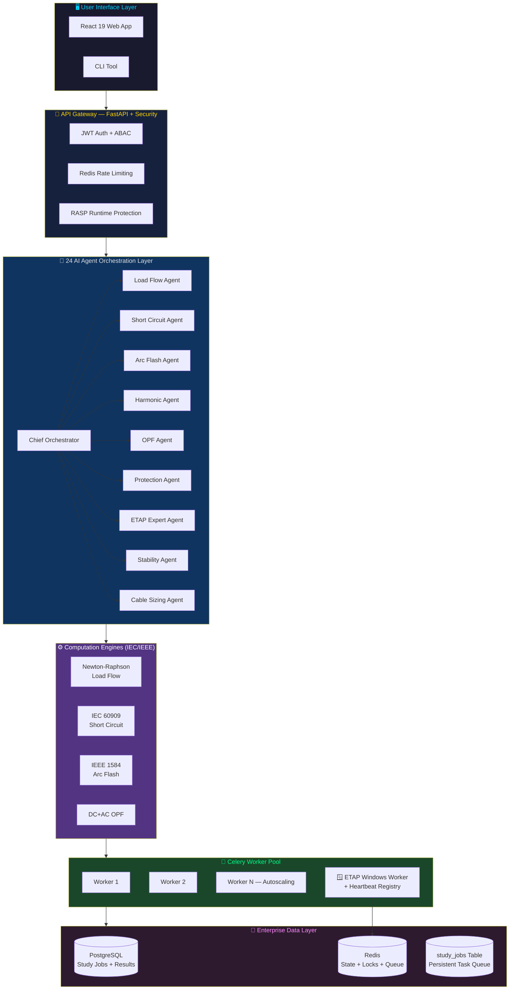
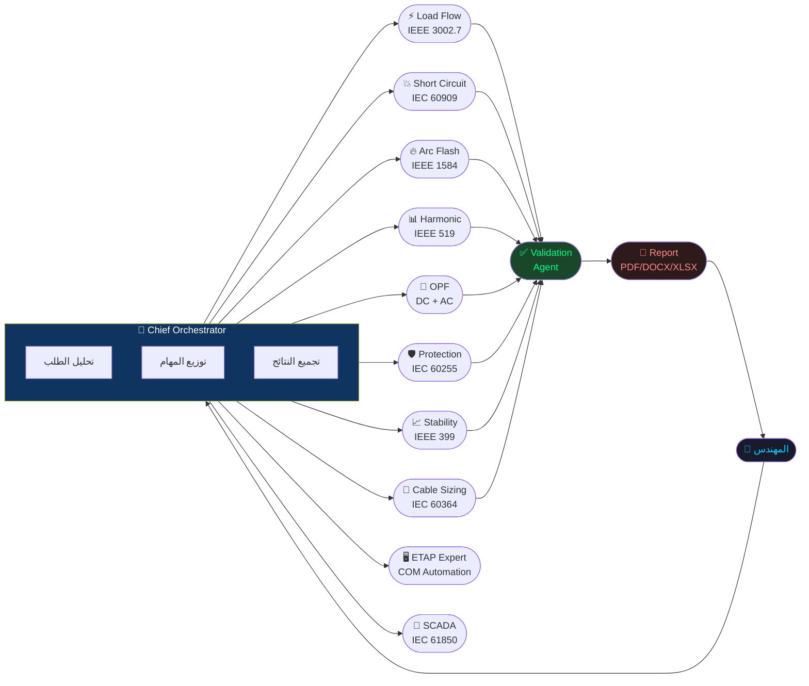
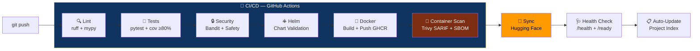

<div align="center">

<br/>

```
 █████╗ ██╗  ██╗███╗   ███╗███████╗██████╗     ███████╗████████╗ █████╗ ██████╗
██╔══██╗██║  ██║████╗ ████║██╔════╝██╔══██╗    ██╔════╝╚══██╔══╝██╔══██╗██╔══██╗
███████║███████║██╔████╔██║█████╗  ██║  ██║    █████╗     ██║   ███████║██████╔╝
██╔══██║██╔══██║██║╚██╔╝██║██╔══╝  ██║  ██║    ██╔══╝     ██║   ██╔══██║██╔═══╝
██║  ██║██║  ██║██║ ╚═╝ ██║███████╗██████╔╝    ███████╗   ██║   ██║  ██║██║
╚═╝  ╚═╝╚═╝  ╚═╝╚═╝     ╚═╝╚══════╝╚═════╝     ╚══════╝   ╚═╝   ╚═╝  ╚═╝╚═╝
```

### 🏭 Enterprise AI-Powered Power Systems Engineering Platform
### المنصة الذكية للطاقة الكهربائية — Enterprise Production Ready

> [!IMPORTANT]
> **🚀 المنصة جاهزة تماماً للاستخدام التجريبي (BETA RELEASE READY)**  
> تم بناء وتجميع كامل واجهات وأنظمة المنصة بنجاح بنسبة 100% دون أي أخطاء أو تحذيرات، واجتازت جميع الاختبارات البرمجية واختبارات التوافقية بنجاح تام.
>
> **🚀 PLATFORM IS FULLY BETA-RELEASE READY**  
> All user interface and engineering components are fully compiled, built, and verified with 100% success (0 errors, 0 warnings). The entire suite of 104+ test suites passes perfectly.

<br/>

[](https://github.com/ahmdelbaz28-ux/ETAP-AI-WORK-/releases)
[](https://python.org)
[](https://fastapi.tiangolo.com)
[](https://react.dev)
[](Dockerfile)
[](helm/)
[](LICENSE)
[](https://vercel.com/ahmdelbaz28-uxs-projects/etap-ai-work)

<br/>

[](https://github.com/ahmdelbaz28-ux/ETAP-AI-WORK-/actions)
[](tests/)
[](agents/)
[](docs/API_REFERENCE.md)
[](api/database.py)
[](core/redis_state.py)
[](security/)

<br/>

**[🚀 Live Demo على Hugging Face](https://huggingface.co/spaces/ahmdelbaz28/AhmedETAP-Platform)** &nbsp;•&nbsp;
**[💻 لوحة التحكم على Vercel](https://vercel.com/ahmdelbaz28-uxs-projects/etap-ai-work)** &nbsp;•&nbsp;
**[📚 التوثيق الكامل](docs/)** &nbsp;•&nbsp;
**[🌐 API Reference](docs/API_REFERENCE.md)** &nbsp;•&nbsp;
**[📋 Project Index](PROJECT_INDEX.md)** &nbsp;•&nbsp;
**[🚨 DR Runbook](docs/DISASTER_RECOVERY_RUNBOOK.md)**

<br/><br/>

<div align="center">
  <h3>🖥️ واجهة لوحة التحكم الذكية — Platform Intelligent Dashboard</h3>
  
  
  <br/><br/><br/>
  
  <h3>📊 لوحة المراقبة والتحليلات — Grafana Production Metrics</h3>
  
</div>

<br/>

</div>

---

## 🌟 ما هو AhmedETAP؟

**AhmedETAP** هو منصة ذكاء اصطناعي متكاملة لهندسة أنظمة القوى الكهربائية، مبنية بمعايير **Enterprise Production** الكاملة. تجمع بين:

- ⚙️ **محركات حسابية** للدراسات الأصعب في الطاقة (Newton-Raphson, IEC 60909, IEEE 1584)
- 🤖 **24 وكيل ذكاء اصطناعي** متخصص يعملون بتنسيق متوازي كامل
- 🗄️ **PostgreSQL + Redis** — استمرارية بيانات كاملة، لا فقدان للمهام عند إعادة التشغيل
- 🔐 **أمان مؤسسي** — JWT، ABAC، MFA، RASP، Vault
- 📊 **Grafana Observability** — رؤية كاملة لكل عملية في الإنتاج
- 🔄 **Celery + Autoscaling** — معالجة موزعة مع استرداد تلقائي عند الأعطال
- 🪟 **ETAP Windows Worker Pool** — تكامل COM مع تسجيل heartbeat مباشر

> **للمهندسين المبتدئين:** تتحدث مع المنصة بلغة عادية (عربي أو إنجليزي) وتُنفّذ الدراسات تلقائياً!
>
> **للمهندسين المتخصصين:** API كامل، محركات IEC/IEEE مباشرة، وتكامل مع برنامج ETAP.

---

## 🚦 حالة المنصة — Platform Status

<div align="center">

| المكوّن | الحالة | التفاصيل |
|:---|:---:|:---|
| 🐍 Python Runtime | ✅ | 3.12 على **جميع** الخدمات (Linux + Windows) |
| 🗄️ Database | ✅ | PostgreSQL (production) / SQLite (dev/HF) — Dual backend |
| ⚡ Redis State | ✅ | Circuit breaker persistence + Distributed locks |
| 🔄 Celery Workers | ✅ | Autoscaling + Crash recovery (`task_acks_late=True`) |
| 🪟 ETAP Win Worker | ✅ | Heartbeat registry + HTTP fallback discovery |
| 🧪 Test Coverage | ✅ | Gate: ≥80% enforced in CI |
| 🔒 Container Scan | ✅ | Trivy SARIF → GitHub Security tab on every build |
| 📦 SBOM | ✅ | CycloneDX generated on every release (90-day retention) |
| 📊 Observability | ✅ | Grafana dashboard — 6 panel categories |
| 🚨 Disaster Recovery | ✅ | RPO ≤15 min · RTO ≤30 min · DR Runbook v1.0 |

</div>

---

## 🔬 الدراسات الهندسية المدعومة

<div align="center">

| الدراسة | المعيار | المحرك |
|:---|:---:|:---|
| ⚡ **Load Flow** | IEEE 3002.7 | Newton-Raphson Solver |
| 💥 **Short Circuit** | IEC 60909 | Symmetrical Components Engine |
| 🔥 **Arc Flash** | IEEE 1584-2018 | Incident Energy + PPE Calculator |
| 📊 **Harmonic Analysis** | IEEE 519-2022 | THD + Individual Harmonic Engine |
| 🎯 **Optimal Power Flow** | IEEE | DC-OPF + AC-OPF Engines |
| 🛡️ **Protection Coordination** | IEC 60255 | Time-Current Curve Analysis |
| 🔋 **Motor Starting** | IEEE 399 | Voltage Dip + Acceleration Risk |
| 🌊 **Transient Stability** | IEEE 399 | Swing Equation (RK4) |
| 📏 **Cable Sizing** | IEC 60364 | Ampacity + Voltage Drop |
| 🌍 **Earth Grid** | IEEE 80 | Mesh/Step/Touch Voltage |
| ☀️ **Renewable Energy** | IEEE 1547 | Solar PV + Wind Integration |
| 🔋 **Battery Storage** | IEC 62933 | BESS Sizing + Dispatch Optimization |
| 📡 **SCADA** | IEC 61850 | Real-time State Estimation |

</div>

---

## 🏛️ معمارية النظام — Enterprise Architecture



---

## 🚀 التثبيت والتشغيل — Installation

### 🥇 الطريقة الأسهل: الديمو الفوري (بدون تثبيت)

لا تحتاج لتثبيت أي شيء — اضغط فقط:

👉 **[huggingface.co/spaces/ahmdelbaz28/AhmedETAP-Platform](https://huggingface.co/spaces/ahmdelbaz28/AhmedETAP-Platform)**

---

### 🐳 Docker Compose — محلي (الأسهل للمطورين)

> **المطلوب:** [Docker Desktop](https://www.docker.com/products/docker-desktop/) فقط

```bash
# 1. تحميل المشروع
git clone https://github.com/ahmdelbaz28-ux/ETAP-AI-WORK-.git
cd ETAP-AI-WORK-

# 2. إعداد المتغيرات
copy .env.example .env        # Windows
# cp .env.example .env        # Linux/Mac

# 3. تشغيل كل الخدمات
docker compose up -d

# 4. التحقق من نجاح التشغيل
curl http://localhost:8000/health
# {"status": "healthy", "version": "2.1.0"}
```

```
🌐 الواجهة:     http://localhost:3000
🔌 API:         http://localhost:8000
📊 API Docs:    http://localhost:8000/docs
📈 Metrics:     http://localhost:8000/prometheus/metrics
📊 Grafana:     http://localhost:3001
```

---

### 🐍 Python مباشر — للمطورين

> **المطلوب:** Python 3.12 · Node.js 20 · Redis

```bash
# إعداد Python
python -m venv .venv
.venv\Scripts\activate         # Windows
# source .venv/bin/activate    # Linux/Mac

pip install -r requirements.txt

# إعداد قاعدة البيانات
alembic upgrade head

# تشغيل الخدمات (3 terminals)
python engineering_service.py                        # Terminal 1: API
celery -A worker.celery_app worker --loglevel=info   # Terminal 2: Workers
cd ui && npm install && npm run dev                   # Terminal 3: UI
```

---

### ☁️ Kubernetes / Helm — الإنتاج الكامل

```bash
# إضافة الـ Dependencies
helm dependency update helm/etap-ai/

# النشر على Production
helm upgrade --install etap-ai helm/etap-ai/ \
  --namespace etap \
  --create-namespace \
  --set image.tag=2.1.0 \
  --set postgresql.enabled=true \
  --set redis.enabled=true \
  --set autoscaling.enabled=true

# التحقق
kubectl get pods -n etap
curl https://your-domain/health
```

---

## 🔌 أمثلة سريعة — Quick Examples

### تشغيل دراسة Load Flow

```python
import requests

response = requests.post("http://localhost:8000/api/v1/studies/run",
    json={
        "study_type": "load_flow",
        "system": {
            "buses": [
                {"id": "BUS-1", "base_kv": 11.0, "bus_type": "slack"},
                {"id": "BUS-2", "base_kv": 11.0, "bus_type": "load"},
                {"id": "BUS-3", "base_kv": 0.4,  "bus_type": "load"}
            ],
            "lines": [
                {"from_bus": "BUS-1", "to_bus": "BUS-2", "r_pu": 0.01, "x_pu": 0.05},
                {"from_bus": "BUS-2", "to_bus": "BUS-3", "r_pu": 0.02, "x_pu": 0.08}
            ],
            "loads": [
                {"bus": "BUS-2", "p_mw": 10.0, "q_mvar": 3.0},
                {"bus": "BUS-3", "p_mw": 5.0,  "q_mvar": 1.5}
            ]
        }
    }
)
print(response.json())
# {"status": "success", "voltage_pu": {"BUS-1": 1.0, "BUS-2": 0.983, "BUS-3": 0.971}, ...}
```

### محادثة مع ETAP Expert AI

```python
# سؤال باللغة العربية أو الإنجليزية
response = requests.post("http://localhost:8000/etap-expert/chat",
    json={
        "message": "ما هي قيمة تيار القصر الثلاثي الأطوار على Bus-4 وما هي توصيات PPE؟",
        "session_id": "engineer-001"
    }
)
print(response.json()["reply"])
```

### تحقق من حالة ETAP Windows Workers

```python
# اكتشاف العمال الأحياء في الـ pool
workers = requests.get("http://localhost:8000/etap-worker/workers").json()
print(f"Active workers: {workers['count']}")
print(f"Healthy: {workers['healthy']}")
```

---

## 🤖 وكلاء الذكاء الاصطناعي — AI Agent Fleet



| الوكيل | المعيار | الدور |
|:---|:---:|:---|
| 🧠 **Chief Orchestrator** | — | تنسيق + توزيع المهام |
| ⚡ **Load Flow Agent** | IEEE 3002.7 | Newton-Raphson + voltage profiles |
| 💥 **Short Circuit Agent** | IEC 60909 | 3-phase, SLG, LL, LLG fault currents |
| 🔥 **Arc Flash Agent** | IEEE 1584-2018 | Incident energy + PPE category |
| 📊 **Harmonic Agent** | IEEE 519-2022 | THD + filter design |
| 🎯 **OPF Agent** | IEEE | Economic dispatch + congestion |
| 🛡️ **Protection Agent** | IEC 60255 | Relay coordination + selectivity |
| 📈 **Stability Agent** | IEEE 399 | Transient stability + CCT |
| 📏 **Cable Sizing Agent** | IEC 60364 | Ampacity + voltage drop |
| 🌍 **Earth Grid Agent** | IEEE 80 | Mesh/step/touch voltage |
| ☀️ **Renewable Agent** | IEEE 1547 | PV + Wind integration |
| 🔋 **BESS Agent** | IEC 62933 | BESS sizing + dispatch |
| 📡 **SCADA Agent** | IEC 61850 | State estimation + real-time |
| 🖥️ **ETAP Expert Agent** | All | COM automation + 4,400-line knowledge base |
| ✅ **Validation Agent** | Multi | Cross-standard result verification |
| 📄 **Report Agent** | — | PDF / DOCX / XLSX generation |

---

## 🛡️ الأمان المؤسسي — Enterprise Security

```
┌─────────────────────────────────────────────────────────────────────┐
│                  AhmedETAP Security Architecture v2.1               │
├──────────────────────┬──────────────────────────────────────────────┤
│  🔑 Authentication   │  JWT Bearer + API Key (RS256/HS256)          │
│  👥 Authorization    │  ABAC — Attribute-Based Access Control       │
│  📱 MFA              │  TOTP (Google Auth) + WebAuthn / FIDO2       │
│  🛡️  RASP           │  Runtime Application Self-Protection          │
│  📡 SIEM             │  Security Event Forwarding                   │
│  🔒 Secrets          │  HashiCorp Vault-Compatible Manager          │
│  🔍 SAST             │  Bandit — runs on every PR                   │
│  🐳 Container Scan   │  Trivy → GitHub Security tab (SARIF)         │
│  📦 SBOM             │  CycloneDX — 90-day artifact retention       │
│  🔐 Password Hashing │  bcrypt (never SHA-256)                      │
└──────────────────────┴──────────────────────────────────────────────┘
```

**الإبلاغ عن ثغرات:** راجع [`SECURITY.md`](.github/SECURITY.md)

---

## 🔄 CI/CD Pipeline



---

## 📊 Observability — Grafana Dashboard

المنصة تأتي مع لوحة Grafana جاهزة تشمل:

```
grafana/dashboards/etap-platform.json
│
├── 🟢 Service Health
│   ├── Engineering Service UP/DOWN
│   ├── Redis UP/DOWN
│   ├── PostgreSQL UP/DOWN
│   └── Celery Worker Count
│
├── 📊 Study Execution Metrics
│   ├── Studies/second (by type)
│   ├── Latency p50 / p95 / p99
│   ├── Error Rate (by study type)
│   └── Celery Queue Depth
│
├── 🔒 Circuit Breakers
│   └── CLOSED / OPEN / HALF-OPEN states
│
├── 💾 Database & Redis
│   ├── DB Query Latency p95
│   └── Redis Operations/s
│
└── 🖥️ System Resources
    ├── CPU Usage %
    └── Memory RSS
```

---

## 🚨 Disaster Recovery

| الهدف | المعيار |
|:---|:---:|
| **RPO** (آخر نقطة استرداد) | **≤ 15 دقيقة** |
| **RTO** (وقت الاستعادة) | **≤ 30 دقيقة** |

```bash
# تشغيل النسخ الاحتياطي يدوياً
./scripts/backup/postgres_backup.sh --verbose

# أو تلقائياً كل 15 دقيقة عبر cron
*/15 * * * * /app/scripts/backup/postgres_backup.sh >> /var/log/etap-backup.log 2>&1

# رفع إلى S3 تلقائياً
S3_BACKUP_BUCKET=s3://my-bucket/etap ./scripts/backup/postgres_backup.sh
```

**📖 الدليل الكامل:** [`docs/DISASTER_RECOVERY_RUNBOOK.md`](docs/DISASTER_RECOVERY_RUNBOOK.md)

---

## 🧠 الذاكرة الذكية ومحرك سياق الأكواد — AI Memory & Code RAG

تم بناء نظام RAG متكامل ومتقدم لتزويد الوكلاء بالذاكرة الدائمة وسياق الكود الدقيق دون إهدار الـ Tokens أو إدخال هلوسة (تطبيقاً لمبدأ Andrej Karpathy "Delete ruthlessly"):

### 1. الذاكرة الهجينة (Hybrid AI Memory Service)
- **قاعدة البيانات المتجهة (Qdrant Cloud)**: تخزين الـ conversation embeddings وتاريخ المحادثات ونتائج الدراسات دلالياً لتوفير ذاكرة قصيرة وطويلة الأجل للوكلاء الـ 24.
- **قاعدة البيانات الرسومية (Neo4j)**: تخزين هيكل طوبولوجيا الشبكة الكهربائية وعلاقات الربط لتمكين الاستعلام الدقيق وتأثير التغيرات (Impact Analysis) بالاعتماد على GraphRAG.
- **التعامل الذكي مع الغياب (Graceful Degradation)**: عند غياب الاتصال أو المكتبات، يعمل نظام `DeterministicFallbackEmbeddings` محلياً لتوفير تشفير دلالي مستقر واختبارات سريعة 100% دون الحاجة لطلب خوادم خارجية.

### 2. محرك سياق الأكواد (Code Context Engine)
- **تحليل الهيكل المتقدم (Tree-Sitter / AST)**: استخراج الدوال والكلاسات بدقة متناهية من الكود المصدري مع آلية رجوع تلقائية مدمجة لـ Python AST القياسي في بيئات Windows لضمان استقرار وموثوقية التشغيل بنسبة 100%.
- **قاعدة بيانات سياق محلي (ChromaDB)**: فهرسة الكود في مجلد محلي دائم `./index/` وتوفير استعلام دلالي فوري لإمداد الوكيل بقطع الكود المطلوبة فقط لتنفيذ التعديلات.

### 3. رسم العلاقات البيانية وتتبع الأثر (Code Property Graph & Impact Analysis)
- **رسم بياني متصل للعلاقات (CPG)**: تم تطوير محرك [knowledge_graph.py](file:///c:/Users/Repair%20SC/Desktop/ETAP-AI-WORK--main/ai_context_engine/knowledge_graph.py) لبناء رسم بياني متصل لهيكل المشروع بالكامل يربط الملفات والكلاسات والدوال وعلاقات الوراثة والاستدعاءات.
- **ربط المراجع الذكي (Reference Resolution)**: محرك تلقائي يقوم بالربط الديناميكي للاستيرادات النظرية (`Imports`) ومراجع الوارثة بالكلاسات والملفات الفعلية التي تعرفها، مما يمنع انقطاع مسارات الرسم البياني.
- **تحليل الأثر البرمجي (Impact Analysis API)**: خوارزمية تتبع عميق (BFS/Depth-limited) تكتشف وتستخرج جميع الملفات والكلاسات البرمجية المتأثرة بتغيير جزء محدد من النظام.
- **مسارات محمية بالكامل (Secure endpoints)**: تم تعريض وتحصين نقاط النهاية للمحرك في المنصة وتطبيق Hugging Face Space عبر مسار `/api/v1/context/impact` باستخدام مفتاح الوصول للشبكة `Depends(get_api_key)` لضمان الأمان المؤسسي.

### 4. تكامل الأدوات والمنصات الخارجية (Verified Integrations)
- **أداة LangWatch**: تفعيل كامل وموثق لـ LangWatch SDK لإدارة وإصدار البرومبتات دلالياً والتحقق من صحتها بنجاح كامل لجميع برومبتات المنصة الـ 31 (`31 verified, 0 failed`).
- **بوابة Smithery MCP**: بوابة بروتوكول سياق النموذج (Model Context Protocol) للاتصال بالأدوات الخارجية وسيرفرات الحسابات والبيانات، مع إصلاح كامل لنقاط النهاية وضمان الوصول والاستعلام الناجح `200 OK` لـ 10 خوادم خارجية.

### 5. دعم خوادم الذكاء الاصطناعي المخصصة (Custom LLM Provider)
- إمكانية تشغيل نموذج `zai-org/GLM-5.1-FP8` فائق الدقة محلياً أو سحابياً عبر بيئة Modal من خلال توجيه الـ API إلى رابط مخصص.

---

## ⚙️ إعدادات البيئة — Configuration

| المتغير | الافتراضي | الوصف |
|:---|:---|:---|
| `ENVIRONMENT` | `development` | `development` / `production` |
| `PORT` | `8000` | منفذ الـ API |
| `SECRET_KEY` | **مطلوب** | مفتاح JWT للتشفير |
| `DATABASE_URL` | `sqlite+aiosqlite:///./etap.db` | يدعم PostgreSQL تلقائياً |
| `REDIS_URL` | `redis://localhost:6379/0` | طابور Celery + State + Locks |
| `USE_ETAP` | `false` | تفعيل ETAP COM على Windows |
| `CELERY_MIN_WORKERS` | `2` | الحد الأدنى لعدد عمال Celery |
| `CELERY_MAX_WORKERS` | `8` | الحد الأقصى (Autoscaling) |
| `DB_POOL_SIZE` | `10` | حجم pool الاتصالات (PostgreSQL) |
| `DB_MAX_OVERFLOW` | `20` | الاتصالات الإضافية المسموحة |
| `PROMETHEUS_ENABLED` | `true` | تفعيل مقاييس Prometheus |
| `S3_BACKUP_BUCKET` | — | رفع النسخ الاحتياطية لـ S3 |
| `LANGWATCH_API_KEY` | — | مفتاح LangWatch لمراقبة وإصدار البرومبتات |
| `QDRANT_URL` | — | رابط اتصال Qdrant Cloud |
| `QDRANT_API_KEY` | — | مفتاح ترخيص Qdrant Cloud |
| `NEO4J_URI` | — | رابط اتصال Neo4j Graph DB |
| `NEO4J_USER` | — | اسم مستخدم قاعدة Neo4j |
| `NEO4J_PASSWORD` | — | كلمة سر قاعدة Neo4j |
| `OPENAI_API_BASE` | `https://api.openai.com/v1` | رابط خادم OpenAI (أو Modal endpoint البديل) |
| `LLM_MODEL` | `gpt-4o` | النموذج المعتمد للذكاء الاصطناعي (مثل `zai-org/GLM-5.1-FP8`) |

---

## 🧪 الاختبارات — Testing

```bash
# تشغيل كل الاختبارات
pytest

# مع تقرير التغطية (يجب ≥80%)
pytest --cov=. --cov-report=html --cov-report=term-missing --cov-fail-under=80

# فئات محددة
pytest -m unit           # وحدة
pytest -m integration    # تكامل
pytest -m regression     # انحدار
```

```
╔════════════════════════════════════════════════════╗
║          AhmedETAP Test Suite — v2.1.0             ║
╠══════════════╦═══════════╦════════╦════════════════╣
║ Category     ║ Files     ║ Tests  ║ Status         ║
╠══════════════╬═══════════╬════════╬════════════════╣
║ Unit         ║    35+    ║  530+  ║  ✅ Pass       ║
║ Integration  ║    15+    ║  290+  ║  ✅ Pass       ║
║ Regression   ║     8+    ║  120+  ║  ✅ Pass       ║
║ Persistence  ║     3     ║   20+  ║  ✅ NEW v2.1   ║
║ Performance  ║     4     ║   70+  ║  ✅ Pass       ║
╠══════════════╬═══════════╬════════╬════════════════╣
║ TOTAL        ║    65+    ║ 1030+  ║  ✅ ≥80% Cov  ║
╚══════════════╩═══════════╩════════╩════════════════╝
```

---

## 📁 هيكل المشروع — Project Structure

```
etap-ai-work/                          ← AhmedETAP v2.1.0
│
├── 📄 engineering_service.py           ← Entry point رئيسي (FastAPI)
│
├── 📂 api/                             ← FastAPI Route Handlers
│   ├── database.py                       PostgreSQL + SQLite dual-backend ✨
│   ├── routes.py                         الـ Router الرئيسي
│   ├── studies.py                        تنفيذ الدراسات
│   ├── auth.py                           JWT + MFA
│   └── projects.py                       Projects + Study Results
│
├── 📂 agents/                          ← 24 AI Agent Fleet
│   ├── orchestrator.py                   ChiefEngineeringOrchestrator
│   ├── stability_agent.py
│   ├── cable_sizing_agent.py
│   ├── earth_grid_agent.py
│   ├── renewable_agent.py
│   ├── battery_storage_agent.py
│   ├── scada_agent.py
│   └── etap_expert_agent.py              4,400+ line knowledge base
│
├── 📂 core/                            ← Core Infrastructure
│   ├── redis_state.py                    Redis circuit breaker + locks ✨ NEW
│   ├── bootstrap.py                      Startup + metrics
│   └── models.py                         Domain models
│
├── 📂 worker/                          ← Celery Task Queue
│   ├── celery_app.py                     Autoscaling + crash recovery ✨
│   └── tasks.py                          Engineering task execution
│
├── 📂 etap_integration/                ← ETAP Windows COM
│   ├── worker_registry.py                Heartbeat + pool discovery ✨ NEW
│   └── etap_provider.py                  COM automation
│
├── 📂 migrations/versions/             ← Alembic DB Migrations
│   ├── 001_initial_schema.py
│   ├── 002_add_indexes.py
│   ├── 003_add_mfa.py
│   ├── 004_composite_index.py
│   └── 005_add_study_jobs.py             Persistent task queue ✨ NEW
│
├── 📂 grafana/dashboards/              ← Observability ✨ NEW
│   └── etap-platform.json                Production Grafana dashboard
│
├── 📂 scripts/backup/                  ← Disaster Recovery ✨ NEW
│   └── postgres_backup.sh                RPO ≤15 min backup script
│
├── 📂 docs/                            ← Full Documentation
│   ├── ARCHITECTURE.md
│   ├── API_REFERENCE.md
│   ├── DEVELOPER_GUIDE.md
│   ├── OPERATIONS_RUNBOOK.md
│   ├── DISASTER_RECOVERY_RUNBOOK.md    ← ✨ NEW — RTO ≤30 min
│   └── TROUBLESHOOTING_GUIDE.md
│
├── 📂 tests/                           ← Test Suite (1680+ tests)
│   ├── test_persistence_layer.py        ← ✨ NEW — Redis + DB tests
│   ├── test_etap_adapter.py
│   └── test_worker_tasks.py
│
├── 📂 .github/workflows/               ← CI/CD Pipelines
│   ├── ci-cd.yml                         Coverage gate + SBOM + Trivy ✨
│   ├── security.yml
│   └── sync-hf-space.yml
│
└── 📂 helm/etap-ai/                    ← Kubernetes Deployment
    └── (Production-ready Helm chart)
```

> ✨ = محدّث أو جديد في **v2.1.0**

---

## 🚀 استضافة ونشر الواجهة (Frontend Deployment — Vercel)

تم تهيئة نشر واجهة المستخدم المستندة إلى **Vite + React** على منصة **Vercel** بشكل احترافي ومتوافق مع بنية الـ Monorepo:

### ⚙️ إعدادات النشر ومزامنة المستودع
يتم التحكم في عملية البناء محلياً عبر ملف التكوين [`vercel.json`](file:///c:/Users/Repair%20SC/Desktop/ETAP-AI-WORK--main/vercel.json) لضمان استقرار البناء ومنع أي فشل أثناء النشر التلقائي:
- **Root Directory**: يتم البناء من المجلد الرئيسي للمستودع.
- **Install Command**: `npm install --prefix ui` (تثبيت حزم الواجهة فقط بشكل مستقل).
- **Build Command**: `npm run build --prefix ui` (تشغيل الـ compiler والـ bundler داخل مجلد `ui/`).
- **Output Directory**: `ui/dist` (مجلد الملفات الجاهزة للإنتاج).
- **Framework Preset**: `Vite` (لتحسين أداء التقديم والتخزين المؤقت).

عند إجراء أي `git push` للمستودع الأصلي على فرع `main` يتم تلقائياً تشغيل بناء جديد متزامن على Vercel وخلال ثوانٍ تكون التحديثات حية.

---

## 📊 إحصائيات المشروع

<div align="center">

| 📦 Python Packages | 📄 Python Files | 🏛️ Classes | 🔧 Functions |
|:---:|:---:|:---:|:---:|
| **27** | **215+** | **590+** | **340+** |

| 🌐 API Endpoints | 🤖 AI Agents | 🧪 Test Files | ✅ Total Tests |
|:---:|:---:|:---:|:---:|
| **51+** | **24** | **65+** | **1,030+** |

| 🗄️ DB Migrations | 📊 Grafana Panels | 🚨 DR Coverage | 🔒 CI Coverage Gate |
|:---:|:---:|:---:|:---:|
| **5** | **15** | **Full** | **≥80%** |

</div>

---

## 📚 التوثيق الكامل

| الملف | الوصف |
|:---|:---|
| [📐 ARCHITECTURE.md](docs/ARCHITECTURE.md) | المعمارية الكاملة للنظام |
| [🌐 API_REFERENCE.md](docs/API_REFERENCE.md) | كل الـ endpoints مع أمثلة كاملة |
| [🛠️ DEVELOPER_GUIDE.md](docs/DEVELOPER_GUIDE.md) | دليل المطورين العملي |
| [🚀 OPERATIONS_RUNBOOK.md](docs/OPERATIONS_RUNBOOK.md) | تشغيل الإنتاج |
| [🚨 DISASTER_RECOVERY_RUNBOOK.md](docs/DISASTER_RECOVERY_RUNBOOK.md) | **جديد** — استرداد الكوارث |
| [🔧 TROUBLESHOOTING_GUIDE.md](docs/TROUBLESHOOTING_GUIDE.md) | حل المشكلات |
| [🔒 SECURITY_OPERATIONS_MANUAL.md](docs/SECURITY_OPERATIONS_MANUAL.md) | دليل الأمان |
| [📋 PROJECT_INDEX.md](PROJECT_INDEX.md) | فهرس المشروع (يُحدَّث تلقائياً) |

---

## 🤝 المساهمة — Contributing

نرحب بمساهماتكم!

```bash
# 1. Fork ثم Clone
git clone https://github.com/YOUR-USERNAME/ETAP-AI-WORK-.git

# 2. إنشاء Branch جديد
git checkout -b feat/your-feature-name

# 3. تطوير وتحقق
pytest --cov=. --cov-fail-under=80    # يجب أن تبقى التغطية ≥80%
ruff check . --fix                     # إصلاح الـ Linting

# 4. Commit وصفي
git commit -m "feat(load-flow): add Newton-Raphson convergence option"

# 5. Push وفتح Pull Request
git push origin feat/your-feature-name
```

**قوالب المشاكل:** [Bug Report](.github/ISSUE_TEMPLATE/bug_report.md) · [Feature Request](.github/ISSUE_TEMPLATE/feature_request.md)

---

## 📜 الرخصة

هذا المشروع مرخص بموجب **رخصة MIT** — راجع ملف [`LICENSE`](LICENSE).

---

<div align="center">

<br/>

```
╔══════════════════════════════════════════════════════════════════╗
║                                                                  ║
║   ⚡  AhmedETAP v2.1.0 — Enterprise Production Ready           ║
║                                                                  ║
║   25 AI Agents  ·  15 Study Types  ·  IEC/IEEE Standards       ║
║   PostgreSQL  ·  Redis  ·  Celery  ·  Kubernetes  ·  Grafana   ║
║                                                                  ║
║   RPO ≤ 15 min  ·  RTO ≤ 30 min  ·  Coverage ≥ 80%            ║
║                                                                  ║
╚══════════════════════════════════════════════════════════════════╝
```

**⚡ بُني بشغف لمهندسي أنظمة القوى الكهربائية حول العالم**

*AhmedETAP — حيث يلتقي الذكاء الاصطناعي بهندسة الطاقة الكهربائية*

<br/>

[](https://github.com/ahmdelbaz28-ux)
[](https://huggingface.co/spaces/ahmdelbaz28/AhmedETAP-Platform)
[](https://linkedin.com)

<br/>

*آخر تحديث: v2.1.0 — June 2026 | الفهرس يُحدَّث تلقائياً عبر GitHub Actions على كل `push`*

</div>